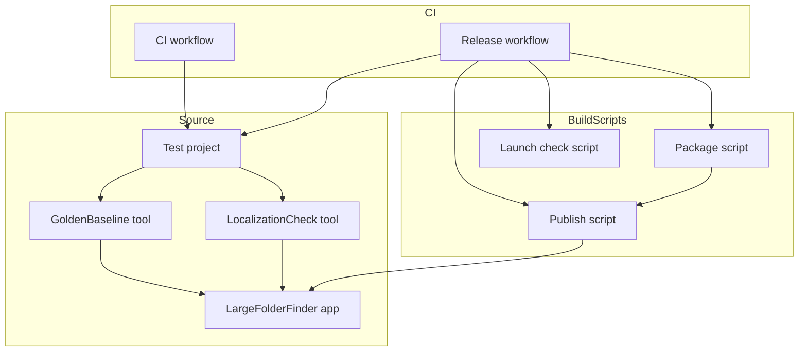
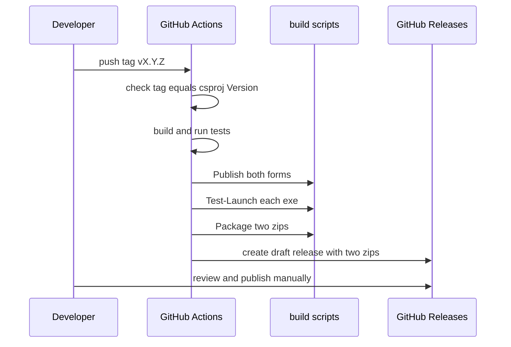
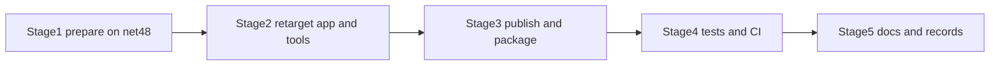

# Design Document

## Overview

**Purpose**: Large Folder Finder の実行基盤を .NET Framework 4.8 から .NET 10 へ移し、後続のすべてのスペックが前提とする土台（長いパスを扱える基盤、テストの基盤、自動ビルド）を整える。

**Users**: 利用者は、ランタイムの導入が要らない自己完結版と、軽いフレームワーク依存版のどちらかを入手して、これまでと同じ操作で使う。開発者は、タグを送るだけで2形態の配布物と下書きのリリースが用意され、変更のたびにテストと検証ツールが自動で走る環境で作業する。

**Impact**: アプリのプロジェクト設定を差し替え、コードは .NET 10 で使えない API と新たに出る警告の箇所だけを直す。フォルダ選択ダイアログを標準のものに置き換える。検証ツール2つを .NET 10 に移し、テストプロジェクト、CI、発行・梱包・起動確認のスクリプトを新設する。走査結果の期待値データを、移行で現れる既知の欠落4件を含む形に更新する。

### Goals
- `net10.0-windows` でビルドでき、警告が移行前（0件）から増えない
- 自己完結の単一 exe（既定）とフレームワーク依存の単一 exe を、同じ手順で手元と CI の両方で作れる
- タグの push で、2形態のビルド・起動確認・zip・下書きのリリースまでが自動で行われる
- テストが期待値データとの突き合わせと翻訳の網羅の検証を行い、CI で毎回走る
- 走査結果の差が既知の欠落4件とその親のサイズだけであることを確かめ、期待値データを更新する

### Non-Goals
- 長いパスを扱うための走査の変更、フォルダ数の事前カウントの置き換え（`scan-correctness`）
- 速度の最適化（`scan-performance`）
- MVVM の部品の導入、コードの構造変更、失われた機能の復元（`architecture-refactoring`）
- C# の新しい言語機能の全面適用（警告を消すための最小限の注釈を除く）
- UI の見た目・操作・既定値の変更
- 保存データの形式の変更
- 使われていない P/Invoke 宣言や定数の除去（移行に必要ないため。見つけたことだけを記録する）

## Boundary Commitments

### This Spec Owns
- アプリのプロジェクト設定（`LargeFolderFinder.csproj`、`FodyWeavers.xml` の削除、発行の設定）
- SDK の固定（`global.json`）
- 移行に伴うコードの修正（.NET 10 に無い API の置き換え、フォルダ選択ダイアログの置き換え、移行で増えた警告の解消）
- 2つの検証ツールの対象フレームワークの変更と、実行基盤の変更で壊れる箇所の修正（GoldenBaseline の ACL の API と、net48 の制約を前提にした自己検証13件）
- テストプロジェクト `Tests/LargeFolderFinder.Tests`
- 発行・梱包・起動確認のスクリプト（`build/`）と CI（`.github/workflows/`）
- 走査結果の期待値データ `baselines/fixture-v1.golden.txt` の更新と、その記録
- 依存の版（MessagePack、YamlDotNet、CommunityToolkit.Mvvm の下限の記録）と `Resources/License/ThirdPartyNotices.txt`
- 利用者向けの案内（`README.md`）と steering の移行後の事実への更新

### Out of Boundary
- 走査のロジック（`Services/Scanner.cs`）と、その P/Invoke（`Helpers/Win32.cs`）
- 画面の構成と文言（言語ファイルの訳文を含む）
- 保存データの形式（MessagePack のスキーマ）
- 検証ツールの判定規則（期待値データの形式、比較の規則、翻訳の網羅の判定）
- CommunityToolkit.Mvvm の導入（版の下限だけを確定して記録する）

### Allowed Dependencies
- .NET 10 SDK（`global.json` で固定）と Windows Desktop ランタイム
- NuGet: MessagePack、YamlDotNet（アプリ）、xunit.v3（テストのみ。配布物に含めない）
- GitHub Actions の `windows-2025` ランナー、`actions/checkout`、`actions/setup-dotnet`、`gh`（ランナーに同梱）
- 検証ツール → アプリ本体（`ProjectReference`、読み取り専用。現状のまま）
- テスト → 検証ツールの実行ファイル（子プロセスとして起動）
- アプリ本体は、検証ツール・テスト・スクリプトのいずれにも依存しない

### Revalidation Triggers
- SDK の版を変えるとき → 2形態の発行と起動確認、検証ツールとテストを再実行する（`global.json` の変更は必ず CI を通す）
- 発行の設定（単一ファイル、自己完結、同梱ファイル）を変えるとき → 発行物の中身と起動確認、利用者向けの案内を見直す
- YamlDotNet の版を変えるとき → `Tools/LocalizationCheck` の `selfcheck`（重複キー・空のファイル・値の無いキーの扱い）とアプリの `Config.txt` の読み込みを確かめる
- MessagePack の版を変えるとき → 移行前の設定・セッションを読めることを確かめる
- 期待値データを更新したとき → `scan-correctness`、`scan-performance` はこの更新後の期待値を基準にする
- CI の終了コードの扱いや検証ツールの入口を変えるとき → 後続のすべてのスペックの検証手順に影響する

## Architecture

### Existing Architecture Analysis
- SDK 形式の csproj で `net48`、`UseWPF`、`UseWindowsForms`（実際には未使用）。依存 DLL は Costura で exe に埋め込む
- 実行ファイルの隣の `Config.txt` と `Resources/` を `AppDomain.CurrentDomain.BaseDirectory` で読む（8箇所、読み取りのみ）。書き込みは利用者ごとのローカルのアプリデータ配下で、フォルダ名は `AssemblyTitle` から取る
- 検証ツール2つ（`Tools/GoldenBaseline`、`Tools/LocalizationCheck`）は net48 のコンソールで、アプリを `ProjectReference` で参照し、終了コード 0/1/2 と `selfcheck` を持つ
- CI、テストプロジェクト、`global.json` は無い

### Architecture Pattern & Boundary Map



**Architecture Integration**:
- **採用した型**: 段階を分けた移行（research.md の Option B）。各段階の終わりで、既存の期待値データとの比較と検証ツールが成立する位置に区切る
- **スクリプトを単一の入口にする**: 発行・梱包・起動確認は PowerShell スクリプトにまとめ、開発者の手元と CI が同じスクリプトを呼ぶ（要件5.8）。ワークフローはスクリプトを呼ぶだけの薄い層にする
- **テストは検証ツールの入口を使う**: テストは検証ツールの実行ファイルを子プロセスで起動し、終了コードと出力で判定する。判定の組み立てを重複させない（要件6.5）
- **依存の向き**: アプリ ← 検証ツール ← テスト ← CI。スクリプトはアプリのプロジェクトを外から発行するだけで、アプリはどれにも依存しない

### Technology Stack

| Layer | Choice / Version | Role in Feature | Notes |
|-------|------------------|-----------------|-------|
| Runtime | .NET 10（`net10.0-windows`）、WPF | アプリと検証ツールの実行基盤 | LTS、サポート終了 2028-11-14 |
| SDK | .NET SDK 10.0.401、`rollForward: latestPatch` | ビルドと発行 | 4xx 系のパッチだけ追う。ランタイム 10.0.12 を同梱する |
| App packages | MessagePack 3.1.9、YamlDotNet 18.1.0 | 保存データ、設定と言語ファイル | どちらも実測でビルド・読み書きを確認済み |
| MVVM（記録のみ） | CommunityToolkit.Mvvm 8.4.2 以上 | 後続スペックで導入 | 8.4.0 は .NET 10 でビルド不能 |
| Test | xunit.v3 4.x（Microsoft Testing Platform v2） | テストの基盤 | テスト専用。配布物に含めない |
| Scripts | Windows PowerShell 5.1 互換の `.ps1` | 発行・梱包・起動確認 | 開発者の PC と CI の両方で動く |
| CI | GitHub Actions `windows-2025`、`actions/setup-dotnet`、`gh` | ビルド・テスト・下書きリリース | SDK は `global.json` から入れる |

## File Structure Plan

### Directory Structure
```
global.json                                  # SDK 10.0.401（latestPatch）と、テストの実行方式（Microsoft Testing Platform）
build/
├── Publish.ps1                              # 2形態の発行（自己完結 / フレームワーク依存）。発行先と形態を引数で受ける
├── Package.ps1                              # 発行物から配布用の zip を2つ作る（pdb を除く、構成を検査する）
└── Test-Launch.ps1                          # exe を起動し、ウィンドウが出て生きていることを確かめて閉じる
.github/workflows/
├── ci.yml                                   # push と pull request: ビルド、テスト、検証ツール
└── release.yml                              # バージョンのタグ: 版の照合、発行、起動確認、zip、下書きのリリース
Tests/LargeFolderFinder.Tests/
├── LargeFolderFinder.Tests.csproj           # net10.0-windows、xunit.v3。検証ツールを参照（出力だけを使う）
├── ToolRunner.cs                            # 検証ツールの実行ファイルを探して子プロセスで実行し、終了コードと出力を返す
├── GoldenBaselineTests.cs                   # 期待値データとの突き合わせ、GoldenBaseline の自己検証
└── LocalizationTests.cs                     # 翻訳の網羅の検証、LocalizationCheck の自己検証
```

### Modified Files
- `LargeFolderFinder.csproj` — `TargetFramework` を `net10.0-windows` に。`UseWindowsForms`、旧式の `Reference` 11件、Fody・Costura.Fody を削除。`RuntimeIdentifier`（win-x64）、`IncludeSourceRevisionInInformationalVersion=false` を追加。MessagePack と YamlDotNet の版を上げる。Ookii.Dialogs.Wpf を削除。`DefaultItemExcludes` に `Tests\**`、`build\**`、`artifacts\**` を加える
- `FodyWeavers.xml`、`FodyWeavers.xsd` — 削除
- `Views/MainWindow.xaml.cs` — フォルダ選択を `Microsoft.Win32.OpenFolderDialog` に置き換える（`BrowseButton_Click`）。所有者の取得の `File.GetAccessControl(path)` を `new FileInfo(path).GetAccessControl()` に置き換え、戻り値が null のときの扱いを明示する
- `Helpers/RelayCommand.cs` — .NET 10 の `ICommand` の null 許容の注釈に合わせる（挙動は変えない）
- `Tools/GoldenBaseline/GoldenBaseline.csproj`、`Tools/LocalizationCheck/LocalizationCheck.csproj` — `net10.0-windows` に
- `Tools/GoldenBaseline/Fixture/AccessControlGate.cs` — ACL の取得と設定を `DirectoryInfo` の拡張メソッドに置き換える
- `Tools/GoldenBaseline/SelfCheck/SelfChecks.cs` — net48 の制約（長いパスを作れない・列挙できない）を前提にした13件の期待を、移行後の事実に改める。その他の項目と判定規則は変えない
- `baselines/fixture-v1.golden.txt` — 移行後の走査結果で更新する（既存の `update` コマンドを使う）
- `LargeFolderFinder.sln` — テストプロジェクトを加える
- `.gitignore` — スクリプトの出力先 `artifacts/` を加える
- `.kiro/steering/decisions.md` — 既存の「.NET 9 の自己完結型・単一ファイルの発行設定」の項目に、移行で自己完結・単一ファイルの配布に戻ったことと、2026-09-17 の利用者の決定と理由を追記する（200行の目安を保つため新しい項目は立てない）
- `.kiro/specs/dotnet10-migration/research.md` — 末尾に「移行の記録」の節を設け、取り除いたもの・残したもの、自己検証13件の旧期待と新期待、期待値データの差の全文、起動確認の方式と結果を記録する（本スペックの「記録する」はすべてここに書く）
- `Resources/License/ThirdPartyNotices.txt` — Ookii.Dialogs.Wpf・Fody・Costura.Fody を削除。自己完結版に同梱する .NET ランタイム（MIT）を加える。MessagePack の同梱物の記載を実態に合わせる
- `README.md` — 動作環境、2つの配布物の違いと選び方、入手と起動の手順
- `.kiro/steering/tech.md`、`product.md`、`structure.md` — 実行基盤、依存、配布、コマンド、テスト、既知の制約を移行後の事実に

## System Flows

### リリースの流れ（タグの push）



**判定の分岐**:
- タグと csproj の `Version` が一致しない、テストが失敗する、起動確認が失敗する、梱包の検査が失敗する → その時点で失敗として止め、下書きは作らない
- 同じタグの下書きが既にある → 失敗として止める（上書きしない）

### 移行の段階



- **段階1（net48 のまま）**: `global.json` の追加と、SDK 10.0.4xx で net48 のビルド・検証ツールが今までどおり通ることの確認。フォルダ選択ダイアログの置き換えはこの段階では行わない（`OpenFolderDialog` は .NET 8 以降にしか無いため）
- **段階2**: アプリと検証ツールの対象の変更、依存の更新、API と警告の修正。ここで期待値データとの差を測り、既知の4件だけであることを確かめて更新する
- **段階3**: 発行・梱包・起動確認のスクリプト
- **段階4**: テストプロジェクトと CI
- **段階5**: 案内と記録の更新

## Requirements Traceability

| Requirement | Summary | Components | Interfaces | Flows |
|-------------|---------|------------|------------|-------|
| 1.1 | .NET 10 でビルド、警告を増やさない | AppProject、CodeFixes | `dotnet build` の警告数 | 段階2 |
| 1.2 | 画面と操作が移行前と同じ | AppProject、CodeFixes、手動確認 | — | 段階2 |
| 1.3 | 保存場所を保つ | AppProject（`AssemblyTitle` を変えない） | — | 段階2 |
| 1.4 | 固有・非提供の API をなくす | CodeFixes（ACL） | — | 段階2 |
| 1.5 | 画面・操作・既定値を変えない | CodeFixes（最小の修正に限る） | — | 段階2 |
| 1.6 | 不要なものを除去し記録 | AppProject（旧式の参照、`UseWindowsForms`、Fody） | 記録 | 段階2 |
| 2.1 | 自己完結の単一 exe | PublishScript | `Publish.ps1 -Form SelfContained` | リリース |
| 2.2 | 軽量な配布物 | PublishScript | `Publish.ps1 -Form FrameworkDependent` | リリース |
| 2.3 | 自己完結版で隣のファイルを読む | AppProject（Content の既存設定）、LaunchCheck | — | リリース |
| 2.4 | 軽量版で隣のファイルを読む | 同上 | — | リリース |
| 2.5 | 管理者として開き直す | CodeFixes（現行の `MainModule.FileName` を維持） | — | 手動確認 |
| 2.6 | 版の文字列に余分な付加情報がない | AppProject（`IncludeSourceRevisionInInformationalVersion=false`） | — | — |
| 2.7 | 2形態の中身の構成が同じ | PackageScript（構成の検査） | `Package.ps1` | リリース |
| 2.8 | 違いと選び方の案内 | Docs（README） | — | 段階5 |
| 3.1 | 埋め込みの仕組みを単一ファイル発行に | AppProject、PublishScript | — | 段階2・3 |
| 3.2 | 標準のフォルダ選択ダイアログ | CodeFixes（`OpenFolderDialog`） | — | 段階2 |
| 3.3 | 説明の表示と開始パス | CodeFixes | `Title`、`InitialDirectory` | 段階2 |
| 3.4 | 保存データの部品の更新 | AppProject（MessagePack 3.1.9） | — | 段階2 |
| 3.5 | 設定・言語ファイルの部品の更新 | AppProject（YamlDotNet 18.1.0）、LocalizationCheck | `selfcheck`、`check` | 段階2 |
| 3.6 | MVVM の部品の下限の記録 | Docs（steering） | — | 段階5 |
| 3.7 | 著作権表示の更新 | Docs（ThirdPartyNotices） | — | 段階5 |
| 4.1 | 差が既知の4件と親のサイズだけ | GoldenBaselineTool | `compare` | 段階2 |
| 4.2 | それ以外の差は不具合として直す | GoldenBaselineTool、CodeFixes | `compare` | 段階2 |
| 4.3 | 期待値を更新し内訳を記録 | GoldenBaselineTool | `update` | 段階2 |
| 4.4 | 保存データ・設定・ログが引き続き動く | 手動確認、LaunchCheck | — | 段階2・3 |
| 4.5 | 長いパス対応の実装をしない | 境界（`Scanner.cs` に触れない） | — | — |
| 5.1 | タグで2形態をビルドし書庫に | ReleaseWorkflow、PublishScript、PackageScript | — | リリース |
| 5.2 | 起動を確かめ、失敗を報告 | ReleaseWorkflow、LaunchCheck | `Test-Launch.ps1` | リリース |
| 5.3 | 下書きのリリースを作る | ReleaseWorkflow | `gh release create --draft` | リリース |
| 5.4 | 公開は人が行う | ReleaseWorkflow（公開しない） | — | リリース |
| 5.5 | 変更のたびにビルドとテスト | CiWorkflow | — | — |
| 5.6 | SDK の版を固定し記録 | GlobalJson、Docs | `global.json` | — |
| 5.7 | 問題があれば版を変えて記録 | GlobalJson、Docs（手順） | — | — |
| 5.8 | 手元でも同じ手順 | PublishScript、PackageScript、LaunchCheck | 各スクリプト | — |
| 6.1 | テストを1つのコマンドで | TestProject | `dotnet test` | — |
| 6.2 | 期待値との突き合わせ | TestProject（GoldenBaselineTests） | `compare` | — |
| 6.3 | CI でテストを実行し、失敗で止める | CiWorkflow、ReleaseWorkflow | — | — |
| 6.4 | 環境の制約で成立しないときは区別して報告 | TestProject（スキップ） | 終了コード 2 の扱い | — |
| 6.5 | 既存の判定を作り直さない | TestProject（ToolRunner） | 子プロセス | — |
| 7.1 | 走査結果の検証ツールが同じ入口で動く | GoldenBaselineTool | コマンドと終了コード | 段階2 |
| 7.2 | 使えなくなる API の置き換え | GoldenBaselineTool（AccessControlGate） | — | 段階2 |
| 7.3 | 翻訳の網羅の検証ツールが動き、CI で判定 | LocalizationCheckTool、TestProject、CiWorkflow | `check` | 段階2・4 |
| 7.4 | 自己検証がすべて成功 | GoldenBaselineTool、LocalizationCheckTool | `selfcheck` | 段階2 |
| 7.5 | 判定規則を変えない | GoldenBaselineTool（自己検証の前提だけを改める） | — | 段階2 |
| 8.1 | 記録を移行後の事実に | Docs（steering） | — | 段階5 |
| 8.2 | 利用者向けの案内を更新 | Docs（README） | — | 段階5 |
| 8.3 | 既知の制約を記録 | Docs（steering） | — | 段階5 |

## Components and Interfaces

| Component | Domain/Layer | Intent | Req Coverage | Key Dependencies | Contracts |
|-----------|--------------|--------|--------------|------------------|-----------|
| AppProject | プロジェクト設定 | アプリを .NET 10 の単一 exe として作れるようにする | 1.1, 1.3, 1.6, 2.3, 2.4, 2.6, 3.1, 3.4, 3.5 | .NET 10 SDK (P0) | — |
| GlobalJson | プロジェクト設定 | SDK の版を固定する | 5.6, 5.7 | — | State |
| CodeFixes | アプリのコード | .NET 10 に無い API、ダイアログ、警告を直す | 1.1, 1.2, 1.4, 1.5, 2.5, 3.2, 3.3, 4.2 | AppProject (P0) | — |
| GoldenBaselineTool | 検証ツール | 移行後も同じ入口で走査結果を検証する | 4.1, 4.2, 4.3, 7.1, 7.2, 7.4, 7.5 | AppProject (P0) | Batch |
| LocalizationCheckTool | 検証ツール | 移行後も同じ入口で翻訳の網羅を検証する | 3.5, 7.3, 7.4, 7.5 | AppProject (P0) | Batch |
| PublishScript | ビルドの道具 | 2形態を発行する | 2.1, 2.2, 3.1, 5.1, 5.8 | AppProject (P0) | Batch |
| PackageScript | ビルドの道具 | 発行物から zip を作り、構成を検査する | 2.7, 5.1, 5.8 | PublishScript (P0) | Batch |
| LaunchCheck | ビルドの道具 | exe が起動して使える状態になるかを確かめる | 2.3, 2.4, 4.4, 5.2, 5.8 | PublishScript (P0) | Batch |
| TestProject | テスト | 検証ツールを呼び、結果を成否として示す | 6.1, 6.2, 6.4, 6.5, 7.3 | GoldenBaselineTool (P0), LocalizationCheckTool (P0) | Batch |
| CiWorkflow | CI | 変更のたびにビルド・テストを走らせる | 5.5, 6.3, 7.3 | TestProject (P0) | Batch |
| ReleaseWorkflow | CI | タグから下書きのリリースまでを作る | 5.1, 5.2, 5.3, 5.4, 6.3 | 各スクリプト (P0), TestProject (P0) | Batch |
| Docs | 記録 | 案内・著作権表示・steering を移行後の事実に | 2.8, 3.6, 3.7, 5.6, 8.1, 8.2, 8.3 | — | — |

### プロジェクト設定

#### AppProject（`LargeFolderFinder.csproj`）

**Responsibilities & Constraints**
- 対象: `net10.0-windows`、`UseWPF=true`、`RuntimeIdentifier=win-x64`
- 削除: `UseWindowsForms`、旧式の `Reference` 11件、`Fody`、`Costura.Fody`、`Ookii.Dialogs.Wpf`、`FodyWeavers.xml`、`FodyWeavers.xsd`
- 追加: `IncludeSourceRevisionInInformationalVersion=false`（版の文字列を `1.0.3` の形にする）
- 維持: `Version`、`Title`、`Copyright`、`AssemblyName`、`RootNamespace`、`Nullable`、`LangVersion`、既存の `Content` の設定（`Config.txt` と `Resources/` は既存の設定のまま発行フォルダに出ることを実測済み）。**`AssemblyTitle` を変えない**（アプリデータのフォルダ名が変わるため。要件1.3）
- `DefaultItemExcludes` に `Tests\**`、`build\**`、`artifacts\**` を加え、テスト・スクリプト・発行物がアプリのビルドに入らないようにする
- 版: MessagePack 3.1.9、YamlDotNet 18.1.0
- 単一ファイルの圧縮は使わない（zip が縮まず、起動が遅くなるだけのため）

#### GlobalJson（`global.json`）

**Contracts**: State [x]
```json
{
  "sdk": { "version": "10.0.401", "rollForward": "latestPatch" },
  "test": { "runner": "Microsoft.Testing.Platform" }
}
```
- 4xx 系のパッチ（10.0.402 以降）は自動で使い、3xx 系や 5xx 系には移らない
- 版を変えるときは、2形態の発行・起動確認・テストを CI で通し、選んだ版と理由を steering の tech.md に記録する（要件5.7）

### アプリのコード

#### CodeFixes

| Field | Detail |
|-------|--------|
| Intent | .NET 10 でビルド・動作させるための最小の修正 |
| Requirements | 1.1, 1.2, 1.4, 1.5, 2.5, 3.2, 3.3, 4.2 |

**Responsibilities & Constraints**
- **フォルダ選択**（`Views/MainWindow.xaml.cs` の `BrowseButton_Click`）: `Microsoft.Win32.OpenFolderDialog` に置き換える
  - `Title` に従来の説明の文言（ローカライズされた `FolderLabel`）を入れる（従来は説明の文言をタイトルに使っていた）
  - パス入力欄の値が存在するフォルダのときだけ `InitialDirectory` に入れる。存在しない・空のときは指定しない
  - `ShowDialog(this)` が true のとき `FolderName` を入力欄とセッションのパスに反映する。それ以外は何もしない
  - ログの文言の「via Ookii」を実態に合わせる
- **所有者の取得**（同ファイル）: `File.GetAccessControl(path)` を `new FileInfo(path).GetAccessControl()` に置き換える。所有者が取れない（null）ときは、従来と同じ表示になるよう扱いを明示する
- **警告の解消**: `Helpers/RelayCommand.cs` を .NET 10 の `ICommand` の null 許容の注釈（`CanExecute(object?)`、`Execute(object?)`、`CanExecuteChanged` の型）に合わせる。挙動は変えない
- **管理者として開き直す**: 現行の `Process.GetCurrentProcess().MainModule?.FileName` を維持する（単一 exe ではどちらの形態でも exe 自身を返すことを実測済み。`Environment.ProcessPath` に変えても差はない）
- **触れないもの**: 走査（`Services/Scanner.cs`）、P/Invoke（`Helpers/Win32.cs`）、画面の構成、訳文。未使用の P/Invoke（`ShowWindow`、`GetCompressedFileSize`）と定数 `AppIconFileName` は移行に不要なので残し、見つけたことを記録する

### 検証ツール

#### GoldenBaselineTool（`Tools/GoldenBaseline`）

**Contracts**: Batch [x]（既存の入口を維持）
- コマンド: `selfcheck`、`build-fixture`、`generate`、`compare --golden <path>`、`update --golden <path>`、`--help`
- 終了コード: 0（一致・成功）、1（差異・失敗）、2（エラー）

**Responsibilities & Constraints**
- 対象を `net10.0-windows` に変える
- `Fixture/AccessControlGate.cs` の ACL の取得・設定を `DirectoryInfo` の `GetAccessControl()` / `SetAccessControl()`（`System.IO.FileSystemAclExtensions`）に置き換える。拒否の内容と後始末の順序は変えない
- `SelfCheck/SelfChecks.cs` の、net48 の制約を前提にした13件を、移行後の事実（長いパスを作れる・列挙できる）に合わせて期待を改める。改めた各項目の名前と、旧期待・新期待を記録する。**期待値データの形式・比較の規則・既知の欠落の判定規則は変えない**（要件7.5）
- `baselines/fixture-v1.golden.txt` の更新は、`compare` で差が既知の4件と親フォルダ8件のサイズだけであることを確かめたうえで、既存の `update` コマンドで行う。差の全文を記録する（要件4.1〜4.3）
- 更新後の期待値では「既知の欠落」が0件になる。走査の本処理の不具合（フォルダ数の事前カウントが長いパスで数え損ねる）は `scan-correctness` に残る

#### LocalizationCheckTool（`Tools/LocalizationCheck`）
- 対象を `net10.0-windows` に変えるだけ。入口・終了コード・判定規則は変えない（実測で `selfcheck` 59件成功、`check` 問題0件、YamlDotNet 18.1.0 でも同じ）
- 実行ファイルの場所は `bin/<構成>/net10.0-windows/` に変わる。steering のコマンドを直す

### ビルドの道具（`build/`）

共通: Windows PowerShell 5.1 でも動く書き方にする。失敗したら 0 以外の終了コードで止まる（`$ErrorActionPreference = 'Stop'` と、外部コマンドの終了コードの検査）。出力先はリポジトリ直下の `artifacts/`（`.gitignore` に加える）。

#### PublishScript（`build/Publish.ps1`）

**Contracts**: Batch [x]
- 引数: `-Form SelfContained | FrameworkDependent`、`-OutputDir <path>`（省略時 `artifacts/publish/<Form>`）、`-Configuration Release`
- 処理:
  - 自己完結: `dotnet publish LargeFolderFinder.csproj -c Release -r win-x64 --self-contained true -p:PublishSingleFile=true -p:IncludeNativeLibrariesForSelfExtract=true -o <OutputDir>`
  - フレームワーク依存: `dotnet publish ... -r win-x64 --no-self-contained -p:PublishSingleFile=true -o <OutputDir>`（`--self-contained false` は使わない。1xx 系の SDK で自己完結になる不具合があるため）
- 出力: 発行フォルダ。終了コード 0 で成功

#### PackageScript（`build/Package.ps1`）

**Contracts**: Batch [x]
- 引数: `-SelfContainedDir`、`-FrameworkDependentDir`、`-OutputDir`（省略時 `artifacts/package`）
- 処理: 各発行フォルダから、次の構成だけを zip にする。`LargeFolderFinder.exe`、`Config.txt`、`Resources/Languages/*.yaml`、`Resources/Readme/*.txt`、`Resources/License/*`。**pdb など上記以外は入れない**
- 検査（要件2.7）: 2つの zip の中身のファイル一覧が、exe の大きさを除いて一致すること。必須のファイル（exe、`Config.txt`、言語ファイル13本、ライセンス2本）がそろっていること。満たさなければ終了コード 1
- 出力のファイル名: `LargeFolderFinder.zip`（自己完結、既定）、`LargeFolderFinder-FrameworkDependent.zip`

#### LaunchCheck（`build/Test-Launch.ps1`）

**Contracts**: Batch [x]
- 引数: `-ExePath`、`-TimeoutSeconds`（既定 20）
- 処理: exe を起動し、プロセスが生きていてメインウィンドウのハンドルが得られるまで待つ。得られたらウィンドウを閉じる要求を送り、決められた時間内に終わらなければ**自分が起動したそのプロセスだけ**を終了させる
- 判定: ウィンドウが出る前にプロセスが終了した、または時間内にウィンドウが出なかった → 終了コード 1（exe の標準エラーの出力や終了コードを添えて報告する）
- 実行時の注意: 起動するとアプリはアプリデータ配下に設定とログを書く。CI では使い捨ての環境なので問題ない。開発者の手元で使うときは、そのことを案内に書く

### テスト

#### TestProject（`Tests/LargeFolderFinder.Tests`）

**Contracts**: Batch [x]
- 実行: `dotnet test --solution LargeFolderFinder.sln -c Release`（リポジトリ直下。直下に csproj と sln が並ぶためソリューションを明示する。`global.json` の設定で Microsoft Testing Platform で走る）。構成（`-c`）はビルドとそろえる。ToolRunner が `bin/<構成>/` を探すため
- 参照: 2つの検証ツールを `ProjectReference`（`ReferenceOutputAssembly=false`）で参照し、ビルドの順序と出力の存在だけを保証する
- `ToolRunner`: 検証ツールの実行ファイルを、テストの出力フォルダから親へたどってリポジトリの `Tools/<名前>/bin/<構成>/net10.0-windows/<名前>.exe` として探す。子プロセスで実行し、終了コード・標準出力・標準エラーを返す。見つからないときはテストを失敗にする
- テスト:
  - `GoldenBaselineTests`: `selfcheck` が 0、`compare --golden baselines/fixture-v1.golden.txt` が 0
  - `LocalizationTests`: `selfcheck` が 0、`check` が 0
- **環境の制約の扱い**（要件6.4）: 検証ツールが終了コード 2（エラー）を返した場合、出力から原因が実行環境の制約（権限のないフォルダを作れない、パスの長さの制約など、ツールが報告する「生成できなかった項目」）と判断できるときはテストを**スキップ**として報告し、成功と区別する。それ以外の 2 は失敗にする
- 配布物に含めない（アプリのプロジェクトから参照しない）

### CI（`.github/workflows/`）

#### CiWorkflow（`ci.yml`）
- 契機: すべてのブランチへの push と pull request
- 手順: チェックアウト → `global.json` に従って SDK を入れる → `dotnet build LargeFolderFinder.sln -c Release -warnaserror`（警告が1件でもあれば失敗。要件1.1）→ `dotnet test --solution LargeFolderFinder.sln -c Release --no-build`（テストの中で検証ツールが走る）
- 失敗したら全体を失敗にする（要件5.5、6.3、7.3）

#### ReleaseWorkflow（`release.yml`）
- 契機: `v*` のタグの push。手動実行（`workflow_dispatch`）は既定のブランチに定義が無いと使えないため、契機にしない
- 試験: 本番のタグと区別できる試験用のタグ（`vX.Y.Z-test.N`）でも動く。試験用のタグでは、版の照合は `-` より前だけを比べ、下書きのタイトルに試験である印を付ける。試験後はタグと下書きを削除する
- 権限: `contents: write`（下書きのリリースを作るため。他の権限は与えない）
- 手順:
  1. タグ `vX.Y.Z`（試験用は `-` より前）と csproj の `Version` の一致を確かめる。不一致なら失敗
  2. ビルドとテスト（CiWorkflow と同じ手順）
  3. `Publish.ps1` で2形態を発行し、発行した exe の `ProductVersion` が `X.Y.Z` の形（コミットハッシュが付かない）であることを確かめる（要件2.6）
  4. `Test-Launch.ps1` で2つの exe を起動確認（要件5.2）
  5. `Package.ps1` で zip を2つ作る
  6. `gh release create <tag> --draft --title <tag> --notes <2つの配布物の違いの定型文>` に2つの zip を添える。同じタグのリリースが既にあれば失敗させる（上書きしない）
- 公開（下書きの解除）はしない（要件5.4）

**Implementation Notes**
- **Risks**: ホスト型ランナーで GUI の起動確認が成立するかは未確認（公開情報が食い違う）。最初に試験用のタグで確かめる。成立しない場合の代替は、起動確認を「プロセスが決められた時間生き続けること」に弱め、その判断を記録する。アプリ側に確認用の起動引数を加える案は、アプリの挙動を増やすため本スペックでは採らない

### 記録

#### Docs
- `README.md`（英語・日本語の両節）: 動作環境を「Windows 10/11。自己完結版はランタイムの導入不要、軽量版は .NET 10 Desktop Runtime が必要」に。2つの配布物の違い（大きさ、ランタイムの要否）と選び方、入手と起動の手順
- `Resources/License/ThirdPartyNotices.txt`: Ookii.Dialogs.Wpf、Fody、Costura.Fody を削除。自己完結版に同梱される .NET ランタイム（MIT）を加える。MessagePack の節の同梱物を実態に合わせる。xunit.v3 は配布物に含まないので載せない
- steering `tech.md`: 実行基盤、依存、発行と配布、`global.json` と SDK の版の理由、コマンド（ビルド、発行、テスト、検証ツールの新しい場所）、テストの節、既知の制約（自己完結版の大きさ、フォルダ数の事前カウントに残る長さの制限）、CommunityToolkit.Mvvm の下限 8.4.2。「.NET Framework 4.8 を維持」の判断を移行後の判断（利用者の決定と理由）に置き換える
- steering `product.md`: 「ランタイム導入不要（.NET Framework 4.8 は Windows 標準搭載）」を、自己完結版での事実に改める
- steering `structure.md`: `build/`、`.github/`、`Tests/` の所在と役割

## Error Handling
- スクリプトは失敗を終了コードで返し、途中の成果物を成功として扱わない
- リリースの流れは、どこで失敗しても下書きを作らない（部分的なリリースを残さない）
- テストは、検証ツールの終了コード 2 のうち環境の制約に由来するものだけをスキップにし、それ以外は失敗にする

## Testing Strategy

### 自動（CI とテストプロジェクト）
1. アプリのビルドの警告が0件であること（要件1.1。CI のビルドを `-warnaserror` で行う）
2. `GoldenBaseline` の `selfcheck`（書き直した13件を含む）と `compare`（更新後の期待値と一致）が 0（要件4、7.1、7.4）
3. `LocalizationCheck` の `selfcheck` と `check` が 0（要件3.5、7.3）
4. 2形態の発行物について、構成の検査と起動確認が通ること（要件2.1〜2.4、2.7、5.2）
5. 版の文字列が `X.Y.Z` の形であること（ReleaseWorkflow が発行した exe の `ProductVersion` を確かめる。要件2.6）

### 移行時に一度だけ行う確認（記録に残す）
1. 更新前の期待値との `compare` の差が、既知の4件と親8件のサイズだけであること（要件4.1）
2. 移行前の設定とセッションを移行後のアプリが読めること（要件4.4。実測済みの手順を再実行する）
3. 手元で2形態の発行・梱包・起動確認のスクリプトが通ること（要件5.8）
4. CI で、試験用の手動実行により下書きのリリースが作られること（要件5.1〜5.4）

### 手動での確認（利用者）
1. 自己完結版と軽量版の両方で、フォルダの選択（新しいダイアログ。説明の文言と開始フォルダ）、走査、タブ、並べ替え、絞り込み、コピー、言語の切り替え、設定ファイル・Readme・ライセンスの表示が移行前と同じであること（要件1.2、1.5、3.2、3.3）
2. 「管理者として開き直す」で UAC の確認が出て、管理者として起動し直すこと（要件2.5）
3. 以前の版の設定（言語、レイアウト、フォントサイズ）とタブが引き継がれること（要件1.3、4.4）
4. 可能なら、.NET ランタイムの入っていない PC で自己完結版が起動すること（要件2.1）
