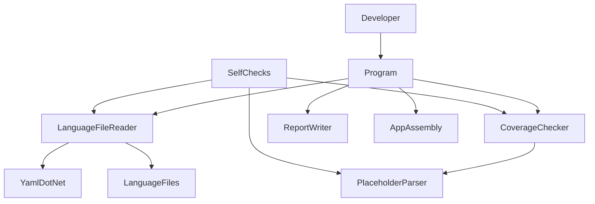
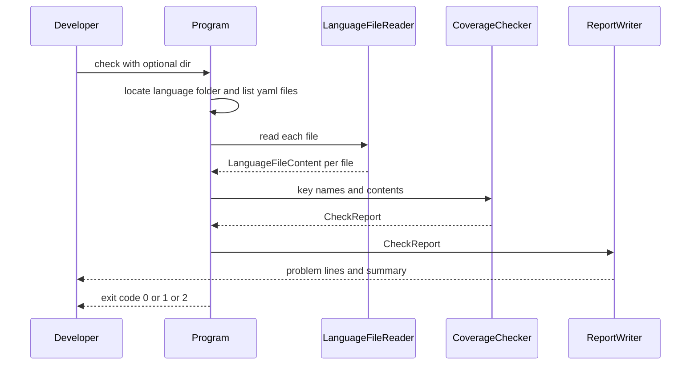

# Design Document

## Overview

**Purpose**: 英語・日本語以外の11言語の利用者に、欠けや二重表示のない表示を届ける。あわせて開発者に、翻訳の抜けとずれを機械的に見つける検証を提供する。

**Users**: 11言語の利用者は、所有者カラムの見出し、右クリックメニュー、スキャン中の状態表示でこの修正の恩恵を受ける。開発者は、ラベルを追加・変更したあとに検証ツールを実行し、結果を終了コードと報告で受け取る。

**Impact**: 言語ファイル13本のうち12本の訳文を修正する。アプリ本体のコードは `LanguageKey` の宣言コメントだけを変え、読み込みや表示の挙動は変えない。新しい検証ツール `Tools/LocalizationCheck` を加える。アプリのビルドには組み込まない。

### Goals
- 13言語すべてが `LanguageKey` の81キーを持つ
- 全言語の全訳文で、差し込み位置の番号の組が英語と一致する（11言語のスキャン中の表示で「経過」の二重表示と残り時間の欠落が解消する）
- 欠落・孤児・差し込み位置のずれ・読み込み不能・重複を1回の実行ですべて報告し、終了コードで判定できる検証ツールがある
- `LanguageKey` の宣言コメントが実装と一致する

### Non-Goals
- 新しいラベルの追加、対応言語の増減、差し込み位置以外の訳文の見直し
- 使われていないキー（`LiveScanningMessage` など）の削除
- `LocalizationManager` の読み込み・置き換えの挙動の変更
- 検証の CI への組み込みとテストプロジェクトの新設（`dotnet10-migration`）
- 欠落時にアプリのビルドを失敗させること

## Boundary Commitments

### This Spec Owns
- `Resources/Languages/*.yaml` のうち、`HeaderOwner`、`ContextShowOwner`、`TimeStatusFormat`、`LiveScanningMessage` の訳文
- 検証ツール `Tools/LocalizationCheck`（判定規則、報告の形式、終了コードの契約）
- `LanguageKey` の宣言コメント（`Services/LocalizationManager.cs` のコメント行のみ）
- steering のローカライズに関する記述（`tech.md`）と、検証ツールの所在（`structure.md`）の更新

### Out of Boundary
- `LocalizationManager` の処理（読み込み、初期言語の選択、英語への置き換え）
- 上記4キー以外の訳文
- `Readme/Readme_{lang}.txt` など言語ファイル以外の多言語資料
- アプリ本体の csproj とビルドの設定
- CI の構築、xUnit v3 のテストプロジェクト（`dotnet10-migration`）
- 走査結果の検証（`Tools/GoldenBaseline` と `scan-golden-baseline`）

### Allowed Dependencies
- 検証ツール → アプリ本体（`ProjectReference`、読み取り専用）: `LanguageKey` の列挙値の名前を得るためだけに使う。アプリの他の型は使わない
- 検証ツール → YamlDotNet（アプリが参照している 16.3.0 をそのまま使う。新しいパッケージは加えない）
- 検証ツール → `Resources/Languages/` の言語ファイル（読み取りのみ）
- アプリ本体 → 検証ツールへの依存は持たない

### Revalidation Triggers
- `LocalizationManager` の言語ファイルの読み込み規則（対象の拡張子、フォルダの探し方、デシリアライズの設定）が変わったとき → 検証ツールの読み込み部品を追従させる（`architecture-refactoring` が触る可能性がある）
- 検証ツールの終了コードや報告の形式を変えるとき → `dotnet10-migration` の CI とテストからの呼び出しを再確認する
- 検証ツールの対象フレームワークを変えるとき（`dotnet10-migration`）→ `selfcheck` と実データでの検証を再実行する
- `ui-redesign` がキーを追加・削除するとき → 検証ツールを実行する

## Architecture

### Existing Architecture Analysis
- `LanguageKey` の名前を文字列キーとして、言語フォルダ直下の `{code}.yaml` を `Dictionary<string, string>` に読み、見つからなければ `en.yaml` に置き換える。順序には依存しない
- 言語ファイルは csproj の `<Content Include="Resources\Languages\**\*.yaml">` でビルド出力の `Languages/` にコピーされる。アプリはそのフォルダ直下の `*.yaml` だけを列挙する
- `Tools/GoldenBaseline` が、アプリを参照する net48 のコンソールツール、終了コード 0/1/2、`selfcheck` による自己検証という型をすでに持つ

### Architecture Pattern & Boundary Map



**Architecture Integration**:
- **採用した型**: GoldenBaseline と同じ、アプリを読み取り専用で参照する独立したコンソールツール
- **判定の中核と入出力の分離**: 判定の中核（`CoverageChecker`、`PlaceholderParser`）は、ファイルもコンソールも扱わない純粋な部品にする。ファイルの読み込みは `LanguageFileReader`、表示は `ReportWriter`、列挙と終了コードは `Program` に置く
- **依存の向き**: Model（`CheckReport`、`LanguageFileContent`）→ 判定（`PlaceholderParser`、`CoverageChecker`）→ 入出力（`LanguageFileReader`、`ReportWriter`）→ 入口（`Program`、`SelfChecks`）。左の層は右の層を参照しない
- **steering との整合**: `Services/` を UI から独立させる既存方針に倣い、判定を UI や入出力から独立させる

### Technology Stack

| Layer | Choice / Version | Role in Feature | Notes |
|-------|------------------|-----------------|-------|
| CLI | C# 12、.NET Framework 4.8（`net48`） | 検証ツールの実行 | アプリと同じ。移行時は `dotnet10-migration` が対象を変える |
| Library | YamlDotNet 16.3.0 | 言語ファイルの読み込みと重複キーの検出 | アプリが参照しているものを `ProjectReference` 経由で使う。新しい依存は加えない |
| Data | YAML（UTF-8、BOM あり） | 訳文 | 既存の記法（`Key: "value"`、`#` のコメントで区画を区切る）を保つ |

## File Structure Plan

### Directory Structure
```
Tools/LocalizationCheck/
├── LocalizationCheck.csproj        # net48 のコンソール。アプリを ProjectReference で参照する
├── Program.cs                      # コマンドの解釈、言語フォルダの特定と列挙、終了コードの決定
├── Model/
│   ├── CheckReport.cs              # 問題の種類、1件の問題、検証結果全体の型
│   └── LanguageFileContent.cs      # 1つの言語ファイルの読み込み結果の型
├── Check/
│   ├── PlaceholderParser.cs        # 訳文から差し込み位置の番号の組を取り出す
│   └── CoverageChecker.cs          # キー一覧と読み込み結果から問題の一覧を作る（判定の中核）
├── Io/
│   ├── LanguageFileReader.cs       # アプリと同じ規則で1ファイルを読み、重複キーも数える
│   └── ReportWriter.cs             # 検証結果を人が読める行と要約に整形する
└── SelfCheck/
    └── SelfChecks.cs               # 合成した入力で各判定と報告を確かめる自己検証項目と、その実行
```

### Modified Files
- `Resources/Languages/{de,es,fr,hi,it,ko,pt-BR,ru,tr,zh-CN,zh-TW}.yaml` — `HeaderOwner` と `ContextShowOwner` を en と同じ位置（`HeaderType` の直後、`ContextOpen` の直前）に追加する。`TimeStatusFormat` を `"{0} {1}"` に直す
- `Resources/Languages/ja.yaml`、`Resources/Languages/ru.yaml` — `LiveScanningMessage` の差し込み位置を en と一致させる（ja は `{0}` を補い、ru は直書きの「ГБ」を `{0}` に置き換える）
- `Services/LocalizationManager.cs` — `LanguageKey` の宣言の `<summary>` コメントのみを書き換える
- `LargeFolderFinder.sln` — `Tools/LocalizationCheck/LocalizationCheck.csproj` を加える（GoldenBaseline と同じ扱い）
- `.kiro/steering/tech.md` — ローカライズの項の「現に欠落している」「順序についてのコメントが食い違う」の記述を修正後の事実に改め、検証ツールの実行コマンドを加える
- `.kiro/steering/structure.md` — `Tools/` 配下の検証ツール（GoldenBaseline、LocalizationCheck）の所在と役割を加える

## System Flows



**判定の分岐**:
- 言語フォルダが見つからない、`*.yaml` が1本もない、`en.yaml` がない、または読み込めない → 検証不能として終了コード 2。`en.yaml` 以外のファイルは可能な範囲で検証し、報告に含める
- それ以外で問題が1件以上 → 終了コード 1
- 問題が0件 → 終了コード 0

## Requirements Traceability

| Requirement | Summary | Components | Interfaces | Flows |
|-------------|---------|------------|------------|-------|
| 1.1 | 全言語が全キーを持つ | 言語ファイルの修正、CoverageChecker | ProblemKind.Missing | 検証フロー |
| 1.2 | 所有者カラムの見出しの訳文 | 言語ファイルの修正（`HeaderOwner`） | — | — |
| 1.3 | 右クリックメニューの訳文 | 言語ファイルの修正（`ContextShowOwner`） | — | — |
| 1.4 | 用語と語調の整合 | 訳語の規則（本書「訳文の修正内容」） | — | — |
| 2.1 | 経過時間と残り時間の両方を表示 | 言語ファイルの修正（`TimeStatusFormat`） | — | — |
| 2.2 | 差し込み位置の番号の組を英語と一致 | 言語ファイルの修正、PlaceholderParser、CoverageChecker | ProblemKind.PlaceholderMismatch | 検証フロー |
| 2.3 | 必要な範囲を超えて言い回しを変えない | 訳文の修正内容 | — | — |
| 2.4 | 単位名を訳さない決定に反しない | 訳文の修正内容（ru の「ГБ」を `{0}` に置き換える） | — | — |
| 3.1 | 全言語ファイルで全キーを調べる | Program、CoverageChecker | `CoverageChecker.Check` | 検証フロー |
| 3.2 | 欠落を言語とキーで報告 | CoverageChecker、ReportWriter | ProblemKind.Missing | 検証フロー |
| 3.3 | 孤児キーを報告 | CoverageChecker、ReportWriter | ProblemKind.Orphan | 検証フロー |
| 3.4 | 差し込み位置のずれを報告 | PlaceholderParser、CoverageChecker、ReportWriter | ProblemKind.PlaceholderMismatch | 検証フロー |
| 3.5 | 読み込み不能を報告し続行 | LanguageFileReader、CoverageChecker | ProblemKind.Unreadable | 検証フローの分岐 |
| 3.6 | 問題なしを件数付きで報告 | ReportWriter | `CheckReport.LanguageCount`、`KeyCount` | 検証フロー |
| 3.7 | 機械的に判定できる形 | Program | 終了コード 0/1/2 | 判定の分岐 |
| 3.8 | 言語一覧を手作業で更新しない | Program | 言語フォルダ直下の `*.yaml` の列挙 | 検証フロー |
| 3.9 | 全件報告し打ち切らない | CoverageChecker、ReportWriter | `CheckReport.Problems` | 検証フロー |
| 3.10 | 重複キーを報告 | LanguageFileReader、CoverageChecker | ProblemKind.Duplicate | 検証フロー |
| 4.1 | アプリのビルドを失敗させない | 独立したツールとして配置 | — | — |
| 4.2 | 現時点の環境で実行できる | LocalizationCheck.csproj（net48）、SelfChecks | `check`、`selfcheck` | — |
| 4.3 | 移行後も判定規則を作り直さない | 判定の中核の分離 | `CoverageChecker.Check` | — |
| 4.4 | ファイルと成果物を変更しない | LanguageFileReader（読み取りのみ） | — | — |
| 5.1 | 順序一致の記述を取り除く | `LanguageKey` の宣言コメント | — | — |
| 5.2 | 名前で引く・全言語に追加・検証で確かめる | `LanguageKey` の宣言コメント | — | — |
| 6.1 | 読み込み・選択・置き換えを変えない | 変更範囲の限定（`LocalizationManager` は処理に触れない） | — | — |
| 6.2 | 言語の一覧を変えない | 変更範囲の限定（言語ファイルの追加・削除なし） | — | — |
| 6.3 | 対象外の訳文を変えない | 変更範囲の限定（4キーのみ） | — | — |

## Components and Interfaces

| Component | Domain/Layer | Intent | Req Coverage | Key Dependencies (P0/P1) | Contracts |
|-----------|--------------|--------|--------------|--------------------------|-----------|
| 言語ファイルの修正 | Data | 4キーの訳文を追加・修正する | 1.1〜1.4, 2.1〜2.4, 6.2, 6.3 | 既存の同種キー (P1) | — |
| CheckReport | Model | 問題と検証結果を表す不変の型 | 3.2〜3.6, 3.9, 3.10 | なし | State |
| PlaceholderParser | Check | 差し込み位置の番号の組を取り出す | 2.2, 3.4 | なし | Service |
| CoverageChecker | Check | キー一覧と読み込み結果から問題を列挙する | 1.1, 2.2, 3.1〜3.5, 3.9, 3.10, 4.3 | PlaceholderParser (P0) | Service |
| LanguageFileReader | Io | アプリと同じ規則で読み、重複を数える | 3.5, 3.10, 4.4 | YamlDotNet (P0) | Service |
| ReportWriter | Io | 結果を行と要約に整形する | 3.2〜3.6, 3.9, 3.10 | CheckReport (P0) | Service |
| Program | Entry | フォルダの特定・列挙・実行・終了コード | 3.1, 3.7, 3.8, 4.1, 4.2 | アプリ本体 (P0)、上記すべて (P0) | Batch |
| SelfChecks | Entry | 合成入力で判定と報告を自己検証する | 4.2 | Check と Io の部品 (P0) | Batch |
| `LanguageKey` の宣言コメント | App | キーの扱いの説明を実態に合わせる | 5.1, 5.2, 6.1 | なし | — |

### Model

#### CheckReport

| Field | Detail |
|-------|--------|
| Intent | 検証で見つかった問題と、検証した範囲を表す |
| Requirements | 3.2, 3.3, 3.4, 3.5, 3.6, 3.9, 3.10 |

**Contracts**: State [x]

```csharp
namespace LargeFolderFinder.LocalizationCheck.Model;

/// <summary>問題の種類。報告の並び順もこの順とする。</summary>
public enum ProblemKind
{
    Unreadable,          // 読み込み不能（3.5）
    Duplicate,           // 同じキーが2回以上（3.10）
    Missing,             // LanguageKey のキーが無い（3.2）
    Orphan,              // LanguageKey に無いキーがある（3.3）
    PlaceholderMismatch, // 差し込み位置の番号の組が英語と異なる（3.4）
}

/// <summary>1件の問題。</summary>
public sealed class Problem
{
    public ProblemKind Kind { get; }
    public string FileName { get; }             // 例: "de.yaml"
    public string? Key { get; }                 // Unreadable のときは null
    public string? Detail { get; }              // Unreadable の理由、差し込み位置の英語側と当該言語側
    public Problem(ProblemKind kind, string fileName, string? key, string? detail);
}

/// <summary>検証結果全体。</summary>
public sealed class CheckReport
{
    public IReadOnlyList<Problem> Problems { get; }  // 並び: ファイル名（序数順）→ 種類 → LanguageKey の定義順（孤児はキー名の序数順）
    public int LanguageCount { get; }                // 検証した言語ファイルの数（読み込み不能を含む）
    public int KeyCount { get; }                     // LanguageKey のキーの数
    public bool IsReferenceUsable { get; }           // en.yaml が存在し読み込めたか
}
```
- **不変条件**: `Problems` は同じ内容の入力に対して常に同じ並びになる

```csharp
namespace LargeFolderFinder.LocalizationCheck.Model;

/// <summary>1つの言語ファイルの読み込み結果。</summary>
public sealed class LanguageFileContent
{
    public string FileName { get; }                              // 例: "de.yaml"
    public IReadOnlyDictionary<string, string>? Entries { get; } // 読み込めなかったときは null
    public string? UnreadableReason { get; }                     // 読み込めなかった理由（例外の型名とメッセージ、または「中身が空」）
    public IReadOnlyList<string> DuplicateKeys { get; }          // 2回以上現れたキー（出現順、重複なし）
}

```
- `LanguageFileReader` が作り、`CoverageChecker` が読む。判定の層が入出力の層に依存しないよう、Model に置く

### Check

#### PlaceholderParser

| Field | Detail |
|-------|--------|
| Intent | 1つの訳文から、`string.Format` の差し込み位置の番号の組を取り出す |
| Requirements | 2.2, 3.4 |

**Contracts**: Service [x]

```csharp
namespace LargeFolderFinder.LocalizationCheck.Check;

public static class PlaceholderParser
{
    /// <summary>訳文に含まれる差し込み位置の番号を、重複を除いて昇順で返す。</summary>
    public static IReadOnlyList<int> ParseIndexes(string text);
}
```
- **規則**: `{番号}`、`{番号,幅}`、`{番号:書式}`、`{番号,幅:書式}` を差し込み位置とみなす。`{{` と `}}` はエスケープされた波括弧として無視する
- **比較**: 番号の組（重複を除いた集合）で比べる。同じ番号が2回出ることや、出現の順序の違いはずれとみなさない
- **例**: `"{0} {1:F0}%  [{2}]  [{3}]"` → `[0, 1, 2, 3]`、`"Noch etwa {0}{1} {2}{3}"` → `[0, 1, 2, 3]`

#### CoverageChecker

| Field | Detail |
|-------|--------|
| Intent | 期待するキーの一覧と各言語ファイルの読み込み結果から、すべての問題を列挙する |
| Requirements | 1.1, 2.2, 3.1, 3.2, 3.3, 3.4, 3.5, 3.9, 3.10, 4.3 |

**Contracts**: Service [x]

```csharp
namespace LargeFolderFinder.LocalizationCheck.Check;

public static class CoverageChecker
{
    /// <summary>
    /// 英語の言語ファイル名。差し込み位置の基準に使う。
    /// </summary>
    public const string ReferenceFileName = "en.yaml";

    /// <param name="expectedKeys">LanguageKey の名前（定義順）</param>
    /// <param name="files">言語ファイルごとの読み込み結果</param>
    public static CheckReport Check(IReadOnlyList<string> expectedKeys, IReadOnlyList<LanguageFileContent> files);
}
```
- **事前条件**: `expectedKeys` は空でなく重複を含まない
- **事後条件**:
  - 読み込めなかったファイルは Unreadable を1件だけ持ち、そのファイルのキーに関する他の問題は作らない
  - 読み込めたファイルは、重複、欠落、孤児を持つ
  - 差し込み位置は、英語の訳文が存在するキーについて、両方に訳文があるときだけ比べる。英語が読み込めないときは差し込み位置を比べず、`IsReferenceUsable` を false にする
  - 1件目の問題で打ち切らない
- **ファイルシステムとコンソールを扱わない**。テストから直接呼べる

### Io

#### LanguageFileReader

| Field | Detail |
|-------|--------|
| Intent | 1つの言語ファイルを、アプリと同じ規則で読み込み、あわせて重複キーを数える |
| Requirements | 3.5, 3.10, 4.4 |

**Contracts**: Service [x]

```csharp
namespace LargeFolderFinder.LocalizationCheck.Io;

public static class LanguageFileReader
{
    /// <summary>ファイルを読み取り専用で開き、読み込み結果を返す。例外は外に出さない。</summary>
    public static LanguageFileContent Read(string filePath);

    /// <summary>ファイル名と内容の文字列から読み込み結果を作る（自己検証とテスト用）。</summary>
    public static LanguageFileContent Parse(string fileName, string text);
}
```
- **アプリと同じ規則**: `new DeserializerBuilder().Build()` で `Dictionary<string, string>` へ読む。結果が null なら「中身が空」として読み込み不能、例外なら読み込み不能とする。ファイルは `StreamReader` の既定の判定で文字コードを読む（アプリと同じ）
- **重複キー**: 読み込み可否とは別に `YamlStream` で読み、最上位のマッピングのキーを数える。`YamlStream` が例外になるときは重複の検出を行わない（読み込み不能として報告される）
- **書き込みをしない**

#### ReportWriter

| Field | Detail |
|-------|--------|
| Intent | 検証結果を、人が読める1問題1行の報告と要約に整形する |
| Requirements | 3.2, 3.3, 3.4, 3.5, 3.6, 3.9, 3.10 |

**Contracts**: Service [x]

```csharp
namespace LargeFolderFinder.LocalizationCheck.Io;

public static class ReportWriter
{
    /// <summary>報告の各行を返す。最終行は要約。</summary>
    public static IReadOnlyList<string> Format(CheckReport report);
}
```
- **行の形式**（例）:
  - `[読み込み不能] xx.yaml: SyntaxErrorException: While scanning ...`
  - `[重複] de.yaml: HeaderSize`
  - `[欠落] de.yaml: HeaderOwner`
  - `[孤児] de.yaml: OldKey`
  - `[差し込み位置] de.yaml: TimeStatusFormat 英語={0},{1} 当該={0}`
- **要約**: 問題なしのとき `問題はありません（言語 13、キー 81）`。問題ありのとき `問題 N 件（言語 13、キー 81）`。英語が使えないとき、要約の前に `[検証不能] en.yaml が無いか読み込めないため、差し込み位置を検証できません` を出す

### Entry

#### Program

| Field | Detail |
|-------|--------|
| Intent | コマンドを解釈し、言語フォルダを特定して検証を実行し、終了コードを返す |
| Requirements | 3.1, 3.7, 3.8, 4.1, 4.2 |

**Contracts**: Batch [x]

##### Batch / Job Contract
- **起動**: `LocalizationCheck check [--dir <言語フォルダ>]`、`LocalizationCheck selfcheck`、`LocalizationCheck --help`
- **入力**:
  - `--dir` を省略したとき、ツールの実行ファイルの場所から親へたどり、`LargeFolderFinder.sln` を含むフォルダを見つけ、その `Resources/Languages` を使う
  - 言語フォルダ直下の `*.yaml` をファイル名の序数順で列挙する（下位フォルダは見ない。アプリと同じ）
  - 期待するキーは `Enum.GetNames(typeof(LargeFolderFinder.LanguageKey))` の定義順
- **出力**: 標準出力（UTF-8）に `ReportWriter` の行を出す
- **終了コード**（GoldenBaseline と同じ番号体系）:

| 終了コード | 意味 |
|-----------|------|
| 0 | 問題なし |
| 1 | 問題あり（欠落、孤児、差し込み位置、重複、en 以外の読み込み不能のいずれか） |
| 2 | 検証不能（言語フォルダが無い、`*.yaml` が0本、`en.yaml` が無いか読み込めない、引数の誤り、予期しない例外） |

- **冪等性**: 読み取りのみで、何度実行しても同じ入力に同じ結果を返す

#### SelfChecks

| Field | Detail |
|-------|--------|
| Intent | テスト基盤がない現時点で、判定と報告の正しさを合成入力で確かめる |
| Requirements | 4.2 |

**Contracts**: Batch [x]
- **起動**: `LocalizationCheck selfcheck`。全項目を実行し、1項目ずつ `[OK]` か `[NG] 理由` を出す。1件でも NG なら終了コード 1、すべて OK なら 0
- **項目**（Testing Strategy の単体の項目と対応）

### App

#### `LanguageKey` の宣言コメント
- **変更内容**: 「YAML ファイルと順序を一致させること」を削除し、次の3点を記す: キーは名前で言語ファイルから引かれ、並び順は問わないこと。キーを追加・削除したら全言語のファイルに訳文を加える・消すこと。`Tools/LocalizationCheck` の `check` で欠けやずれを確かめられること
- **コード（列挙値、処理）は変更しない**（6.1）

## 訳文の修正内容

### `HeaderOwner` と `ContextShowOwner`（1.1〜1.4）
- **位置**: en と同じく `HeaderType` の直後、`ContextOpen` の直前に置く
- **`HeaderOwner` の訳語**: 既存の見出し（名前、サイズ、種類、更新日時）が Windows エクスプローラーの列名と一致しているため、各言語のエクスプローラーの「所有者」列の名前を使う。実装時の参考: de「Besitzer」、es「Propietario」、fr「Propriétaire」、hi「स्वामी」、it「Proprietario」、ko「소유자」、pt-BR「Proprietário」、ru「Владелец」、tr「Sahip」、zh-CN「所有者」、zh-TW「擁有者」
- **`ContextShowOwner` の訳語**: `HeaderOwner` と同じ語を使い、「所有者を表示」を、その言語の既存の右クリックメニュー項目・メニュー項目と同じ語形（動詞の形、語順、大文字の使い方）で表す

### `TimeStatusFormat`（2.1〜2.3）
- 11言語の `"{0} <経過の語>"` を `"{0} {1}"` に改める
- **理由**: `{0}` にはすでに `ElapsedFormat` と `UnitElapsed` で「経過」が付いた文字列が入る。現状は経過の語が二重に表示され、`{1}`（残り時間）が表示されない。en・ja と同じ形にすることが、差し込み位置を直すための最小の変更である

### `LiveScanningMessage`（2.2〜2.4）
- ja: `"スキャン中…… サイズ({0})は途中結果を表示しています。"` のように、en の「Size({0})」に当たる位置に `{0}` を補う
- ru: 直書きの「ГБ」を `{0}` に置き換える（単位名を訳文に固定しない。単位名を訳さない決定に反しない）
- このキーはコードから参照されていない。訳文の削除は範囲外とし、差し込み位置だけをそろえる

## Error Handling

### Error Strategy
- 検証ツールは、個々のファイルの問題（読み込み不能、重複など）を例外で止めず、すべて報告の行に変える（3.5, 3.9）
- 検証そのものが成り立たない状況だけを終了コード 2 とする（フォルダが無い、言語ファイルが無い、英語が使えない、引数の誤り）
- 予期しない例外は、メッセージを標準エラーに出して終了コード 2 とする

### Monitoring
- 対象外（開発者が手元で、または CI で実行するツール）

## Testing Strategy

### Unit Tests（`selfcheck` の項目）
1. `PlaceholderParser.ParseIndexes`: `{0}`、`{1:F0}`、`{2,10}`、`{{0}}`（エスケープで無視）、番号の重複、差し込み位置なしの各入力で期待どおりの組を返す（2.2, 3.4）
2. `LanguageFileReader.Parse`: 正常な文書、構文の誤り、空の文書、入れ子の構造、重複キーを含む文書で、`Entries`、`UnreadableReason`、`DuplicateKeys` が実測した YamlDotNet の挙動と一致する（3.5, 3.10）
3. `CoverageChecker.Check`: 欠落、孤児、差し込み位置のずれ、重複、読み込み不能を1つずつ仕込んだ合成入力で、それぞれがちょうど1件ずつ報告され、1件目で打ち切られない（3.2〜3.5, 3.9, 3.10）
4. `CoverageChecker.Check`: `en.yaml` が読み込めない入力で、差し込み位置の比較を行わず `IsReferenceUsable` が false になる。問題のない入力で問題が0件になる（3.4, 3.6）
5. `ReportWriter.Format`: 各種類の行の形式と、問題あり・なし・英語が使えないときの要約の文面（3.2〜3.6）

### Integration Tests（実データでの確認）
1. 言語ファイルを直す前に `check` を実行し、終了コード 1、欠落22件（11言語 × 2キー）、差し込み位置13件（11言語の `TimeStatusFormat`、ja と ru の `LiveScanningMessage`）が報告されることを確かめる。検出能力の実データでの証明とする（3.1〜3.4）
2. 言語ファイルを直した後に `check` を実行し、終了コード 0、`問題はありません（言語 13、キー 81）` になる（1.1, 2.2, 3.6）
3. 一時フォルダに言語ファイルを複製し、1本を追加・1本を削除した状態で `--dir` を指定して実行し、対象の言語の数が追随する（3.8）
4. `check` の前後で、言語ファイルのハッシュが変わらない（4.4）
5. 検証ツールを加えたあとも、アプリ本体のビルドが言語ファイルの状態にかかわらず成功する（4.1）。アプリのビルドは利用者の操作で行う

### 手動での確認
1. 英語以外の言語（例: de、ko）でアプリを起動し、所有者カラムの見出しと右クリックメニューの項目がその言語で表示される（1.2, 1.3）
2. 同じ言語でスキャンを実行し、状態表示に経過時間と残り時間が1回ずつ表示される（2.1）

## Supporting References

### ビルドと実行
```
# アプリ本体を一度ビルドしておく（検証ツールはその出力を参照する）
dotnet build LargeFolderFinder.csproj
# 検証ツールだけをビルドする
dotnet build Tools/LocalizationCheck/LocalizationCheck.csproj -c Debug -p:BuildProjectReferences=false
# 実行する
Tools/LocalizationCheck/bin/Debug/net48/LocalizationCheck.exe check
Tools/LocalizationCheck/bin/Debug/net48/LocalizationCheck.exe selfcheck
```
