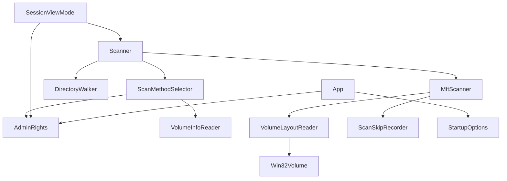
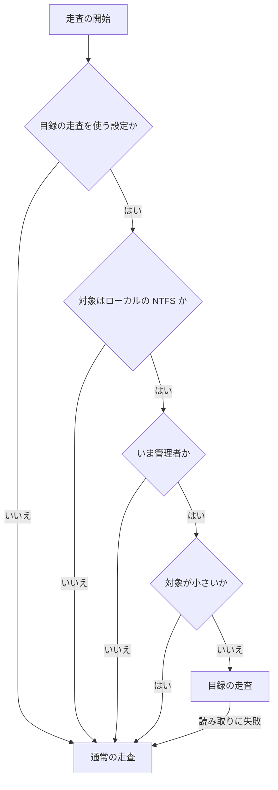
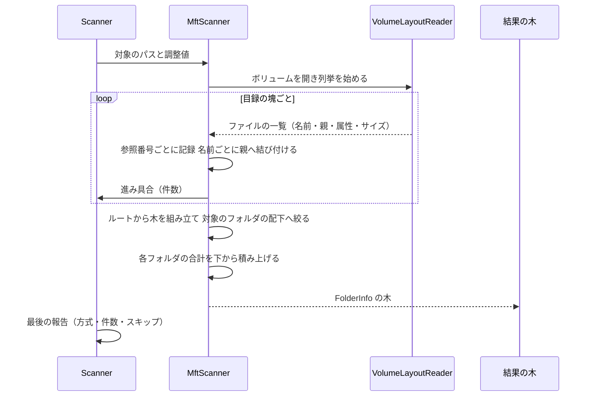

# Technical Design Document

## Overview

本フィーチャーは、ローカルの NTFS ドライブを管理者として走査するときに、**ファイルシステムの目録をまとめて読む走査方式**（`FSCTL_QUERY_FILE_LAYOUT`）を加える。使えない条件（ネットワーク、NTFS 以外、管理者でない、読み取りに失敗）では、いまの通常の走査に自動で戻る。走査の方式が変わっても結果の木の形・保存・表示は同じで、利用者にはどちらの方式で走査したかが分かる。

**Users**: ローカルのドライブの容量の原因を調べる利用者。速さの主張を確かめる開発者。

**Impact**: 走査の入口に方式を選ぶ判断を加え、新しい走査の経路（目録を読む → 木を組み立てる）を並べる。**アプリのマニフェストを `highestAvailable` にし、管理者の権限を持つ利用者は起動のときに昇格する**（走査のたびに尋ねる処理は持たない）。通常の走査の処理（`DirectoryWalker`）と結果の木の形・保存形式には手を入れない。

### Goals
- ローカルの NTFS を管理者として走査するとき、WizTree 以下の所要時間になる
- アクセス権の無い場所も含めてドライブ全体を数える（利用者の決定）
- 使えない条件では通常の走査に戻り、失敗しない
- 集計値の意味がいまの走査と揃っている（アクセス権の無い場所を数える差を除く）

### Non-Goals
- 通常の列挙の経路の速さ（`scan-performance` が担当。完了済み）
- 常駐監視・インデックスの事前構築・変更の差分の取り込み
- NTFS 以外（ReFS・FAT・exFAT）の目録の読み取り
- 結果の表示の作り替え（`ui-redesign`）。本フィーチャーは「どちらの方式で走査したか」が分かる最小限の表示にとどめる
- 「管理者として開き直す」メニューの状態の整理（`architecture-refactoring`）

## Boundary Commitments

### This Spec Owns
- 目録をまとめて読む走査の経路（ボリュームを開く、目録を列挙する、木を組み立てる、対象のフォルダへ絞る）
- 走査の方式を決める判断（ローカルか、NTFS か、管理者か、設定、対象の小ささ）と、通常の走査への切り替え
- 起動時の昇格（マニフェストの `highestAvailable`）と、いま管理者かどうかの判定
- 走査の方式の記録と最小限の表示（完了時にどちらで走査したか）
- ハードリンクにより合計がディスクの実使用量より大きく出ることの記載（README・同梱の Readme）
- 目録の走査の集計値を通常の走査と突き合わせる検証と、WizTree との比較の計測の手順・記録

### Out of Boundary
- `Services/DirectoryWalker.cs`（通常の走査）と `Services/ScanParallelism.cs`（並列度）の処理
- `Models/FolderInfo.cs`・`Models/SessionData.cs` の保存の形、`Services/SessionFileManager.cs`
- `Services/ResultFormatter.cs` と画面の描画、進捗の通知の間隔と残り時間の推定の式
- 事前カウント（`FolderCounter`）。**目録の走査では事前カウントを使わない**（進み具合は目録の件数で示す）
- 期待値データ（`baselines/fixture-v1.golden.txt`）の意味。これは**通常の走査の結果**を守るものとして維持する

### Allowed Dependencies
- .NET 10 の BCL と、新しい OS の直接呼び出し（`CreateFile` でボリュームを開く、`DeviceIoControl`、`GetVolumeInformation`、権限の判定）。**この例外の理由**: ボリュームのハンドルはパスを渡さないため長いパスの制約を受けない（`brief.md`）。新しい直接呼び出しは専用の部品に閉じ込める
- 既存の `FolderInfo`、`ScanProgress`、`ScanSkipRecorder`、`Config`、`Logger`、`LocalizationManager`
- 新しいパッケージは追加しない

### Revalidation Triggers
- 結果の木の規約（ルートの名前は完全パス、子の `Parent` を足す前に設定、`lock (Children)` の下で一括追加）を変えるとき → 通常の走査・検証ツール・`architecture-refactoring` を再確認
- 集計の意味（無名のストリームだけを数える、ハードリンクは名前ごと、予約レコードを除く）を変えるとき → 通常の走査との突き合わせの検証と、README・同梱の Readme の記載を更新
- 昇格の扱い（尋ねる条件、設定）を変えるとき → README・同梱の Readme 13言語・`Config.txt` を更新
- 走査がさらに速くなるため、`scan-correctness` の並行読み取りの自己検証の余裕（並列で1巡あたり9回）を再測定する

## Architecture

### Existing Architecture Analysis
- `Scanner.RunScan(path, …, ScanTuning?)` が唯一の走査の入口で、`ScanParallelism.Resolve` で並列度を決め、`DirectoryWalker.Walk` が決まった数のワーカーで木を組み立てる
- 進捗は `IProgress<ScanProgress>`（報告5秒・ログ20秒、EMA で残り時間、完了時に `IsFinal` の報告を1回）
- 列挙の失敗は `ScanSkipRecorder` に集め、走査の終わりに1回だけログへ書く
- 「管理者として開き直す」メニューは今のプロセスを終了して昇格した新しいプロセスを起動するだけで、**走査の対象を引き継がない**。`App` は起動の引数を扱っていない
- 走査の結果は `FolderInfo` の木で、保存・表示・検証ツールがこの形に依存する

### Architecture Pattern & Boundary Map



- **依存の方向**: Views → ViewModels → Services → Models。Helpers（`Win32Volume`、`AdminRights`）はどの層からも使える
- **方式の分かれ目は `Scanner.RunScan` の中の1箇所**。どちらの経路も同じ `FolderInfo` の木と同じ進捗の規約を返す

### Technology Stack
| Layer | Choice | Role | Notes |
|---|---|---|---|
| 目録の読み取り | `FSCTL_QUERY_FILE_LAYOUT`（Windows 8.1 以降、NTFS 専用） | 名前・親・属性・ストリームのサイズを連続で列挙 | 指定は `INCLUDE_NAMES | INCLUDE_STREAMS | INCLUDE_STREAMS_WITH_NO_CLUSTERS_ALLOCATED | INCLUDE_EXTRA_INFO`。範囲の情報は含めない |
| ボリュームの判定 | `GetVolumeInformation` のファイルシステム名、`DriveInfo` | NTFS か、ローカルか | 一次の判定。失敗したら通常の走査 |
| 権限の判定 | `WindowsIdentity`/`WindowsPrincipal` | いま管理者として動いているか | 方式の選択に使う |
| 起動時の昇格 | アプリのマニフェスト（`requestedExecutionLevel level="highestAvailable"`） | 管理者の権限を持つ利用者は起動のときに昇格する | `requireAdministrator` は採らない（管理者でない利用者が起動できなくなるため）。走査のたびに尋ねる処理は持たない |

## File Structure Plan

### New Files
```
Services/
├── ScanMethodSelector.cs   # 走査の方式を決める（ローカル・NTFS・管理者・設定・対象の小ささ）
├── MftScanner.cs           # 目録の列挙から FolderInfo の木を組み立て、対象のフォルダへ絞る
└── VolumeLayoutReader.cs   # ボリュームを開き、目録を連続して列挙する（低レベルの読み取り）
Models/
├── ScanMethod.cs           # 走査の方式（通常の列挙 / 目録の読み取り）と、選ばなかった理由
└── VolumeFileEntry.cs      # 目録の1件（ファイル参照番号、親の参照番号、名前、属性、論理サイズ、更新日時）
Helpers/
├── Win32Volume.cs          # ボリュームを開く・目録を列挙する・ファイルシステム名を得る OS の直接呼び出し
└── AdminRights.cs          # いま管理者として動いているか
app.manifest                # requestedExecutionLevel を highestAvailable にする（新設）
```

### Modified Files
- `Services/Scanner.cs` — 走査の方式を決め、目録の経路か通常の経路のどちらかを実行する。進捗と最後の報告の規約は変えない
- `Models/ScanProgress.cs` — 最後の報告に使った走査の方式を載せる
- `Models/Config.cs` と `Config.txt` — `UseMftScan`（既定 true。目録の走査を使うかどうか）
- `ViewModels/SessionViewModel.cs` — 完了のログと状態表示に走査の方式を含める
- `LargeFolderFinder.csproj` — マニフェストを組み込む設定（`ApplicationManifest`）
- `Services/LocalizationManager.cs` と `Resources/Languages/*.yaml`（13言語） — 昇格を尋ねる文言、走査の方式の表示の文言
- `README.md`・`Resources/Readme/Readme_*.txt`（13言語） — 新しい設定と、ハードリンクにより合計が大きく出ること
- `Tools/GoldenBaseline/Scan/`・`SelfCheck/SelfChecks.cs` — 目録の走査の検証（管理者でなければ飛ばす）
- `Tools/ScanBench/Program.cs` — 走査の方式を指定して測る
- `.kiro/steering/tech.md`・`performance.md`・`decisions.md` — OS の直接呼び出しの一覧、走査の方式、管理者の扱い

## System Flows

### 走査の方式の決定


- 管理者かどうかは起動のときに決まる（マニフェストの `highestAvailable`）。**走査の途中で昇格を促さない**
- 管理者でない利用者には、速い方式が使えないことを知らせる表示もしない（要件3.4・3.5）
- 「対象が小さいか」の基準は、まず暫定の値を入れ、管理者での計測（利用者の作業）の結果で確定する

### 目録の走査


- 名前ごとに親へ結び付ける（ハードリンクは名前の数だけ現れる）。短縮名（DOS）は除く
- 到達できない「はぐれ」は結果に含めず、件数を記録する
- 合計は木を組み立てた後に下から積み上げる（走査中の途中の木は出さない。要件6.1 の進み具合は件数で示す）

## Requirements Traceability

| Requirement | Summary | Components | Flows |
|---|---|---|---|
| 1.1 | 条件が揃えば目録の走査 | ScanMethodSelector | 方式の決定 |
| 1.2 | WizTree 以下の所要時間 | VolumeLayoutReader、MftScanner、ScanBench | — |
| 1.3 | アクセス権の無い場所も含む全件 | VolumeLayoutReader（ボリュームの読み取り） | 目録の走査 |
| 1.4 | 読み取りだけ | Win32Volume（読み取りの指定のみ） | — |
| 1.5 | 得た情報を結果とログ以外に残さない | MftScanner、VolumeLayoutReader | — |
| 2.1 | 使えない条件では通常の走査 | ScanMethodSelector | 方式の決定 |
| 2.2 | 失敗したら切り替えて完了させる | Scanner（切り替え）、MftScanner（失敗の伝え方） | 方式の決定 |
| 2.3 | どちらの方式で走査したか分かる | ScanProgress（方式）、SessionViewModel（表示とログ） | — |
| 2.4 | 使わない設定 | Config、ScanMethodSelector | 方式の決定 |
| 3.1, 3.2 | 起動時の昇格（管理者を持つ人だけ） | app.manifest（`highestAvailable`） | — |
| 3.3 | 管理者でない利用者も起動できる | app.manifest（`requireAdministrator` を使わない） | — |
| 3.4, 3.5 | 走査のたびに昇格を促さない | ScanMethodSelector（管理者でなければ通常の走査） | 方式の決定 |
| 4.1, 4.2 | アクセス権の無い場所とハードリンクの数え方 | MftScanner | 目録の走査 |
| 4.3 | ハードリンクの注意の記載 | README、同梱の Readme 13言語 | — |
| 4.4, 4.5 | 同じ大きさ・同じ換算 | MftScanner（無名のストリームの論理サイズ、換算の式） | — |
| 4.6 | 管理用の領域を数えない | MftScanner（予約レコードの除外） | — |
| 5.1, 5.2 | 対象のフォルダの配下だけ | MftScanner（絞り込み） | 目録の走査 |
| 5.3 | 小さい対象は通常の走査 | ScanMethodSelector | 方式の決定 |
| 6.1〜6.3 | 進み具合・取り消し・通知の間隔 | MftScanner、Scanner | 目録の走査 |
| 6.4 | 表示・保存・復元が同じ | 木の形を変えない（既存の保存の経路） | — |
| 6.5 | メモリを増やさない | MftScanner（件数分の配列で持つ）、ScanBench | — |
| 7.1 | 通常の走査との突き合わせ | 検証ツールの追加（管理者のときだけ） | — |
| 7.2〜7.4 | WizTree との比較と手順の記録 | performance.md、measurements.md | — |

## Components and Interfaces

| Component | Layer | Intent | Req Coverage | Key Dependencies |
|---|---|---|---|---|
| ScanMethodSelector | Services | 走査の方式を決める | 1.1, 2.1, 2.4, 3.4, 5.3 | AdminRights, Win32Volume (P0) |
| VolumeLayoutReader | Services | 目録を連続して列挙する | 1.2〜1.5 | Win32Volume (P0) |
| MftScanner | Services | 木を組み立て、絞り、合計する | 1.3, 4.1〜4.6, 5.1, 5.2, 6.1〜6.3, 6.5 | VolumeLayoutReader, FolderInfo, ScanSkipRecorder (P0) |
| AdminRights | Helpers | いま管理者として動いているかの判定 | 3.4 | なし |
| Win32Volume | Helpers | OS の直接呼び出し | 1.2〜1.4, 2.1 | なし |
| Scanner（変更） | Services | 方式の選択・切り替え・進捗・最後の報告 | 1.1, 2.2, 2.3, 6.3 | ScanMethodSelector, MftScanner, DirectoryWalker (P0) |
| Config（変更） | Models | 目録の走査を使うかどうかの設定 | 2.4 | なし |
| app.manifest（新設） | 配布 | 起動時の昇格 | 3.1, 3.2, 3.3 | なし |

### Services

#### ScanMethodSelector
```csharp
public enum ScanMethodKind { NormalEnumeration, VolumeLayout }

public sealed record ScanMethodDecision(ScanMethodKind Method, string Reason, bool CanElevateForFaster);

public static class ScanMethodSelector
{
    /// <summary>走査の方式を決める。Reason には選んだ理由（日本語）を入れる。</summary>
    public static ScanMethodDecision Decide(string rootPath, bool useMftScan, bool isElevated, bool canElevate);
}
```
- `CanElevateForFaster` は「いま通常の走査だが、管理者になれば目録の走査が使える」ことを示す（画面が昇格を尋ねる判断に使う）
- 対象の小ささの基準は、まず暫定の値を入れ（対象がドライブのルートでなく、配下のフォルダ数が明らかに少ないと分かる場合。判断が付かないときは目録の走査を選ぶ）、**管理者での計測（利用者の作業）の結果で確定する**

#### VolumeLayoutReader
```csharp
internal sealed class VolumeLayoutReader : IDisposable
{
    /// <summary>ボリュームを読み取りだけで開く。NTFS でない・開けない（管理者でない）ときは例外。</summary>
    public static VolumeLayoutReader Open(string volumeRoot);

    /// <summary>目録を連続して列挙する。1件はファイルまたはフォルダの1つの名前。</summary>
    public IEnumerable<VolumeFileEntry> EnumerateEntries(CancellationToken token);

    /// <summary>指定したパスのファイル参照番号を求める（対象のフォルダへの絞り込みに使う）。</summary>
    public static ulong GetFileId(string path);
}
```
- **管理者が必要なのはこの部品だけ**。ここから先（木の組み立て）は `MftScanner` が受け取った並びだけで動く
- この部品は internal のままでよい（検証ツールから呼ぶのは `MftScanner.Build` と `ScanMethodSelector.Decide`）
- 指定は `INCLUDE_NAMES | INCLUDE_STREAMS | INCLUDE_STREAMS_WITH_NO_CLUSTERS_ALLOCATED | INCLUDE_EXTRA_INFO`
- 短縮名（DOS の印）は返さない。無名のストリームの論理サイズだけを `LogicalSize` に入れる（ADS は数えない）
- 予約レコード（索引 0〜15。ただしルートの 5 は除く）は返さない
- 読み取りだけで開き、書き込みの呼び出しを使わない

#### MftScanner
**目録の読み取りと木の組み立てを分ける。** `MftScanner` は「目録の1件の並び」を受け取るだけの純粋な処理にし、ボリュームを開く部分（管理者が必要）を持たない。これにより、**木の組み立て・ハードリンクの数え方・はぐれ・予約の項目の除外・対象のフォルダへの絞り込み・物理サイズ換算・進み具合・取り消しを、管理者でなくても作った並びで確かめられる**（要件4.1〜4.6、5.1、5.2、6.1〜6.3 の検証が自動で回る）。

```csharp
// 検証ツールから直接呼べるよう public（ScanParallelism・ScanTuning と同じ扱い。InternalsVisibleTo は使わない）
public static class MftScanner
{
    /// <summary>目録の並びから木を組み立て、対象のパスの配下だけを返す。ボリュームは開かない。</summary>
    public static MftScanResult Build(
        string rootPath,
        ulong rootFileId,
        IEnumerable<VolumeFileEntry> entries,
        bool usePhysicalSize,
        long clusterSize,
        ScanSkipRecorder skipRecorder,
        Action<int> onEntriesProcessed,
        CancellationToken token);
}

public readonly record struct MftScanResult(FolderInfo? Root, int EntryCount, int OrphanCount);
```
- `rootFileId` は対象のパスのファイル参照番号（ドライブのルートなら索引5）。呼び出し側（`Scanner`）が求めて渡す
- 検証では、作った `VolumeFileEntry` の並び（ハードリンク・短縮名・はぐれ・予約の項目・深い階層を含む）を渡して結果を確かめる
- 物理サイズ換算は通常の走査と同じ式（クラスタの大きさへの切り上げ）
- ルートのノードの `Name` は完全パス、子は `Parent` を設定してから `lock (Children)` の下で一括追加（`scan-performance` の規約）
- 対象がドライブのルートでないときは、対象のファイル参照番号を求め、その配下だけを木にする
- 合計は木を組み立てた後に下から積み上げる

### Helpers

#### AdminRights
```csharp
public static class AdminRights
{
    /// <summary>いま管理者として動いているか。</summary>
    public static bool IsElevated { get; }
}
```
- 起動時の昇格はマニフェストが行うので、アプリの中で昇格を試みる処理は持たない
- 既存の「管理者として開き直す」メニューは `architecture-refactoring` の担当（本フィーチャーでは触らない）

#### Win32Volume
- `CreateFile`（ボリュームのハンドル、読み取りのみ）、`DeviceIoControl`（`FSCTL_QUERY_FILE_LAYOUT`）、`GetVolumeInformation`（ファイルシステム名）
- **本体に増える OS の直接呼び出しはこの部品だけ**。パスを渡す呼び出しは増やさない（長いパスの制約を受けないため）

### Models
- `ScanMethod.cs`: `ScanMethodKind` と `ScanMethodDecision`（上記）
- `VolumeFileEntry.cs`: **public**（検証ツールが並びを作って渡すため）。`readonly record struct VolumeFileEntry(ulong FileId, ulong ParentFileId, string Name, bool IsDirectory, long LogicalSize, DateTime LastWriteTime)`
- `ScanProgress`（変更）: `ScanMethodKind Method`（最後の報告だけで意味を持つ）
- `ScanTuning`（変更）: `ScanMethodKind? ForcedMethod = null` を足す。**試験と計測のために方式を指定できる**（目録の走査を強制して失敗の切り替えを確かめる、計測で方式を比べる）。画面からは渡さない
- `Config`（変更）: `UseMftScan = true`（目録の走査を使うかどうか。管理者でなければ使われない）
- `StartupOptions.cs`: 起動の引数（`--scan <path>`）の解釈

### 利用者への提示
- 走査の完了時: 状態表示に方式を短く示す（既存の完了の文言に添える）。ログには方式・件数・はぐれの件数
- ハードリンクの注意: README と同梱の Readme の設定の説明に、「複数の名前を持つファイル（Windows の更新の一部など）は名前ごとに数えるため、合計がディスクの実使用量より大きく出ることがあります」を添える

## Error Handling
- ボリュームを開けない・目録の列挙が失敗した → 理由をログに記録し、**その走査を通常の走査で最初からやり直す**（要件2.2）。利用者には結果と方式だけが見える
- 目録の中の壊れた項目・到達できないはぐれ → 結果に含めず件数を記録する（走査は止めない）
- 取り消し → `OperationCanceledException`。通常の走査と同じ経路
- 起動のときの昇格が拒否された → Windows がアプリを起動しない（要件3.2）

## Testing Strategy

**自動の試験は管理者ではない状態で走る**ため、目録の走査そのものは自動では確かめられない。次の形にする。

### 検証の足場（先に用意する）
- **自己検証に「飛ばした」の状態を足す**（いまは成功か失敗の2つだけ）。飛ばした項目は名前と理由を出し、**失敗として数えない**（`dotnet test` は緑のまま）
- **既存の自己検証のうち、管理者では成り立たない項目を逆に飛ばす**。`scan-golden-baseline` の「アクセス拒否の付与・解除は管理者権限を必要としない」は管理者でないことを前提にしているため、管理者で実行すると必ず落ちる
- **`MftScanner` は目録の並びを受け取る形**なので、木の組み立ての検証は管理者でなくても回る。管理者が必要なのは `VolumeLayoutReader` の実機確認だけ

### 自己検証に加える項目
1. **方式の決定（1.1, 2.1, 2.4, 5.3）**: ローカルの NTFS・UNC・NTFS 以外・管理者でない・設定で無効のそれぞれで、`ScanMethodSelector.Decide` が期待どおりの方式と `CanElevateForFaster` を返す（管理者の状態は引数で渡すので、管理者でなくても確かめられる）
2. **権限の判定とマニフェスト（3.1〜3.4）**: `AdminRights.IsElevated` が例外を投げず、いまの環境の実際の状態（`WindowsPrincipal` とプロセスのトークン）と矛盾しない。本体の exe に埋め込まれたマニフェストが `highestAvailable` を宣言し、`requireAdministrator` と `longPathAware` を宣言しない
3. **木の組み立て（4.2, 4.6, 5.1, 5.2, 6.5）**: 作った目録の並び（ハードリンクの別名・短縮名・はぐれ・予約の項目・深い階層）を `MftScanner.Build` に渡し、ノードの集合・合計・はぐれの件数・絞り込みが期待どおりになる。**管理者は不要**
4. **物理サイズ換算（4.5）**: 同じ並びを換算あり・なしで組み立て、通常の走査と同じ式になる。**管理者は不要**
5. **進み具合と取り消し（6.1〜6.3）**: 件数の報告が届くこと、途中で取り消すと取り消しの例外になり最後の報告が送られないこと。**管理者は不要**
6. **失敗したときの切り替え（2.2, 2.3）**: 方式を指定して目録の走査を強制し、ボリュームを開けない（管理者でない）ときに通常の走査へ切り替わって結果が出て、理由がログに残る。**管理者でないことを利用して確かめる**
7. **通常の走査との一致（4.4, 7.1）**: 一時フォルダのフィクスチャを両方の方式で走査し、パスとサイズの一覧が一致する（アクセス権の無い場所を除く）。**管理者のときだけ実行（そうでなければ飛ばす）**
8. **アクセス権の無い場所（1.3, 4.1）**: アクセス拒否のフォルダを含むフィクスチャで、目録の走査では中身が数えられることを確かめる。**管理者のときだけ**

### 管理者での確認の手順（利用者が行う）
- 管理者のコマンドプロンプトから検証ツールの `selfcheck` を実行すると、飛ばしていた項目が実際に走る
- 管理者のコマンドプロンプトから計測の道具で方式を指定して測り、WizTree と交互に3回ずつ比べる（手順は performance.md、記録は measurements.md）

### 変わっていないことの確認
- 通常の走査の期待値データ（`baselines/fixture-v1.golden.txt` と物理サイズ換算ありの控え）が一致のまま
- `scan-correctness` の並行読み取りの自己検証が通る（余裕の再測定を含む）

## Performance & Scalability
- 目標: WizTree 以下（要件1.2）。100万ファイルなら目録は約1GB で、読み取りは NVMe で1秒未満の見込み。解析と木の組み立てを含めて数秒を目指す
- メモリ: 目録の件数分の配列（参照番号・親・サイズ・名前）で持つ。要件6.5 は「完了時のメモリを通常の走査より大きくしない」
- 計測は `Tools/ScanBench` に方式の指定を足して行う（管理者で実行）

## 運用上の注意（2026-09-25 に判明）
- マニフェストを `highestAvailable` にしたため、**管理者の権限を持つ利用者の環境では、自動の起動確認のスクリプト（`build/Test-Launch.ps1`）が使えない**。標準出力を受け取る方式で起動するため、昇格の確認を出せず `ERROR_ELEVATION_REQUIRED` で失敗する（マニフェストが効いている証拠でもある）
  - 管理者の権限を持たない環境では従来どおり通る
  - 管理者の手元では、**昇格したコマンドプロンプトから実行すれば通る**見込み。手順にその前提を書く
  - 代わりに、発行した exe の埋め込みマニフェストを読む自己検証を置いて、自動の裏取りとする
- 管理者の権限を持つ利用者は、**アプリを起動するたびに権限の確認（UAC）が出る**ようになる。README と同梱の Readme で知らせる

## Migration Strategy
- 保存形式・木の形は変えないので、既存の履歴はそのまま読める
- 新しい設定は1つだけで、既定で今までの動きを変えない（`UseMftScan` は true だが、管理者でなければ使われない）
- **マニフェストの変更で、管理者の権限を持つ利用者は起動のたびに UAC の確認が出るようになる**（これまでは出なかった）。README と同梱の Readme で知らせる
- 新しい `Config.txt` を古い版のアプリが読むと未知のキーで解析に失敗して既定に戻る（`scan-performance` と同じ性質。README に記載済みの注意を更新する）
