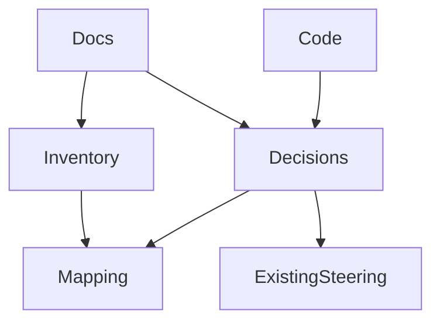
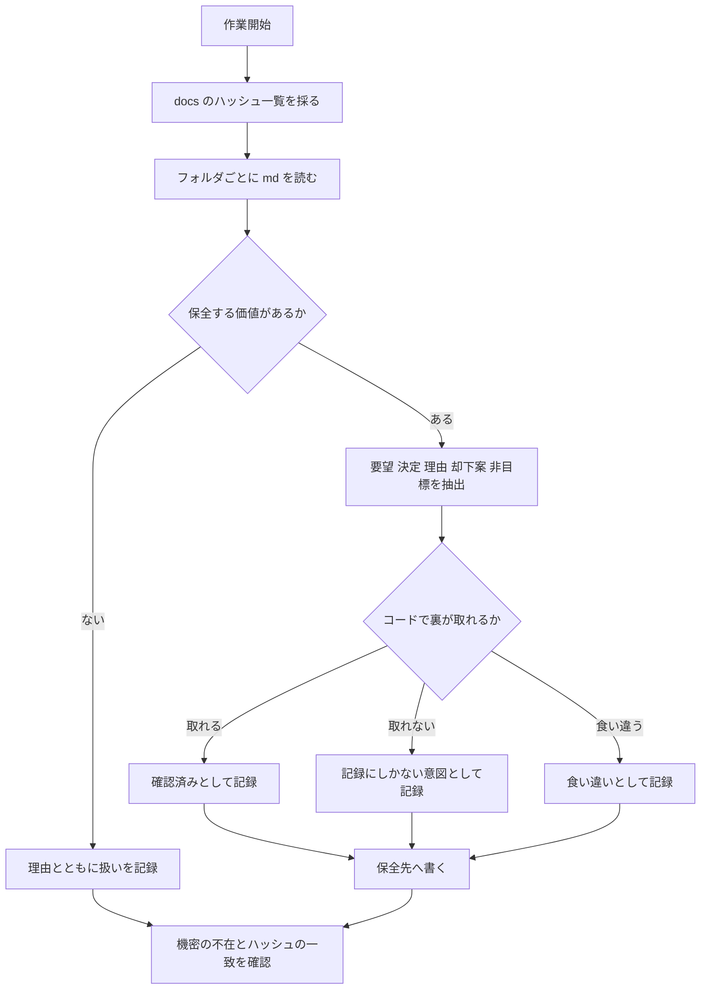

# Technical Design Document

## Overview

本フィーチャーは、旧AIモデルとの開発のやり取りが残る `docs/` 配下のドキュメントから、**利用者の要望・仕様上の決定とその理由・却下された案・明示的な非目標**を抽出し、Git 管理下へ保全する。

**Users**: 本アプリの開発者が、リファクタリング中に「この挙動は変えてよいのか」を判断するために参照する。後続の全スペックが判断根拠として利用する。

**Impact**: コードには一切変更を加えない。`.kiro/steering/` に保全先を1本追加し、既存の steering に理由を補い、スペック配下に索引を残す。`docs/` は読み取り専用として扱い、Git 管理外のまま維持する。

### Goals

- 42フォルダすべての扱い（抽出した／読んだが保全しない）が記録され、保全漏れがないと確認できる
- 却下された案・非目標・決定の理由が、判断のたびに参照できる場所にある
- 保全した記述の出どころを辿れる
- 保全先に環境固有の情報（ユーザー名、絶対パス、個人のアカウント名）が含まれない

### Non-Goals

- `docs/` を Git 管理下へ移すこと。開発者の判断で管理外のまま維持する
- ドキュメントの全文転記。抽出後の分量は250〜400行を見込む（入力3,132行に対し圧縮率およそ90%）
- 抽出した意図と現在のコードの食い違いの修正。記録にとどめ、後続のスペックに委ねる
- 当時の設定値の保全。値は現行コードを正とし、理由のみを保全する

## Boundary Commitments

### This Spec Owns

- `docs/` 配下の棚卸しと、フォルダごとの扱いの記録
- 要望・決定と理由・却下された案・非目標の抽出
- 保全先（`.kiro/steering/decisions.md`）の新設と、その内容
- 既存の steering に対する、理由の補足と事実誤認の訂正
- 抽出元と抽出先の対応関係の記録
- 機密情報の除去と、その確認

### Out of Boundary

- アプリケーションおよび検証ツールのコードの変更
- `docs/` 配下のファイルの変更・削除・移動、および `.gitignore` の変更
- 抽出した意図と現在のコードが食い違う場合の、コード側の修正
- 既存の steering の構成そのものの作り替え（理由の補足と訂正に留める）
- 新しい機能要求の発見や、要望の再解釈

### Allowed Dependencies

- `docs/` 配下の `.md` ファイルに対する読み取り専用のアクセス
- 現行コードに対する読み取り専用のアクセス（記述の裏取りのため）
- 既存の `.kiro/steering/` に対する読み取りと、理由の補足・訂正のための書き込み

### Revalidation Triggers

以下が生じた場合、本フィーチャーの成果の再検証を要する。

- `docs/` の内容が更新されたとき（現時点では更新の予定はない）
- 保全した意図と実際のコードの食い違いが、後続のスペックで解消されたとき（該当する記述の更新が必要）
- `.kiro/steering/` の構成が変わったとき（保全先の位置づけの見直しが必要）

## Architecture

### Existing Architecture Analysis

`.kiro/steering/` の5ファイル（product / tech / structure / performance / roadmap、計470行）はいずれも front matter を持たず、**全文がプロジェクトメモリとして常時読み込まれる**（CLAUDE.md の Steering Configuration）。したがって steering への追加は、毎回の文脈を圧迫する。

既存の5ファイルは**現状のコードから読み取れる事実**を記述しており、「なぜそうしたか」の経緯を持たない。本フィーチャーはこの欠けている層を補う。

### Architecture Pattern & Boundary Map



**Architecture Integration**:

- **Selected pattern**: 読み取り元（`docs/` と現行コード）から、性質の異なる2つの保全先へ振り分ける。判断のたびに参照する**意図**は常時読み込まれる `.kiro/steering/` へ、参照頻度の低い**索引**はスペック配下へ置く
- **Domain boundaries**: 「意図の保全」と「追跡可能性の担保」を分ける。前者は内容で、後者は出典で価値が決まる
- **Dependency direction**: `docs/` と現行コード → 索引 → 保全先。保全先は索引を参照するが、索引は保全先の内容に依存しない
- **Steering compliance**: steering の粒度方針（パターンと理由を残し、網羅的な列挙は避ける。1ファイル100〜200行、単一トピック）に従う

### Technology Stack

| Layer | Choice | Role in Feature | Notes |
|-------|--------|-----------------|-------|
| 成果物 | Markdown | 保全先と索引 | 既存の steering と同じ形式。front matter を持たない |
| 確認 | ファイルのハッシュ一覧、文字列検索 | `docs/` の不変性と機密の不在の確認 | コマンドの出力として証拠を残す |
| 依存パッケージ | なし | — | コードを変更しないため |

## File Structure Plan

### Directory Structure

```
.kiro/
├── steering/
│   └── decisions.md                    # 新設。却下された案・非目標・決定の理由（常時読み込み）
└── specs/
    └── requirements-preservation/
        ├── inventory.md                # 新設。42フォルダごとの扱いと理由
        └── mapping.md                  # 新設。抽出元と抽出先の対応関係
```

`decisions.md` は100〜200行を目安とし、単一のトピック（なぜ現在の仕様がこの形なのか）に絞る。索引2本には分量の上限を設けない。

### Modified Files

- `.kiro/steering/tech.md` — 設定ファイルの形式と拡張子の選定理由、ローカライズにおける例外を補う
- `.kiro/steering/performance.md` — 逐次スキャンを残す本来の理由を補う。記述と現行コードの食い違いがあれば訂正する
- `.kiro/steering/structure.md` — レイアウト切り替えの共通の基底クラスを設けた理由を補う（実装時に判明。`product.md` には補う対象がなかった）
- `.kiro/steering/roadmap.md` — フォルダ数の誤り（41→42）を訂正する

## System Flows

### 抽出と保全の流れ



裏取りの結果を3つに分けるのが本フィーチャーの中核である。旧AIモデルの記述を鵜呑みにせず、読み手が信頼度を判断できるようにする。

## Requirements Traceability

| Requirement | Summary | Components | Artifacts | Flows |
|-------------|---------|------------|-----------|-------|
| 1.1, 1.5, 1.6, 1.7 | 全フォルダの扱いの記録 | 棚卸し | `inventory.md` | 抽出と保全 |
| 1.2, 1.3, 1.4 | 抽出の根拠の限定 | 棚卸し | `inventory.md` | 抽出と保全 |
| 2.1, 2.5 | 要望と非目標の記録 | 意図の保全 | `decisions.md` | 抽出と保全 |
| 2.2, 2.3, 2.4 | 決定と理由、却下された案 | 意図の保全 | `decisions.md` | 抽出と保全 |
| 2.6, 2.7 | 粒度と重複の回避 | 意図の保全 | `decisions.md` | — |
| 3.1, 3.2 | 事実と意図の区別 | 裏取り | `decisions.md` | 抽出と保全 |
| 3.3, 3.4, 3.5 | 食い違いの記録 | 裏取り | `decisions.md` | 抽出と保全 |
| 4.1, 4.2, 4.3, 4.4 | 機密情報の除去 | 除去と確認 | `decisions.md`, `inventory.md`, `mapping.md` | 抽出と保全 |
| 4.5 | 機密の不在の確認 | 除去と確認 | 確認手順の出力 | 抽出と保全 |
| 5.1, 5.2, 5.3 | 追跡可能性 | 対応関係 | `mapping.md` | 抽出と保全 |
| 6.1, 6.2, 6.3, 6.5 | 既存の記録との整合 | 統合 | 既存 steering, `decisions.md` | — |
| 6.4 | 事実誤認の訂正 | 統合 | 既存 steering | — |
| 7.1, 7.2, 7.3, 7.4 | 作業の安全性 | 除去と確認 | — | 抽出と保全 |
| 7.5 | 不変性の確認 | 除去と確認 | 確認手順の出力 | 抽出と保全 |

## Components and Interfaces

| Component | Intent | Requirements | 主な成果物 |
|-----------|--------|--------------|-----------|
| 棚卸し | 全フォルダの扱いを決め、根拠を限定する | 1.1〜1.7 | `inventory.md` |
| 意図の保全 | 要望・決定・理由・却下案・非目標を残す | 2.1〜2.7 | `decisions.md` |
| 裏取り | 記述をコードと突き合わせ、信頼度を分ける | 3.1〜3.5 | `decisions.md` の記載区分 |
| 統合 | 既存の steering と重複させず、理由を補い、誤りを訂正する | 6.1〜6.5 | 既存 steering の更新 |
| 対応関係 | 抽出元と抽出先を辿れるようにする | 5.1〜5.3 | `mapping.md` |
| 除去と確認 | 機密を持ち込まず、`docs/` の不変を示す | 4.1〜4.5, 7.1〜7.5 | 確認手順の出力 |

### 棚卸し

#### Responsibilities

- `docs/` 配下の全フォルダについて、「抽出した」「読んだが保全しない」のいずれかを決める
- 抽出の根拠を `.md` に限定し、編集履歴のスナップショットと付随するメタデータを根拠に用いない
- フォルダ名ではなく内容を根拠に分類する

#### 記録の形

`inventory.md` は次の列を持つ表とする。

| 列 | 内容 |
|----|------|
| フォルダ | `docs/` 配下の名前 |
| 分類 | 機能追加／仕様決定／技術判断／不具合修正／却下・撤回／作業ログ／空 |
| 扱い | 抽出した／読んだが保全しない |
| 理由 | 保全しない場合は、その判断の根拠を1行で |
| 参照した `.md` | 根拠として読んだファイル名 |

- Invariants: すべてのフォルダがちょうど1行を持つ。「読んだが保全しない」の行は理由が空でない

### 意図の保全

#### Responsibilities

- 要望・決定と理由・却下された案・非目標を、`decisions.md` に記録する
- 現在のコードから読み取れる事実の再掲を避ける
- 網羅的な列挙を避け、パターンと理由を残す

#### 記録の形

`decisions.md` は次の節で構成する。

| 節 | 内容 | 見込み |
|----|------|--------|
| 一度試して捨てた案 | 何を試し、なぜ捨てたか、再提案してはいけない条件 | 50〜70行 |
| 明示的な非目標 | やらないと決めたことと、その理由 | 20〜30行 |
| 決定とその理由 | 決定の内容と背景。値ではなく考え方 | 50〜70行 |
| 要望に由来する仕様 | 要望の内容と、そこから導かれた仕様 | 30〜40行 |

- 冒頭に、索引（`inventory.md` と `mapping.md`）の所在を記す
- Invariants: 各項目が出典（フォルダ名とファイル名）を持つ。分量が200行を超えない

### 裏取り

#### Responsibilities

- 記録された内容を現行コードと突き合わせ、3つに分ける
- 値ではなく理由を保全する。値を記す場合はコードで確認したうえで確認済みである旨を添える

#### 記載区分

| 区分 | 意味 | 扱い |
|------|------|------|
| 確認済み | コードで裏が取れた | そのまま記録する |
| 意図のみ | 記録にしか書かれておらず、コードからは確かめられない | 出典を示し、確かめられない旨を添える |
| 食い違い | 記録とコードが異なる | 両方を記し、コードを正とする。修正はしない |

- Invariants: すべての項目がいずれか1つの区分を持つ。「食い違い」の項目は、後続のどのスペックが扱うかを添える

### 統合

#### Responsibilities

- 既存の steering に既出の内容を重ねて書かない
- 既存の記述に理由が欠けている決定について、理由を補う
- 既存の記述に事実と異なるものがあれば訂正する

#### 既知の補足対象

| 既存の記述 | 補う内容 |
|-----------|---------|
| `tech.md` の設定ファイルの前提 | 拡張子と形式の選定理由 |
| `tech.md` のローカライズ | 訳さないと決めた例外の存在 |
| `performance.md` の逐次スキャン | 残している本来の理由 |
| `roadmap.md` のフォルダ数 | 実測との差の訂正 |

- Invariants: 既存ファイルへの追記は、その節の主題から外れない

### 対応関係

#### Responsibilities

- 保全した各記述について、抽出元のフォルダとファイルを辿れるようにする
- 抽出元が失われた場合に何が参照できなくなるかを示す

#### 記録の形

`mapping.md` は「抽出元（フォルダ／ファイル）」「抽出先（ファイル／節）」「内容の要約」を列に持つ表とする。

- Invariants: `decisions.md` の各項目が、少なくとも1行の対応を持つ

### 除去と確認

#### Responsibilities

- 保全先に環境固有の情報を持ち込まない
- `docs/` が作業前と同一であることを示す

#### 確認手順

| 確認 | 方法 | 期待 |
|------|------|------|
| 機密の不在 | 保全先3ファイルと既存 steering に対し、ユーザー名・`file:///` 形式のパス・ドライブ文字から始まる絶対パス・個人のアカウント名・旧ツール由来の内部マーカーを検索する | いずれも0件 |
| `docs/` の不変 | 作業前に採った全ファイルのハッシュ一覧と、作業後の一覧を照合する | 完全一致 |
| 網羅性 | `inventory.md` の行数と、`docs/` 配下のフォルダ数を照合する | 一致 |
| 出典の整合 | `mapping.md` が挙げるフォルダ名が、`docs/` に実在することを照合する | すべて実在 |

- Invariants: 確認はコマンドの出力として残す。主張だけで済ませない

## Data Models

本フィーチャーはデータベースを持たない。成果物である Markdown の構造は、各コンポーネントの「記録の形」に定義する。

## Error Handling

### Error Strategy

文書作業であり実行時のエラーはない。判断に迷う場面の扱いを定める。

### 判断に迷う場面と扱い

| 場面 | 扱い |
|------|------|
| 記録の内容が、保全する価値があるか判断できない | 保全する側に倒す。分量の上限に触れる場合のみ削る |
| 記録どうしが矛盾している | 矛盾していることを含めて記録する（要件3.5） |
| 記録とコードが食い違う | コードを正とし、食い違いを記録する。修正はしない（要件3.3） |
| 機密かどうか判断できない | 持ち込まない側に倒す |
| 既存の steering と重複するか判断できない | 既存を優先し、理由だけを補う |

## Testing Strategy

自動テストの対象となるコードを持たないため、確認は上記の「確認手順」と、記録に対する読み合わせで行う。

### 機械的な確認

- 保全先に機密が含まれないこと（検索して0件）
- `docs/` が作業前と同一であること（ハッシュ一覧の一致）
- `inventory.md` が `docs/` の全フォルダを網羅すること（行数の一致）
- `mapping.md` の挙げるフォルダが実在すること
- `decisions.md` が分量の目安に収まること

### 読み合わせによる確認

- 却下された案について、「何を試し、なぜ捨てたか、再提案してはいけない条件」が揃っていること
- 各項目が3つの区分（確認済み／意図のみ／食い違い）のいずれかを持つこと
- 現在のコードから読み取れる事実の再掲になっていないこと
- 既存の steering と同じ内容を重ねて書いていないこと

## Security Considerations

保全先は Git 管理下に入り、リポジトリは公開される。したがって機密の除去は本フィーチャーの成否に直結する。除去対象は、Windows のユーザー名、ローカルの絶対パス、個人のアカウント名を含む URL、旧開発ツール由来の内部マーカーとする。判断に迷う場合は持ち込まない。
