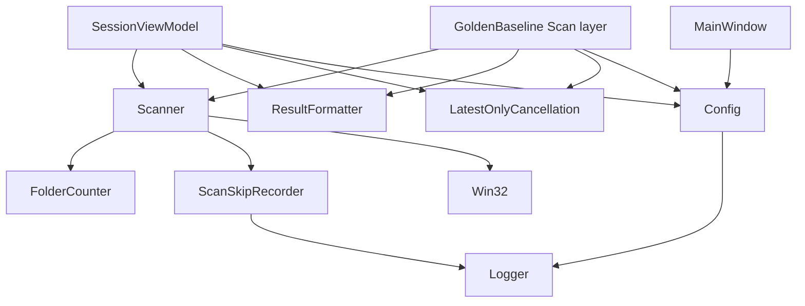
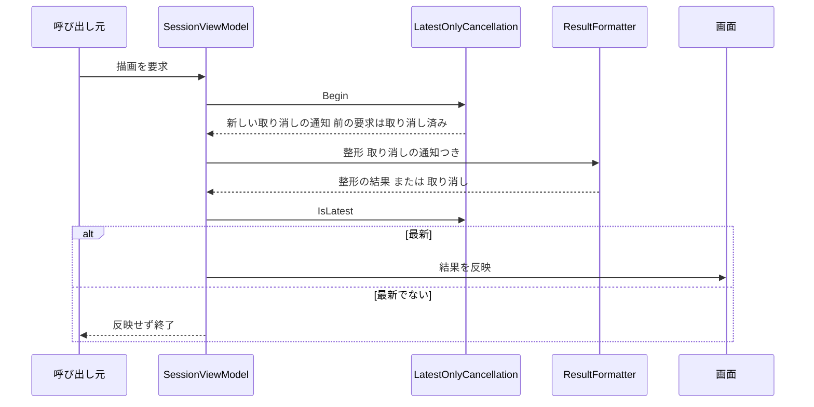

# Technical Design Document

## Overview

本フィーチャーは、Large Folder Finder の走査を「正しく数え、失敗が見える」状態にする。集計値（どのフォルダが何バイトか）は一切変えずに、進捗率の分母となる事前カウントを長いパスに対応させ、描画をタブごとに最新の1件だけ有効にし、失敗の扱いを方針に沿ってそろえる。

**Users**: 走査の途中経過と結果を見て容量整理を判断する利用者と、このあと走査を速度のために作り替える開発者（`scan-performance`）。

**Impact**: 事前カウントから手書きの P/Invoke を除き、使われていない OS 呼び出しの宣言を消す。描画の取り消しをタブごとに効かせる。走査のスキップ、描画の中の例外、`Config.txt` の解析の失敗などを記録し、必要なものは利用者に知らせる。

### Goals
- 事前カウントが 260 文字を超えるパス（日本語を含む）を数え、完了時に走査で数えた数と一致する
- 走査の経路が OS の長いパスの設定と実行ファイルの宣言に依存しない
- 古い描画が新しい描画を上書きせず、完了時に最終結果が表示される
- 意図して無視するもの以外の失敗が記録され、`Config.txt` の解析の失敗は利用者に伝わる

### Non-Goals
- 走査の速度・並列度の改善、結果のツリーの構造の変更（`scan-performance`）
- スキップの件数や失敗の新しい画面表示の設計（`ui-redesign`）
- ログの仕組みそのものの作り替え、一般的な死んだコードの除去、失われた要望の復元（`architecture-refactoring`）

## Boundary Commitments

### This Spec Owns
- 事前カウントの実装（深さの意味、数える対象の集合）と、走査の完了時の最後の進捗の報告
- 走査中に列挙できなかった対象の記録（種類の区別と、完了時のまとめての書き出し）
- 描画のタブごとの取り消しと、取り消された描画を画面に反映しない判定
- 進捗の受け手からの開発用ダイアログの除去と、進捗率の上限
- 失敗の扱いの方針（分類と、意図して無視する理由の書式）と、本体の `catch` への適用
- `Config.txt` の解析の失敗の記録と利用者への通知、その訳文（13言語）
- `Helpers/Win32.cs` の宣言の整理（事前カウント用と未使用の宣言の除去）
- 上記を確かめる、走査の検証ツールの自己検証の項目

### Out of Boundary
- 本スキャンの集計の処理（ファイル・フォルダの列挙、サイズの加算、物理サイズ換算の式）。**本フィーチャーは集計値を変えない**
- 並列度・速度・ツリーの構造（`scan-performance`）
- 結果の整形の中身（`ResultFormatter` の出力の書式）。取り消しの通知を受け取るための引数の受け渡しだけを行う
- 画面の構成と新しい表示領域（`ui-redesign`）
- 検証ツールの既存の判定規則（`BaselineComparer`、`KnownIssueAnalyzer`、`ScanRunner.DetectSkippedPaths`）の変更

### Allowed Dependencies
- .NET 10 の BCL（`System.IO.DirectoryInfo`、`EnumerationOptions`、`System.Threading`、`System.Collections.Concurrent`）
- 既存の `Logger`、`LocalizationManager`、`Config`
- 検証ツール（`Tools/GoldenBaseline`）がアプリの `Scanner`・`ResultFormatter`・`Config`・新設の `LatestOnlyCancellation` を呼ぶこと（既存の `Scan/` 層の規約どおり）
- 新しいパッケージは追加しない

### Revalidation Triggers
- 事前カウントの数える対象の集合、または本スキャンの進捗の数え方を変えるとき → 要件1.4 の一致が崩れる。`scan-performance` が列挙を作り替える際に必ず再確認する
- `GetDiskFreeSpace` によるクラスタサイズの計算を変えるとき → 検証ツールの `ScanRunner.MeasureClusterSize` と乖離する
- `SessionData.RenderCancellation` の型や意味を変えるとき → 描画の取り消しが効かなくなる（`architecture-refactoring` の死んだコードの除去で消されないこと）
- 描画の取り消しの判定の試験を、検証ツールから本格的な単体試験の置き場へ移すとき（`architecture-refactoring`）

## Architecture

### Existing Architecture Analysis
- 走査は `Services/Scanner.cs` の静的メソッド。事前カウント（`CountFoldersAsync` → `CountFoldersRecursive`、P/Invoke）と本スキャン（`RunScan` → `ScanRecursiveInternal`、BCL）に分かれる
- 走査中の暫定ツリーは `IProgress<ScanProgress>.CurrentResult` で5秒ごとに画面へ渡る。読み手の `ResultFormatter` は子の一覧を `lock (node.Children)` の下で写し取る。**この規約を本フィーチャーでも前提として維持する**
- 描画は `SessionViewModel.RenderResult()` に集約されている（`MainWindow` と `MainViewModel` の呼び出しもここに至る）。取り消しは `CancellationToken.None` で効いておらず、`SessionData.RenderCts` は使われていない
- `Config.Instance` の最初の読み込みは XAML のバインディング経由で時点が不定。走査のたびに `Config.Load()` が再度呼ばれる

### Architecture Pattern & Boundary Map



- **依存の方向**: Views → ViewModels → Services → Models。Helpers（`LatestOnlyCancellation`、`Win32`）はどの層からも使える（structure.md の既存の規約）
- **新しい部品の理由**: `FolderCounter` は事前カウントの集合の規則を1箇所に閉じ込めるため。`ScanSkipRecorder` はスキップの収集と書き出しを走査の処理から切り離すため。`LatestOnlyCancellation` は取り消しの判定を画面の部品から独立に試験できるようにするため

### Technology Stack
| Layer | Choice | Role | Notes |
|---|---|---|---|
| 列挙 | `DirectoryInfo.EnumerateDirectories(string, EnumerationOptions)` | 事前カウント | .NET 10 は長いパスを内部で拡張長の形式に変換する。既定の `AttributesToSkip` は隠し・システムを除くため明示する |
| 並行 | `CancellationTokenSource`、`ConcurrentQueue<T>` | 描画の取り消し、スキップの収集 | 新しいパッケージなし |

## File Structure Plan

### New Files
```
Services/
├── FolderCounter.cs           # 事前カウント。深さの上限つきで、本スキャンと同じ集合のフォルダを数える
└── ScanSkipRecorder.cs        # 走査中に列挙できなかった対象を種類つきで集め、完了時にまとめてログへ書く
Models/
└── ScanSkip.cs                # スキップの1件（パス・種類・理由）と種類の列挙
Helpers/
└── LatestOnlyCancellation.cs  # 新しい要求を始めると前の要求を取り消し、最新かどうかを判定する
```

### Modified Files
- `Services/Scanner.cs` — `CountFoldersAsync` を `FolderCounter` に委ね、`CountFoldersRecursive` を削除する。列挙の `catch` を種類別にして `ScanSkipRecorder` へ記録する。完了時（取り消し・中断を含む）にスキップを書き出し、正常な完了時に最後の進捗を1回報告する
- `Models/ScanProgress.cs` — 完了の印（`IsFinal`）とスキップの一覧（`Skipped`）を足す
- `Helpers/Win32.cs` — `FindFirstFileEx`・`FindNextFile`・`FindClose`・`WIN32_FIND_DATA`・関連の定数と列挙・`ShowWindow`・`GetCompressedFileSize` を除く。クラスの説明を実態（クラスタサイズとメモリの切り詰めのみ）に改める
- `Models/SessionData.cs` — 未使用の `RenderCts` を `RenderCancellation`（`LatestOnlyCancellation`、保存しない）に置き換える
- `ViewModels/SessionViewModel.cs` — 描画に取り消しを通し、最新でない描画を画面に反映しない。描画の中の例外を記録する。進捗の受け手から開発用ダイアログを除き、進捗率を100%で頭打ちにする。走査開始時の `Config.Load()` の失敗を知らせる
- `Services/ResultFormatter.cs` — 既に受け取っている取り消しの通知を、描画から渡される値で使う（書式は変えない）
- `Models/Config.cs` — 解析の失敗を記録し、失敗の内容を保持する。`Save` の失敗を記録する。試験のために読み込み元のパスを受け取る入口を足す
- `Views/MainWindow.xaml.cs` — 起動の初期化の後に `Config.txt` の解析の失敗を知らせる。B に分類された `catch` に記録を足す。A に分類された `catch` に理由を残す
- `Views/TextViewer.xaml.cs` — B に分類された `catch` に記録を足す。A に理由を残す
- `Services/Logger.cs`、`Services/TreeFilter.cs`、`Services/LocalizationManager.cs` — A に分類された `catch` に理由を決まった書式で残す
- `Services/LocalizationManager.cs` と `Resources/Languages/*.yaml`（13言語） — 設定の解析の失敗を知らせる文言のキーを1つ足す
- `Tools/GoldenBaseline/Scan/ScanRunner.cs` — 事前カウントを呼ぶ入口と、最後の進捗の数・スキップの一覧を結果に含める
- `Tools/GoldenBaseline/SelfCheck/SelfChecks.cs` — 本フィーチャーの検証項目を足す
- `.kiro/steering/tech.md`・`decisions.md` — 事前カウントの制約の解消、P/Invoke の一覧、描画の取り消しの食い違いの解消、失敗の扱いの方針を反映する

## System Flows

### 描画のタブごとの取り消し


- 取り消しは同じタブの `SessionData` が持つ `LatestOnlyCancellation` の中だけで起きる。別のタブの描画には触れない（要件6.2）
- 走査の完了時の描画は、それまでの走査中の描画をすべて取り消すので、最後に画面に残るのは最終結果になる（要件3.3）
- 取り消しによる終了は失敗として記録しない。それ以外の例外は記録し、画面は直前の状態のまま残す

## Requirements Traceability

| Requirement | Summary | Components | Flows |
|---|---|---|---|
| 1.1, 1.2 | 長いパス（日本語を含む）を事前カウントに含める | FolderCounter | — |
| 1.3 | 進捗率が100%を超えない | SessionViewModel（進捗の受け手）、FolderCounter | — |
| 1.4 | 完了時に事前カウントと走査の数が一致 | FolderCounter、Scanner（最後の報告） | — |
| 1.5 | アクセス拒否で止まらず、リパースポイントを除く | FolderCounter | — |
| 1.6 | 事前カウントを省いたときは残り時間を出さない | SessionViewModel（既存の経路を維持） | — |
| 2.1 | 長いパスの扱いが OS の設定と宣言に依存しない | FolderCounter、Win32 | — |
| 2.2 | 未使用の OS 呼び出しの宣言を含まない | Win32 | — |
| 2.3, 2.5 | 本スキャンの集計値が変わらず、期待値データと一致 | Scanner（集計の処理に触れない） | — |
| 2.4 | 物理サイズ換算の集計値が変わらない | Scanner（`GetClusterSize` を維持）、Win32 | — |
| 3.1, 3.2 | 走査中の読み書きの競合が無く、一貫した結果を表示 | ResultFormatter（写し取りの規約）、SessionViewModel | 描画の取り消し |
| 3.3 | 完了時に最終結果を表示 | LatestOnlyCancellation、SessionViewModel | 描画の取り消し |
| 3.4 | 通知の間隔を短くしない | Scanner（完了時の1回のみ追加） | — |
| 4.1 | 開発用ダイアログを出さない | SessionViewModel | — |
| 4.2 | 途中経過の更新の失敗を記録して続ける | SessionViewModel | — |
| 5.1 | 意図して無視する種類を定め、それ以外を捨てない | 失敗の扱いの方針（本体の `catch` 全件） | — |
| 5.2 | それ以外の失敗を記録する | Config、MainWindow、TextViewer、SessionViewModel（描画） | — |
| 5.3 | スキップを続けて記録する | Scanner、ScanSkipRecorder、ScanSkip | — |
| 5.4, 5.5 | `Config.txt` の解析の失敗を記録し知らせる | Config、MainWindow、SessionViewModel、LocalizationManager | — |
| 5.6 | 走査の想定外の中断を表示し記録する | SessionViewModel（既存の経路を維持） | — |
| 6.1, 6.2, 6.3 | 描画のタブごとの取り消し | LatestOnlyCancellation、SessionData、SessionViewModel、ResultFormatter | 描画の取り消し |

## Components and Interfaces

| Component | Layer | Intent | Req Coverage | Key Dependencies |
|---|---|---|---|---|
| FolderCounter | Services | 本スキャンと同じ集合で事前カウントする | 1.1, 1.2, 1.4, 1.5, 2.1 | BCL 列挙 (P0) |
| ScanSkipRecorder / ScanSkip | Services / Models | スキップの収集と書き出し | 5.3 | Logger (P0) |
| Scanner（変更） | Services | 委譲・スキップの記録・最後の報告 | 1.4, 2.3, 2.4, 3.4, 5.3 | FolderCounter, ScanSkipRecorder (P0) |
| LatestOnlyCancellation | Helpers | 最新の要求だけを有効にする | 3.3, 6.1, 6.2, 6.3 | なし |
| SessionViewModel（変更） | ViewModels | 描画の取り消し・記録・進捗の受け手 | 1.3, 1.6, 3.1, 3.2, 3.3, 4.1, 4.2, 5.2, 5.5, 5.6, 6.1, 6.2, 6.3 | LatestOnlyCancellation, Config (P0) |
| Config（変更） | Models | 解析の失敗の記録と保持 | 5.2, 5.4, 5.5 | Logger (P0) |
| Win32（変更） | Helpers | 宣言の整理 | 2.1, 2.2, 2.4 | なし |
| 検証の追加 | Tools/GoldenBaseline | 上記の試験 | 1.1〜1.5, 2.1〜2.5, 3.1〜3.3, 5.3, 5.4, 6.1〜6.3 | アプリの部品 (P0) |

### Services

#### FolderCounter
| Field | Detail |
|---|---|
| Intent | 深さの上限まで、本スキャンと同じ集合のフォルダを数える |
| Requirements | 1.1, 1.2, 1.4, 1.5, 2.1 |

**Responsibilities & Constraints**
- 起点のフォルダを深さ0として1と数え、深さが上限に達したらそれ以上潜らない（既存の `CountFoldersRecursive` と同じ意味）
- 子の列挙には `EnumerationOptions { AttributesToSkip = FileAttributes.ReparsePoint, IgnoreInaccessible = true, ReturnSpecialDirectories = false, RecurseSubdirectories = false }` を使う。**隠し・システム属性のフォルダは数える**（本スキャンの既定の列挙と同じ）
- アクセスできないフォルダは、そのフォルダ自身を数え、配下は数えない（本スキャンと同じ）。事前カウントでスキップを記録はしない（本スキャンが同じ対象を記録するため二重にしない）
- 取り消しの通知を各階層で確かめる

```csharp
internal static class FolderCounter
{
    /// <summary>深さ0〜maxDepth のフォルダ数（起点を含む）を返す。</summary>
    public static int Count(string rootPath, int maxDepth, CancellationToken token);
}
```
- Preconditions: `rootPath` が存在すること。`maxDepth >= 0`
- Postconditions: 返す数は、同じ木を本スキャンが深さ `maxDepth` まで数えた数と一致する
- `Scanner.CountFoldersAsync(string, int, CancellationToken)` の公開の形は変えず、中で `FolderCounter.Count` を `Task.Run` で呼ぶ

#### ScanSkipRecorder / ScanSkip
| Field | Detail |
|---|---|
| Intent | 列挙できなかった対象を種類つきで集め、走査の終わりに1回でログへ書く |
| Requirements | 5.3 |

```csharp
public enum ScanSkipKind { AccessDenied, NotFound, IoError }

public sealed record ScanSkip(string Path, ScanSkipKind Kind, string Reason);

internal sealed class ScanSkipRecorder
{
    /// <summary>例外の型から種類を決めて記録する。並行に呼べる。</summary>
    public void Record(string path, Exception ex);

    /// <summary>記録の写しを返す。</summary>
    public IReadOnlyList<ScanSkip> Snapshot();

    /// <summary>件数と全件を1回の Logger.Log で書く。2回目以降は何もしない。</summary>
    public void Flush(string scanRootPath);
}
```
- 種類の決め方: `UnauthorizedAccessException` → `AccessDenied`、`DirectoryNotFoundException`・`FileNotFoundException` → `NotFound`、その他の `IOException` → `IoError`。**それ以外の例外は記録の対象にせず、走査の想定外の失敗として上に伝える**（要件5.6 の経路）
- 並行の収集には `ConcurrentQueue<ScanSkip>` を使う
- `Flush` は走査の完了・取り消し・中断のいずれでも `finally` から呼ぶ

#### Scanner（変更点）
- `ScanRecursiveInternal` のファイル列挙とフォルダ列挙の `catch { }` を、`IOException` と `UnauthorizedAccessException` の捕捉に改め、`ScanSkipRecorder.Record` を呼ぶ。**捕捉した後の動き（そのフォルダの残りを飛ばして走査を続ける）は変えない**（集計値を変えないため）
- `RunScan` の終わり（`finally` を含む）で `Flush` を呼び、正常な完了のときは `IsFinal = true` と最後の数・スキップの一覧を載せた進捗を1回報告する
- `GetClusterSize` とその P/Invoke は変えない

### Helpers

#### LatestOnlyCancellation
| Field | Detail |
|---|---|
| Intent | 新しい要求を始めると前の要求を取り消し、渡した通知が最新かを判定する |
| Requirements | 3.3, 6.1, 6.2, 6.3 |

```csharp
public sealed class LatestOnlyCancellation
{
    /// <summary>前の要求を取り消し、新しい要求の取り消しの通知を返す。スレッドセーフ。</summary>
    public CancellationToken Begin();

    /// <summary>通知が最新の要求のものであり、取り消されていなければ true。</summary>
    public bool IsLatest(CancellationToken token);

    /// <summary>進行中の要求を取り消す（タブを閉じるときなど）。</summary>
    public void CancelAll();
}
```
- Invariants: 最新の要求の通知だけが取り消されていない。インスタンスどうしは互いに影響しない
- 取り消し済みの `CancellationTokenSource` は、次の `Begin` で破棄する

### ViewModels

#### SessionViewModel（変更点）
- `RenderResult()` の最初で `_model.RenderCancellation.Begin()` を呼び、得た通知を `BuildFilterCache`・`CalculateMaxLineLength`・`PrintTreeRecursive`・行の組み立てに渡す。**画面へ反映する直前に `IsLatest` を確かめ、最新でなければ反映しない**
- `RenderResult()` 全体を `try` で囲み、`OperationCanceledException` は記録せずに終える。それ以外は `Logger.Log` に記録し、画面は直前の状態のまま残す（投げっぱなしの呼び出しでも失敗が消えない）
- 進捗の受け手: `MessageBox.Show(..., "Debug")` と `_hasShownProgressError` を除く。記録は残し、走査は続ける。進捗率は `Math.Min(100, …)` で頭打ちにする
- 走査開始時: `Config.Load()` の後に、未通知の解析の失敗があれば知らせる（下記）

### Models

#### Config（変更点）
```csharp
public class Config
{
    public static Config Load();                                  // 既存。LoadFrom(既定のパス) を呼ぶ
    public static Config LoadFrom(string path);                   // 新設。試験のため
    public static string? LastLoadError { get; }                  // 直近の読み込みの失敗の内容。成功なら null
    public static bool TryTakeUnnotifiedError(out string error);  // 未通知の失敗があれば返し、通知済みにする
    public void Save();                                           // 既存。失敗を記録する
}
```
- 解析に失敗したら、既定の設定を返し、`Logger.Log` に内容と理由を記録し、`LastLoadError` に保持する（要件5.4）
- ファイルが無いときは従来どおり既定の設定を書き出す。これは失敗ではない
- 同じ内容の失敗は一度だけ通知する。読み込みに成功したら通知済みの記録を消す

#### 利用者への通知（要件5.5）
- 起動時: `MainWindow` の初期化の後（`ContentRendered`）に `Config.Load()` を明示的に呼び、`TryTakeUnnotifiedError` が真ならダイアログで知らせる
- 走査開始時: `SessionViewModel` が `Config.Load()` の後に同じ判定をし、真ならダイアログで知らせてから、既定の設定で走査を続ける
- 文言は新しいキー（例: `ConfigParseError`、差し込み `{0}` に理由）で13言語に用意し、`Tools/LocalizationCheck` の `check` を通す

### 失敗の扱いの方針（要件5.1、5.2）
- **A 意図して無視する**: 捨てる理由をその場に `// 意図して無視: <理由>` の書式で残す。対象は research.md の監査の A の10件
- **B 記録する**: `Logger.Log(<何をしていたか>, ex)` を呼ぶ。対象は B の4件と、投げっぱなしの描画
- **C 走査のスキップ**: `ScanSkipRecorder` に記録する
- **D 既に適切**: 変えない
- **E 利用者に知らせる**: `Config.Load`
- `Logger` 自身の失敗は循環を避けるため A とする

## Error Handling
- 走査中の列挙の失敗は走査を止めない（既存の決定）。種類と理由を記録する
- 描画の失敗は画面を直前の状態に保ち、記録する。取り消しは失敗として扱わない
- 走査の想定外の中断は、既存どおり状態表示に内容を出し記録する（要件5.6）
- 設定の解析の失敗は既定の設定で続け、記録し、知らせる

## Testing Strategy

検証は走査の検証ツール（`Tools/GoldenBaseline`）の自己検証に加え、既存のテスト（`dotnet test --solution`）から実行される。**試験の前後に利用者のアプリデータを退避・復元する**（テストは本体の `Logger` 経由でログを書く）。

### 基盤（変更の前に一度だけ）
- 物理サイズ換算ありの期待値を変更前の版で作り、リポジトリ外（`artifacts/`）に控える。変更後に同じ条件で比較し一致を確かめる（要件2.4）

### 自己検証に加える項目
1. **事前カウントの長いパス（1.1, 1.2, 2.1）**: フィクスチャを作り、深さの上限6で数えた数が、`FixtureSpec.Standard` から導いたフォルダ数（ASCII と日本語の長い連鎖の全階層を含む）と一致する。置き換え前は長い連鎖の深い階層を数え損ねて不一致になる（RED）
2. **事前カウントと走査の一致（1.4, 1.5）**: 同じフィクスチャで、深さの上限3と6のそれぞれについて、事前カウントの数と走査の最後の報告の数が一致する。`access_denied_folder` を含む
3. **集計値の不変（2.3, 2.5）**: 既存の `compare`（期待値データとの比較）が一致のまま
4. **宣言の整理（2.2）**: 本体の `Win32` に `FindFirstFileEx`・`FindNextFile`・`FindClose`・`ShowWindow`・`GetCompressedFileSize` の宣言が無いことを反射で確かめる
5. **走査と読み取りの並行（3.1, 3.2）**: 大きめの合成の木を走査しながら、進捗で渡る暫定ツリーに対して `ResultFormatter.BuildFilterCache` を繰り返し呼び、例外が起きない
6. **最新だけが有効（3.3, 6.1〜6.3）**: `LatestOnlyCancellation` で、2回目の `Begin` が1回目を取り消し、1回目の通知で `IsLatest` が偽になる。別のインスタンスの `Begin` は互いに影響しない。`CancelAll` の後は最新の通知も取り消される
7. **スキップの記録（5.3）**: `access_denied_folder` を含むフィクスチャを走査し、最後の報告のスキップの一覧にそのパスが `AccessDenied` で含まれ、走査が完了している
8. **設定の解析の失敗（5.4）**: 壊れた内容の一時ファイルを `Config.LoadFrom` で読み、既定の設定が返り、`LastLoadError` に理由が入り、`TryTakeUnnotifiedError` が一度だけ真になる

### 翻訳
- 新しいキーについて `LocalizationCheck.exe check` が問題なし（13言語）

### 利用者の手による確認
- 大きなフォルダの走査中にタブを切り替え、各タブの表示が乱れないこと。完了時に最終結果が表示されること（要件3、6）
- `Config.txt` をわざと壊して起動し、既定の設定で動いていることが知らされること（要件5.5）
- 開発用のダイアログが出ないこと（要件4.1）
