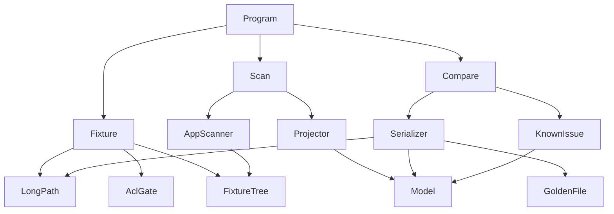
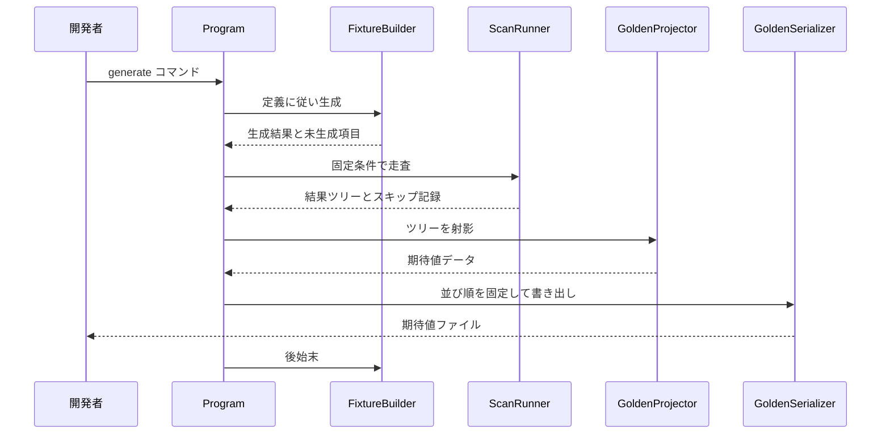
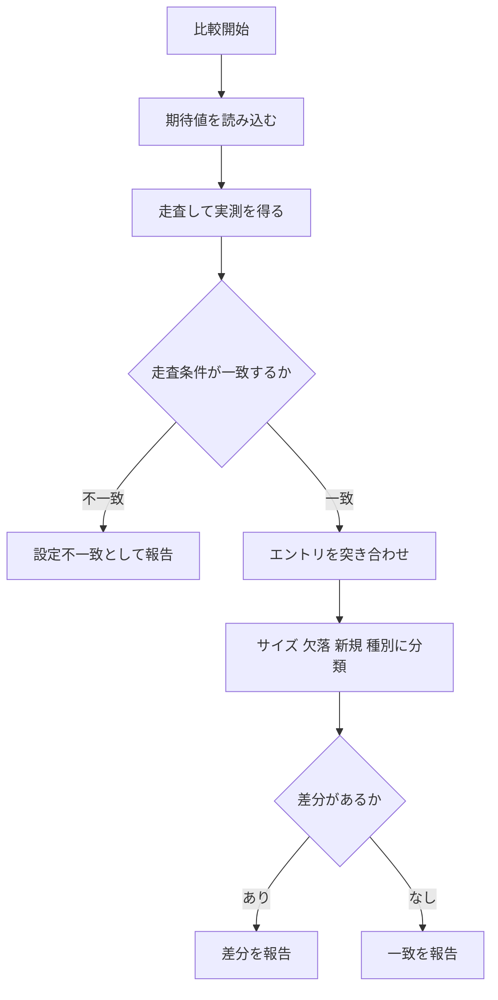

# Technical Design Document

## Overview

本フィーチャーは、Large Folder Finder の走査結果を「相対パス・種別・バイト単位のサイズ」の一覧として固定し、変更前後を突き合わせる仕組みを提供する。以降のリファクタリングと .NET 10 移行において、集計結果が変わっていないことを機械的に確認するための安全網である。

**Users**: 本アプリの開発者が、走査ロジックに手を入れる前後で実行し、差分の有無を判定するために利用する。

**Impact**: 被テストアプリ本体には変更を加えない。検証用の独立したコンソールツールと、Git 管理下に置く期待値データファイルを新設する。本体側の変更は、新規ツールのソースが本体のビルドに取り込まれないようにするためのプロジェクト設定のみに留める。

### Goals

- 走査結果を、実行基盤の版・保存形式・内部クラス構造のいずれにも依存しない形式で記録する
- 260文字超・日本語・空・権限なしといった境界条件を含むフィクスチャを、再現可能に生成する
- 期待値と実測の差分を、サイズ不一致・欠落・新規・種別不一致に分類して報告する
- 移行前に生成した期待値データを、移行後もそのまま比較に使用できる

### Non-Goals

- 走査ロジックの不具合を修正すること。本フィーチャーは現行の挙動を記録するに留まる
- 走査速度の計測と回帰判定。performance.md の実測手順が担う
- 表示層（整形結果、UI）の検証
- テストフレームワークの導入と CI への組み込み。`dotnet10-migration` が担う

## Boundary Commitments

### This Spec Owns

- 期待値データのファイル形式と、その読み書きの契約
- フィクスチャの宣言的定義、生成、後始末
- 走査を固定条件で実行し、結果を期待値データへ射影する経路
- 期待値と実測の比較および差分の分類・報告
- フィクスチャ定義と観測結果の差から、既知の不具合に由来する欠落を識別する判定

### Out of Boundary

- 被テストアプリの走査ロジック、整形処理、UI、保存形式への変更
- 被テストアプリへの `longPathAware` マニフェスト付与およびレジストリ変更。**これを行うと記録対象の不具合が消滅するため、本スペックは明示的にこれを禁じる**
- 走査時間の計測、性能の判定
- 期待値データを自動実行に組み込むこと。本ツールは終了コードで判定結果を示すのみで、呼び出し側の自動化は担わない

### Allowed Dependencies

- 被テストアプリの `Scanner`、`FolderInfo`、`Config` に対する読み取り専用の依存（走査の実行と結果の射影のためにのみ用いる）
- .NET のファイルシステム API およびアクセス制御 API
- 上記以外の新規外部パッケージは導入しない

### Revalidation Triggers

以下の変更が生じた場合、本ツールおよび期待値データの再検証を要する。

- `FolderInfo` の構造変更、または `Scanner.RunScan` のシグネチャ変更（`scan-performance` で発生見込み）
- 走査対象の実行基盤の変更（`dotnet10-migration` での TFM 変更、およびアクセス制御 API の変更）
- 期待値データのファイル形式の変更。既存の期待値ファイルが読めなくなるため、形式バージョンの更新と再生成が必要
- 既知の不具合が修正され、観測結果が変化したとき（`scan-correctness` で発生見込み）

## Architecture

### Existing Architecture Analysis

被テストアプリはレイヤー別のフラット構成で、`Services/Scanner.cs` が走査を、`Models/FolderInfo.cs` が結果ツリーを担う。`Scanner.RunScan` は走査条件を引数で受け取る静的メソッドであり、UI に依存しない。したがって本体を改変せずに外部から呼び出せる。

一方で以下の制約を尊重する必要がある。

- `Config.Instance` は実行ファイルと同階層の `Config.txt` を読む。ツールから走査する際は物理サイズ換算の設定が結果に影響するため、明示的に制御する
- `Logger` は静的初期化時に `%LocalAppData%` 配下へログを書く。ツール実行時も同じ経路が働く
- 本体の csproj は SDK 形式で `**/*.cs` を取り込む。既に `TestPerf\**` を除外している前例があり、同じ手段で新規ツールを除外する

### Architecture Pattern & Boundary Map



**Architecture Integration**:

- **Selected pattern**: 単方向の層構成を持つ単一プロセスのコンソールツール。被テストアプリを外部依存として読み取り専用に利用する
- **Domain boundaries**: 「フィクスチャの生成」「走査の実行と射影」「期待値の永続化」「比較」を分離する。各層は左の層のみを参照する
- **Dependency direction**: `Model` → `Io` → `Fixture` → `Scan` → `Compare` → `Program`。各層は自分より左の層のみを参照し、逆流を禁じる
- **New components rationale**: 被テストアプリを改変しないという境界上の要請から、独立した実行ファイルが必要になる。フィクスチャ生成と走査を同一プロセスに置くのは、生成直後の状態をそのまま走査でき、外部の手順書に頼らず再現性を担保できるため
- **Steering compliance**: 本体の構成には手を触れず、structure.md の「Services は UI に依存しない」という既存の性質に依拠する。本体側の変更はビルド設定1点のみ

### Technology Stack

| Layer | Choice / Version | Role in Feature | Notes |
|-------|------------------|-----------------|-------|
| CLI | C# コンソールアプリケーション | 期待値の生成・比較・更新の実行入口 | サブコマンドと終了コードのみ。対話機能を持たない |
| Runtime | net48（移行後は net10.0-windows） | 被テストアプリと同一の実行基盤 | 本体の TFM に追随する。`\\?\` 方式は両者で同一に動作する |
| Data / Storage | UTF-8 テキスト（BOM なし、改行 LF） | 期待値データの永続化 | 人間が直接読め、差分ツールで比較できる |
| 依存パッケージ | なし（新規追加なし） | — | アクセス制御は移行後に `FileSystemAclExtensions` が必要になる |

## File Structure Plan

### Directory Structure

```
Tools/
└── GoldenBaseline/
    ├── GoldenBaseline.csproj        # 本体プロジェクトを参照する独立した実行ファイル
    ├── Program.cs                   # サブコマンドの振り分けと終了コードの決定
    ├── Model/
    │   ├── GoldenEntry.cs           # 相対パス・種別・バイトサイズの1エントリ
    │   ├── GoldenHeader.cs          # 基準情報と走査条件のメタデータ
    │   └── GoldenDocument.cs        # ヘッダとエントリ集合を束ねる
    ├── Io/
    │   ├── LongPath.cs              # \\?\ 付与のみを担う。拡張長パスを知る唯一の箇所
    │   └── GoldenSerializer.cs      # テキスト形式の読み書き。並び順と不変表記を保証する
    ├── Fixture/
    │   ├── FixtureSpec.cs           # 生成すべき構造の宣言的定義。期待される真値を保持する
    │   ├── FixtureBuilder.cs        # 定義に従った生成と後始末
    │   └── AccessControlGate.cs     # Deny ACE の付与と除去。移行時の API 差分をここに閉じ込める
    ├── Scan/
    │   ├── ScanRunner.cs            # 本体の Scanner を固定条件で呼び出す
    │   └── GoldenProjector.cs       # FolderInfo ツリーを GoldenDocument へ射影する
    └── Compare/
        ├── BaselineComparer.cs      # 期待値と実測の突き合わせ
        ├── DiffReport.cs            # 差分の集約と判定結果
        └── KnownIssueAnalyzer.cs    # フィクスチャ定義と観測結果の差から既知の欠落を識別する

baselines/
└── fixture-v1.golden.txt            # 生成された期待値データ。Git 管理下に置く
```

`Model` 配下は他のどの層も参照しない純粋なデータ型に留める。`Io/LongPath.cs` のみが `\\?\` を扱い、他の箇所は拡張長パスの存在を知らない。

### Modified Files

- `LargeFolderFinder.csproj` — `DefaultItemExcludes` に `Tools\**` を追加する。SDK 形式の glob により `Tools/` 配下の `.cs` が本体のビルドへ取り込まれるのを防ぐ。既存の `TestPerf\**` と同じ形式で追記する
- `LargeFolderFinder.sln` — `GoldenBaseline` プロジェクトを追加する
- `.gitignore` — 生成されるフィクスチャの実体を除外する。`baselines/` 配下の期待値データは追跡対象として残す

## System Flows

### 期待値の生成



未生成の項目があった場合、その事実はヘッダに記録され、期待値データは「不完全である」旨を保持したまま出力される。生成を中断しない理由は、環境差で一部が作れなくても残りの検証価値が失われないためである。

### 比較の判定



走査条件が一致しない場合、エントリの突き合わせを行わずに打ち切る。物理サイズ換算の有無が異なると全エントリが不一致になり、報告が無意味になるためである。

## Requirements Traceability

| Requirement | Summary | Components | Interfaces | Flows |
|-------------|---------|------------|------------|-------|
| 1.1, 1.2, 1.5 | エントリは相対パス・種別・バイトサイズのみ。日時と所有者を持たない | GoldenEntry | `GoldenEntry` | — |
| 1.3, 1.4, 1.6 | 並び順の固定、ロケール非依存、内部構造非依存の形式 | GoldenSerializer | `IGoldenSerializer` | 期待値の生成 |
| 2.1, 2.2 | 指示に応じた走査。表示条件を反映しない | Program, ScanRunner | `IScanRunner` | 期待値の生成 |
| 2.3 | 反復実行で同一の出力 | ScanRunner, GoldenSerializer | `IScanRunner` | 期待値の生成 |
| 2.4 | アクセス不能項目のスキップ記録と継続 | ScanRunner | `ScanOutcome` | 期待値の生成 |
| 2.5 | 基準フォルダと生成日時の記録 | GoldenHeader | `GoldenHeader` | 期待値の生成 |
| 3.1, 3.2, 3.3, 3.4 | 長いパス・日本語・空・権限なしの生成 | FixtureBuilder, AccessControlGate, LongPath | `IFixtureBuilder` | 期待値の生成 |
| 3.5 | 反復実行で同一構造 | FixtureSpec, FixtureBuilder | `FixtureSpec` | 期待値の生成 |
| 3.6 | 未生成項目の報告と継続 | FixtureBuilder | `FixtureBuildResult` | 期待値の生成 |
| 3.7 | 不完全なフィクスチャである旨の記録 | GoldenHeader, Program | `GoldenHeader` | 期待値の生成 |
| 4.1, 4.6 | 比較の実行と一致の報告 | BaselineComparer | `IBaselineComparer` | 比較の判定 |
| 4.2, 4.3, 4.4, 4.5 | サイズ・欠落・新規・種別の分類報告 | BaselineComparer, DiffReport | `DiffEntry` | 比較の判定 |
| 4.7 | 差分有無の機械的判定 | Program, DiffReport | `ExitCode` | 比較の判定 |
| 5.1, 5.5 | 現行挙動をそのまま記録し正しさを判定しない | ScanRunner, GoldenProjector | `IScanRunner` | 期待値の生成 |
| 5.2 | 既知の不具合に由来する欠落の識別 | KnownIssueAnalyzer, FixtureSpec | `IKnownIssueAnalyzer` | 比較の判定 |
| 5.3, 5.4 | 期待値の更新手段と更新前後の差分確認 | Program, BaselineComparer | `ExitCode` | 比較の判定 |
| 6.1, 6.4 | 物理サイズ換算の有無とクラスタサイズの記録 | GoldenHeader, ScanRunner | `GoldenHeader` | 期待値の生成 |
| 6.2, 6.3 | 走査条件の不一致の報告と、一致時のみの判定 | BaselineComparer | `IBaselineComparer` | 比較の判定 |
| 7.1, 7.2, 7.3 | 変更をまたいだ期待値データの再利用 | GoldenSerializer, GoldenDocument | `IGoldenSerializer` | 比較の判定 |
| 7.4 | 人間が直接確認できる形式 | GoldenSerializer | `IGoldenSerializer` | — |

## Components and Interfaces

| Component | Layer | Intent | Req Coverage | Key Dependencies | Contracts |
|-----------|-------|--------|--------------|------------------|-----------|
| GoldenEntry / GoldenHeader / GoldenDocument | Model | 期待値データの表現 | 1.1, 1.2, 1.5, 2.5, 6.1, 6.4 | なし | State |
| LongPath | Io | 拡張長パスへの変換 | 3.1, 3.2 | なし | Service |
| GoldenSerializer | Io | 期待値の読み書きと並び順の保証 | 1.3, 1.4, 1.6, 7.2, 7.3, 7.4 | LongPath (P0) | Service |
| FixtureSpec | Fixture | 生成すべき構造の宣言と真値の保持 | 3.5, 5.2 | Model (P0) | State |
| FixtureBuilder | Fixture | 生成と後始末 | 3.1, 3.2, 3.3, 3.5, 3.6 | LongPath (P0), AccessControlGate (P0) | Service |
| AccessControlGate | Fixture | Deny ACE の付与と除去 | 3.4 | なし | Service |
| ScanRunner | Scan | 固定条件での走査実行 | 2.1, 2.2, 2.3, 2.4, 5.1, 5.5, 6.1, 6.4 | 本体 Scanner (P0), Config (P0) | Service |
| GoldenProjector | Scan | 結果ツリーの射影 | 1.1, 1.2, 5.1 | 本体 FolderInfo (P0), Model (P0) | Service |
| BaselineComparer | Compare | 突き合わせと分類 | 4.1〜4.6, 6.2, 6.3 | Model (P0) | Service |
| KnownIssueAnalyzer | Compare | 既知の欠落の識別 | 5.2 | FixtureSpec (P0), Model (P0) | Service |
| DiffReport | Compare | 差分の集約と判定 | 4.2〜4.5, 4.7 | Model (P0) | State |
| Program | CLI | 入口と終了コード | 2.1, 4.1, 4.7, 5.3, 5.4, 7.1 | 全層 (P0) | Service |

### Model

#### GoldenEntry / GoldenHeader / GoldenDocument

| Field | Detail |
|-------|--------|
| Intent | 期待値データを表す不変のデータ型 |
| Requirements | 1.1, 1.2, 1.5, 2.5, 3.7, 6.1, 6.4 |

**Responsibilities & Constraints**

- エントリは相対パス・種別・バイトサイズの3項目のみを保持する。更新日時と所有者を**型として持たない**ことで、要件 1.5 を構造的に保証する
- サイズは 64 ビット整数として保持し、表示単位への変換を行わない
- ヘッダは走査条件を保持する。物理サイズ換算の有無が異なる期待値どうしを比較させないための情報である

##### State Management

```csharp
public enum GoldenEntryKind { Folder, File }

public sealed class GoldenEntry
{
    public string RelativePath { get; }   // 基準フォルダからの相対パス。区切りは \ に統一
    public GoldenEntryKind Kind { get; }
    public long SizeInBytes { get; }
}

public sealed class GoldenHeader
{
    public int FormatVersion { get; }
    public string BaseFolderLabel { get; }      // 実パスではなく論理名。環境差を持ち込まない
    public DateTimeOffset GeneratedAt { get; }
    public bool UsePhysicalSize { get; }
    public long ClusterSizeInBytes { get; }     // UsePhysicalSize が false のときは 0
    public bool FixtureComplete { get; }
    public IReadOnlyList<string> FixtureOmissions { get; }
}

public sealed class GoldenDocument
{
    public GoldenHeader Header { get; }
    public IReadOnlyList<GoldenEntry> Entries { get; }  // 並び順は Serializer が保証する
}
```

- Invariants: `Entries` に同一の `RelativePath` が重複して現れない。`SizeInBytes` は 0 以上

### Io

#### LongPath

| Field | Detail |
|-------|--------|
| Intent | 通常のパスを拡張長形式へ変換する唯一の箇所 |
| Requirements | 3.1, 3.2 |

**Responsibilities & Constraints**

- `Path.GetFullPath` で正規化したうえで `\\?\`（UNC の場合は `\\?\UNC\`）を付与する。`\\?\` は正規化されないため、順序を逆にしてはならない
- 既に拡張長形式である場合は二重付与しない
- **この部品以外は拡張長パスを扱わない。** 期待値データに記録する相対パスには決して現れない

##### Service Interface

```csharp
public static class LongPath
{
    /// <summary>絶対パスへ正規化したうえで拡張長プレフィクスを付与する。</summary>
    public static string Extend(string path);
}
```

- Preconditions: `path` が空でないこと。`.` / `..` / `/` を含む相対表記は `Extend` の内部で正規化される
- Postconditions: 戻り値は `\\?\` または `\\?\UNC\` で始まる
- Invariants: 同一の入力に対し常に同一の出力を返す

#### GoldenSerializer

| Field | Detail |
|-------|--------|
| Intent | 期待値データのテキスト形式での読み書き |
| Requirements | 1.3, 1.4, 1.6, 7.2, 7.3, 7.4 |

**Responsibilities & Constraints**

- 出力は UTF-8（BOM なし）、改行は LF に固定する
- エントリは `RelativePath` の序数比較（`StringComparer.Ordinal`）で昇順に並べる。カルチャ依存の比較を用いない
- 数値は不変カルチャで出力し、桁区切りを付けない
- 形式にバージョン番号を持たせ、読み取り時に未知のバージョンを検出する
- 本体のクラス構造やシリアライズ実装に一切依存しない。この性質が要件 7.2 と 7.3 の根拠である

##### Service Interface

```csharp
public interface IGoldenSerializer
{
    void Write(GoldenDocument document, string filePath);
    GoldenDocument Read(string filePath);
}
```

- Preconditions: `Write` の出力先ディレクトリが存在すること
- Postconditions: `Read(Write(d))` が `d` と等価な文書を返す
- Invariants: 同一の `GoldenDocument` からは常にバイト単位で同一のファイルが生成される

**Implementation Notes**

- Integration: ヘッダ行は `#` 始まりの `キー: 値` 形式とし、エントリ行はタブ区切りとする。人間が差分ツールで読める形式であることが要件 7.4 の要請である
- Validation: 未知の形式バージョンを読んだ場合は失敗として扱い、黙って解釈しない
- Risks: パスにタブ文字が含まれると区切りが壊れる。読み書き時に検出して失敗させる

### Fixture

#### FixtureSpec

| Field | Detail |
|-------|--------|
| Intent | 生成すべき構造を宣言し、「何が存在するはずか」の真値を保持する |
| Requirements | 3.5, 5.2 |

**Responsibilities & Constraints**

- 生成対象を宣言的に列挙する。コードによる手続きではなくデータとして持つことで、反復生成の同一性（要件 3.5）を保証する
- 各項目に、生成できなかった場合に検証価値が失われる度合いと、その項目が触れる境界条件を記述する
- **この定義が真値であり、走査結果との差が既知の欠落となる。** 期待値ファイルへの手作業の注釈を不要にする

##### State Management

```csharp
public enum FixtureTrait { LongPath, Japanese, Empty, ZeroByte, AccessDenied, Ordinary }

public sealed class FixtureItem
{
    public string RelativePath { get; }
    public GoldenEntryKind Kind { get; }
    public long ContentSizeInBytes { get; }      // Folder の場合は 0
    public IReadOnlyList<FixtureTrait> Traits { get; }
}

public sealed class FixtureSpec
{
    public string Name { get; }
    public IReadOnlyList<FixtureItem> Items { get; }
}
```

- Invariants: 親フォルダが必ず `Items` に含まれる。`RelativePath` は一意

#### FixtureBuilder

| Field | Detail |
|-------|--------|
| Intent | 定義に従ってフィクスチャを生成し、確実に後始末する |
| Requirements | 3.1, 3.2, 3.3, 3.5, 3.6 |

**Responsibilities & Constraints**

- 生成は `LongPath.Extend` を通した経路でのみ行う。プレーンなパスでの生成は 260 文字を超えた時点で失敗するため用いない
- ディレクトリは 248 文字、ファイルは 260 文字と境界が異なる。**両方の境界をまたぐ構造を含める**
- 日本語を含むパスの長さは文字数で数える。バイト数ではない
- 生成できなかった項目があっても中断せず、項目と理由を結果に含めて継続する（要件 3.6）
- 後始末は「Deny ACE の除去 → 削除」の2段階で行う。1段階では削除が失敗する

##### Service Interface

```csharp
public interface IFixtureBuilder
{
    FixtureBuildResult Build(FixtureSpec spec, string rootPath);
    void TearDown(FixtureSpec spec, string rootPath);
}

public sealed class FixtureBuildResult
{
    public bool IsComplete { get; }
    public IReadOnlyList<FixtureOmission> Omissions { get; }
}

public sealed class FixtureOmission
{
    public string RelativePath { get; }
    public string Reason { get; }
}
```

- Preconditions: `rootPath` が短いこと。基準側で長さを消費すると生成できる階層が浅くなる
- Postconditions: `IsComplete` が真のとき、`spec.Items` のすべてがディスク上に存在する
- Invariants: `TearDown` は `Build` が部分的に失敗した後でも呼び出せる

#### AccessControlGate

| Field | Detail |
|-------|--------|
| Intent | 読み取り権限のないフォルダの作成と解除 |
| Requirements | 3.4 |

**Responsibilities & Constraints**

- 実行ユーザー自身の SID に対する Deny ACE を付与する。管理者権限を必要としない
- **除去手段を必ず提供する。** 所有者は DACL に関わらず ACL を書き換える権限を持つため、除去は常に可能である
- 移行時にアクセス制御 API が変わる。**その差分をこの部品の内側に閉じ込める**ことが本部品を独立させる理由である

##### Service Interface

```csharp
public interface IAccessControlGate
{
    void DenyRead(string directoryPath);
    void RestoreRead(string directoryPath);
}
```

- Postconditions: `DenyRead` の後、実行ユーザーによる当該フォルダの列挙が拒否される
- Invariants: `RestoreRead` は `DenyRead` を適用していないフォルダに対しても安全に呼べる

### Scan

#### ScanRunner

| Field | Detail |
|-------|--------|
| Intent | 被テストアプリの走査を固定条件で実行する |
| Requirements | 2.1, 2.2, 2.3, 2.4, 5.1, 5.5, 6.1, 6.4 |

**Responsibilities & Constraints**

- 抽出サイズの閾値をゼロ、ファイル表示を有効として走査する。表示条件を一切適用しない（要件 2.2）
- 物理サイズ換算の有無を明示的に指定し、適用したクラスタサイズをヘッダへ渡す（要件 6.1、6.4）
- **走査結果に手を加えない。** 欠落していても補完せず、正しさを判定しない（要件 5.1、5.5）
- アクセス不能でスキップされた事実を記録する（要件 2.4）
- 本体の内部構造に触れる面を本部品と `GoldenProjector` に限定する。本体の変更時に修正すべき箇所を局所化するためである

##### Service Interface

```csharp
public interface IScanRunner
{
    ScanOutcome Run(string rootPath, bool usePhysicalSize);
}

public sealed class ScanOutcome
{
    public FolderInfo Root { get; }
    public long ClusterSizeInBytes { get; }
    public IReadOnlyList<string> SkippedPaths { get; }
}
```

- Preconditions: `rootPath` が存在すること
- Postconditions: 同一の入力とディスク状態に対し、同一の集計結果を返す（要件 2.3）
- Invariants: 走査条件は呼び出しごとに固定であり、外部設定の影響を受けない

**Implementation Notes**

- Integration: 本体の走査は `Config.Instance` を経由して並列実行の可否を決める。並列でも集計結果は同一になるため、期待値の同一性には影響しない
- Risks: 本体が `%LocalAppData%` へログを書く。ツール実行が本体のログを混在させる点は許容する

#### GoldenProjector

| Field | Detail |
|-------|--------|
| Intent | 走査結果ツリーを期待値データへ射影する |
| Requirements | 1.1, 1.2, 5.1 |

**Responsibilities & Constraints**

- 基準フォルダからの相対パスを組み立て、区切りを `\` に統一する
- サイズはバイト値をそのまま採る。整形経路を通さない
- 更新日時と所有者は射影対象に含めない

##### Service Interface

```csharp
public interface IGoldenProjector
{
    GoldenDocument Project(ScanOutcome outcome, GoldenHeader header);
}
```

### Compare

#### BaselineComparer

| Field | Detail |
|-------|--------|
| Intent | 期待値と実測を突き合わせ、差分を分類する |
| Requirements | 4.1, 4.2, 4.3, 4.4, 4.5, 4.6, 6.2, 6.3 |

**Responsibilities & Constraints**

- 先に走査条件を照合する。物理サイズ換算の有無が異なる場合は突き合わせを行わず、設定不一致として報告する（要件 6.2、6.3）
- 差分をサイズ不一致・欠落・新規・種別不一致の4種に分類する
- 差分がない場合も明示的に一致として報告する（要件 4.6）

##### Service Interface

```csharp
public interface IBaselineComparer
{
    DiffReport Compare(GoldenDocument expected, GoldenDocument actual);
}
```

- Preconditions: 双方の形式バージョンが読み取り可能であること
- Postconditions: `DiffReport` は判定結果と差分の全件を保持する
- Invariants: 比較は対称であり、入力の順序に依存しない

#### DiffReport

| Field | Detail |
|-------|--------|
| Intent | 差分の集約と、機械的に判定可能な結果の提示 |
| Requirements | 4.2, 4.3, 4.4, 4.5, 4.7 |

##### State Management

```csharp
public enum DiffKind { SizeMismatch, Missing, Unexpected, KindMismatch }

public sealed class DiffEntry
{
    public DiffKind Kind { get; }
    public string RelativePath { get; }
    public string ExpectedValue { get; }   // 該当しない場合は空文字
    public string ActualValue { get; }
}

public enum BaselineVerdict { Match, Different, SettingsMismatch }

public sealed class DiffReport
{
    public BaselineVerdict Verdict { get; }
    public IReadOnlyList<DiffEntry> Entries { get; }
}
```

#### KnownIssueAnalyzer

| Field | Detail |
|-------|--------|
| Intent | フィクスチャ定義と観測結果の差から、既知の不具合に由来する欠落を識別する |
| Requirements | 5.2 |

**Responsibilities & Constraints**

- `FixtureSpec` が保持する真値と、走査で観測されたエントリを突き合わせる
- 欠落した項目が持つ境界条件（長いパスなど）を根拠として、既知の不具合に由来するかを判定する
- **手作業の注釈を置き換える。** フィクスチャを変更しても識別が自動的に追随する

##### Service Interface

```csharp
public interface IKnownIssueAnalyzer
{
    IReadOnlyList<KnownIssueFinding> Analyze(FixtureSpec spec, GoldenDocument observed);
}

public sealed class KnownIssueFinding
{
    public string RelativePath { get; }
    public FixtureTrait Trait { get; }     // 欠落の原因と推定される境界条件
}
```

### CLI

#### Program

| Field | Detail |
|-------|--------|
| Intent | サブコマンドの振り分けと終了コードの決定 |
| Requirements | 2.1, 4.1, 4.7, 5.3, 5.4, 7.1 |

**Responsibilities & Constraints**

- `build-fixture` / `generate` / `compare` / `update` の4つを提供する
- `update` は期待値を再生成する前に、現行の期待値との差分を提示する（要件 5.3、5.4）
- 判定結果を終了コードで示す（要件 4.7）。一致は 0、差分ありは 1、設定不一致および実行時エラーは 2 とする

##### Batch / Job Contract

- Trigger: 開発者によるコマンド実行
- Input / validation: 基準パス、期待値ファイルのパス、物理サイズ換算の指定
- Output / destination: 標準出力への報告と、期待値ファイルの書き出し
- Idempotency & recovery: `generate` と `compare` は副作用として期待値ファイル以外を残さない。フィクスチャは実行の最後に必ず後始末する

## Data Models

### 期待値ファイルの論理構造

ヘッダ部とエントリ部からなる行指向のテキストである。

| 区分 | 形式 | 意味 |
|------|------|------|
| ヘッダ | `# キー: 値` | 形式バージョン、基準の論理名、生成日時、物理サイズ換算の有無、クラスタサイズ、フィクスチャの完全性、未生成項目 |
| エントリ | `種別 <TAB> 相対パス <TAB> バイトサイズ` | 種別は `D` または `F` |

**Consistency & Integrity**

- エントリは `RelativePath` の序数昇順で一意に並ぶ。この規則が要件 1.3 の実体である
- 相対パスに拡張長プレフィクスは現れない。`LongPath` の作用は生成・削除時に限定される
- 形式バージョンが変わった期待値ファイルは読み取りを拒否する。黙って解釈すると誤った一致判定を生むため

## Error Handling

### Error Strategy

本ツールは開発者が手元で実行する検証用ツールであり、**失敗を隠さないことを最優先**とする。被テストアプリが例外を握りつぶす方針（走査継続のため）とは意図的に異なる方針を採る。

### Error Categories and Responses

- **入力の誤り**: 存在しない基準パス、読めない期待値ファイル、未知の形式バージョン → 内容を示して終了コード 2 で停止する
- **環境に起因する部分的失敗**: フィクスチャの一部が生成できない、アクセス拒否でスキップされた → 記録して継続し、期待値に不完全である旨を残す（要件 3.6、3.7、2.4）
- **判定上の不一致**: 走査条件の不一致 → 突き合わせを行わず終了コード 2 で報告する（要件 6.2）
- **後始末の失敗**: Deny ACE の除去または削除の失敗 → 残留したパスを明示する。黙って放置しない

### Monitoring

標準出力への報告のみとする。被テストアプリのログ機構には依存しない。

## Testing Strategy

本フィーチャー自体の検証は、テストフレームワーク導入前は手動で行い、`dotnet10-migration` の完了後に自動化する。

### Unit Tests

- `LongPath.Extend` が、相対表記・既に拡張長形式のパス・UNC パスのそれぞれに対して正しい形式を返す（要件 3.1）
- `GoldenSerializer` の書き出しが、入力順序を変えても同一のバイト列を生成する（要件 1.3、2.3）
- `GoldenSerializer` が未知の形式バージョンの読み取りを拒否する（要件 7.3）
- `BaselineComparer` が、サイズ不一致・欠落・新規・種別不一致の4種を正しく分類する（要件 4.2〜4.5）
- `BaselineComparer` が、物理サイズ換算の設定差を突き合わせ前に検出する（要件 6.2、6.3）

### Integration Tests

- フィクスチャを生成し、走査し、期待値を書き出し、再読み込みして一致することを確認する（要件 2.1、7.1）
- 248 文字を超えるフォルダと 260 文字を超えるファイルが**現行版では欠落する**ことを確認し、それが既知の不具合として識別される（要件 3.1、5.1、5.2）
- Deny ACE を付けたフォルダが走査でスキップされ、走査自体は完了する（要件 3.4、2.4）
- フィクスチャの一部が生成できなかった場合に、期待値へ不完全である旨が記録される（要件 3.6、3.7）
- 後始末が、Deny ACE を含むフィクスチャを残留なく削除する

### Performance / Load

本フィーチャーは性能を対象としない。フィクスチャは境界条件の網羅を目的とした小規模な構造に留め、規模に依存する検証は performance.md の実測手順が担う。

## Migration Strategy

`dotnet10-migration` において本ツールも同時に移行する。影響は2箇所に限定される。

- `AccessControlGate` — アクセス制御 API が `FileSystemAclExtensions` 経由に変わる
- `GoldenBaseline.csproj` — TFM を本体に追随させる

`LongPath` と `GoldenSerializer` は移行の影響を受けない。**移行前に生成した期待値ファイルをそのまま読み込み、移行による集計値の変化を検出できることが、本フィーチャーの成立条件である**（要件 7.1）。
