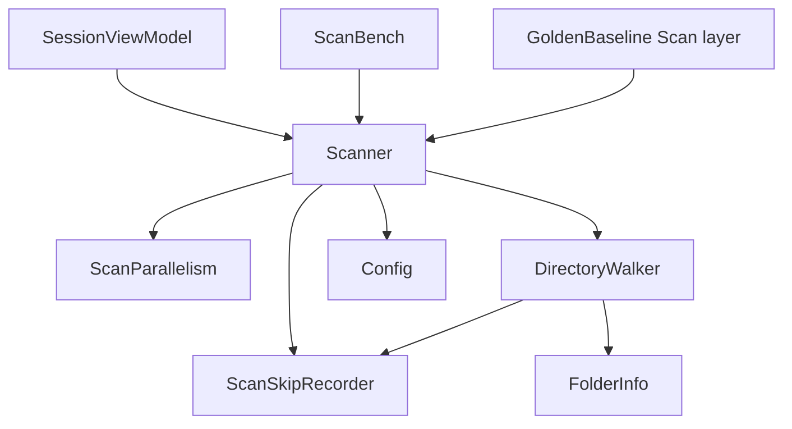
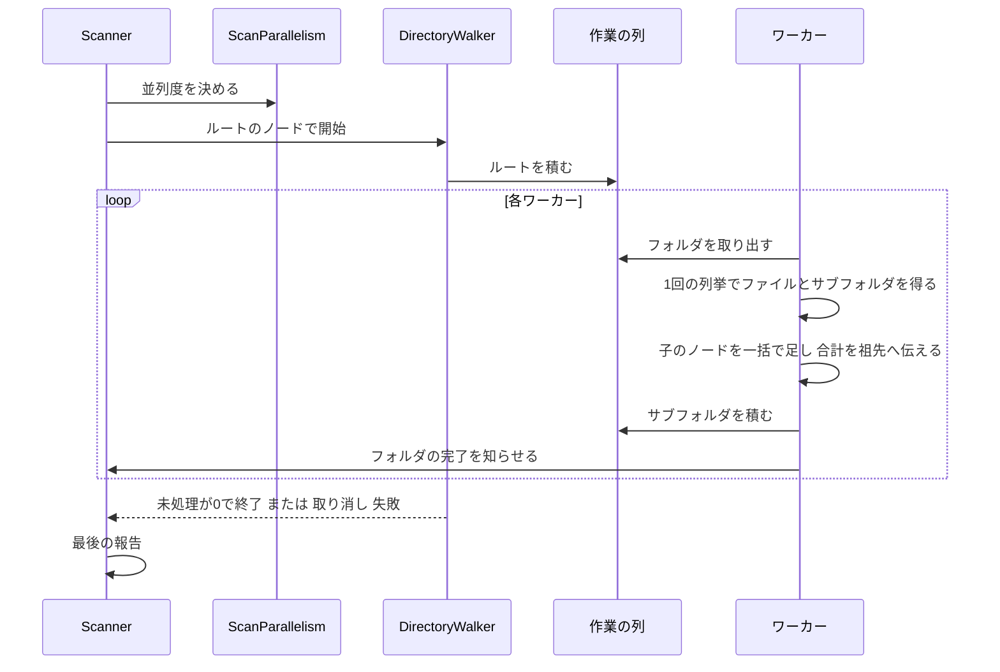

# Technical Design Document

## Overview

本フィーチャーは、Large Folder Finder の本スキャンを速くする。集計値と走査の振る舞い（スキップの記録、取り消し、最後の進捗の報告、途中の木の表示）はそのままに、列挙の回数・ファイルごとの確保とロック・上限の無い入れ子の並列化を取り除く。あわせて、変更の前後と WizTree との比較を同じ手順で測る道具と記録を整える。

**Users**: NAS やローカルのドライブの容量の原因を調べる利用者。速さの主張を確かめる開発者。

**Impact**: 本スキャンの内部（`Scanner` の再帰）を、決まった数の専用ワーカーが共有の作業の列からフォルダを取り出して1回の列挙で処理する方式に置き換える。`Config.txt` に並列度の設定を1つ足す。計測の道具 `Tools/ScanBench` を新設する。保存形式と `FolderInfo` の公開の形は変えない。

### Goals
- 同じ対象・同じ条件で、ローカルと NAS の走査時間が変更の前より短くなる
- 通常の列挙の場面（NAS、管理者でない・NTFS 以外のローカル）で WizTree 以下の所要時間になり、記録で示せる
- 同時の列挙の数が、フォルダの深さや広さに関わらず上限以内に収まる
- 集計値と走査の振る舞いが変わらない

### Non-Goals
- MFT を直接読む走査方式（`ntfs-mft-scan`）
- 結果の木のデータ構造と保存形式の作り替え（構造体の配列など。`architecture-refactoring` 以降の候補）
- 結果の表示・描き直しの速さ（`ui-redesign`）。走査中の5秒ごとの描き直しもそのまま
- 事前カウントの速さの作り込み

## Boundary Commitments

### This Spec Owns
- 本スキャンの列挙と木の組み立ての方式（ワーカーの数、作業の列、1回の列挙、子の一括の追加、フォルダの合計の伝え方）
- 並列度の決め方（自動の既定値、`Config.txt` の `ScanThreads`、逐次の設定）と、その説明（`Config.txt` のコメントと README）
- 走査の最後の報告に載せる並列度の情報（実際のワーカー数と、同時の列挙の数の最大）
- 計測の道具 `Tools/ScanBench` と、計測の手順（performance.md）と記録（`measurements.md`）、README の公開値
- 上記を確かめる、走査の検証ツールの自己検証の項目

### Out of Boundary
- `FolderInfo` の公開のメンバーと MessagePack の `[Key]`、`SessionData`、`SessionFileManager` の保存形式
- 事前カウント（`FolderCounter`）の実装。**数える集合は本スキャンと揃え続ける**
- `ScanSkipRecorder`、最後の進捗の報告の意味、途中の通知の間隔と残り時間の推定の式（`ReportProgress` の EMA）
- 途中の木を読む側（`ResultFormatter`）と画面の描画
- WizTree そのものの計測の実行（利用者の PC で利用者が行う。本スペックは手順と記録の形を持つ）

### Allowed Dependencies
- .NET 10 の BCL（`System.IO.Enumeration.FileSystemEnumerable<T>`、`System.Threading`、`System.Collections.Concurrent`、`System.Diagnostics.Process`）
- 既存の `FolderInfo`、`ScanSkipRecorder`、`ScanProgress`、`Config`、`Logger`
- `Tools/ScanBench` から本体の公開の `Scanner.RunScan` と `FolderInfo` を呼ぶこと（`Tools/GoldenBaseline` と同じ参照の形）
- 新しいパッケージは追加しない

### Revalidation Triggers
- 本スキャンが数えるフォルダの集合を変えるとき → 事前カウントとの一致（scan-correctness 要件1.4 の自己検証）を確かめる
- `Scanner.RunScan` の公開の形、または結果の木の規約（ルートの Name は完全パス、子の Parent の設定、`lock (Children)` で子を足す）を変えるとき → `ntfs-mft-scan`（同じ木を別の方式で作る）、`architecture-refactoring`、検証ツールを再確認する
- `ScanThreads` の意味や既定値を変えるとき → README と `Config.txt` の説明、計測の記録を更新する
- 走査が大きく速くなったことで、scan-correctness の並行読み取りの自己検証（2.5）が並行に読めた回数の不足で失敗しうる → 合成の木の大きさを見直す

## Architecture

### Existing Architecture Analysis
- `Scanner.RunScan` → `ScanRecursiveInternal` がフォルダごとに `EnumerateFiles()` と `EnumerateDirectories()` の2回列挙し、ファイルごとに `FileInfo` と `FolderInfo` を確保して1件ずつ `lock (Children)` で足す。サブフォルダは全階層で入れ子の `Parallel.ForEach`（上限なし）
- フォルダのファイルの合計は `AddSize` で祖先へ伝わり、途中の木にサイズが出る
- 途中の木は5秒ごとに進捗で画面へ渡り、`ResultFormatter` が `lock (node.Children)` の下で写し取って読む
- 保存は `FolderInfo` の MessagePack（`Parent` は保存せず、読み込みで付け直す）

### Architecture Pattern & Boundary Map



- **依存の方向**: Views → ViewModels → Services → Models（structure.md）。`Tools/*` は本体の公開の型だけを使う
- **新しい部品の理由**: `DirectoryWalker` は列挙と並列の制御を `Scanner` の進捗・報告の責務から分け、同時の列挙の数を1箇所で保証するため。`ScanParallelism` は並列度の決め方を画面・計測の道具・検証ツールで同じにするため

### Technology Stack
| Layer | Choice | Role | Notes |
|---|---|---|---|
| 列挙 | `FileSystemEnumerable<T>`（.NET 10） | 1フォルダを1回の列挙で、名前・属性・長さ・更新日時を得る | `AttributesToSkip = 0` を明示（既定は隠し・システムを除くため）。`IgnoreInaccessible = false`（失敗を記録するため） |
| 並列 | 専用スレッド N 本 + `ConcurrentStack<T>` と `SemaphoreSlim` | 全体の同時の列挙を N 以下にする | スレッドプールを使わない（ブロックする I/O のため） |
| 計測 | `Stopwatch`、`Process.PeakWorkingSet64`、`GC.GetTotalMemory` | 所要時間とメモリ | 新しいパッケージなし |

## File Structure Plan

### New Files
```
Services/
├── DirectoryWalker.cs      # 決まった数のワーカーで木を列挙し、FolderInfo の木を組み立てる
└── ScanParallelism.cs      # 並列度を決める（逐次・設定・ネットワーク/ローカルの自動）
Models/
└── ScanTuning.cs           # 走査の調整値（並列度、列挙のバッファの大きさ）
Tools/ScanBench/
├── ScanBench.csproj        # 本体を参照するコンソール（net10.0-windows）
├── Program.cs              # 引数の解析と、計測の繰り返し・出力
└── ResultDigest.cs         # 結果の木から、パスとサイズの一覧の要約値を作る
.kiro/specs/scan-performance/
└── measurements.md         # 計測の記録（変更の前後、WizTree との比較）
```

### Modified Files
- `Services/Scanner.cs` — `RunScan` に省略可能な `ScanTuning` を足し、`ScanRecursiveInternal` を `DirectoryWalker` に置き換える。進捗の数え方（事前カウントの範囲の深さだけを数える）、5秒・20秒の間引き、EMA、最後の報告はそのまま。フォルダごとの時刻の取得を単調で安価な時計にする
- `Models/ScanProgress.cs` — 最後の報告に `WorkerCount`（実際のワーカー数）と `PeakConcurrentEnumerations`（同時の列挙の最大）を足す
- `Models/Config.cs` と `Config.txt` — `ScanThreads`（0 = 自動）を足す。`Config.txt` に既定の行と短い説明を足す
- `ViewModels/SessionViewModel.cs` — `RunScan` に `ScanThreads` を渡す。走査の完了のログにワーカー数を含める
- `README.md`（日英） — `ScanThreads` の説明と並列度の決め方、計測の結果（環境を併記）
- `LargeFolderFinder.sln` — `Tools/ScanBench` を足す
- `Tools/GoldenBaseline/Scan/ScanRunner.cs`・`Tools/GoldenBaseline/SelfCheck/SelfChecks.cs` — 本フィーチャーの検証項目
- `.kiro/steering/performance.md`・`tech.md` — 走査の方式、並列度、計測の手順を実装の事実に合わせる

## System Flows

### 本スキャンの流れ


- 未処理の数（積んだが終わっていないフォルダの数）が0になったら全ワーカーが終わる
- 取り消しは各フォルダの取り出しの前に確かめ、`OperationCanceledException` を `RunScan` から投げる
- 想定外の例外は最初の1件を控えて他のワーカーを止め、その例外を `RunScan` から投げる（従来の入れ子の `AggregateException` にならない）
- 作業の列は後入れ先出し（深さ優先に近い順）にし、列に溜まるフォルダの数を抑える

## Requirements Traceability

| Requirement | Summary | Components | Flows |
|---|---|---|---|
| 1.1, 1.2 | 集計値が変わらない（換算なし・あり） | DirectoryWalker（同じ集合・同じ式） | 本スキャン |
| 1.3 | 並列と逐次で同じ集計値 | DirectoryWalker、ScanParallelism | 本スキャン |
| 1.4 | 事前カウントとの一致 | DirectoryWalker（フォルダの集合）、Scanner（深さの範囲の数え方） | — |
| 1.5 | スキップして続け、記録する | DirectoryWalker → ScanSkipRecorder | 本スキャン |
| 1.6 | 取り消しを状態表示に示す | DirectoryWalker（取り消しの伝え方）、既存の SessionViewModel の経路 | 本スキャン |
| 1.7 | 通知の間隔を短くしない | Scanner（間引きは不変） | — |
| 2.1, 2.2, 2.3 | ローカル・NAS で速く、どの場面でも遅くならない | DirectoryWalker、ScanParallelism、ScanBench | — |
| 2.4 | 走査中の画面の応答 | DirectoryWalker（専用スレッド）、Scanner（間引き） | — |
| 3.1 | 同時の列挙の上限 | DirectoryWalker | 本スキャン |
| 3.2 | 逐次の設定 | ScanParallelism（1本） | — |
| 3.3 | 並列度の説明 | Config.txt、README | — |
| 4.1, 4.2, 4.3, 4.4 | WizTree との比較と記録 | ScanBench、measurements.md、計測の手順 | — |
| 5.1, 5.2, 5.3 | 前後の計測、手順、公開値 | ScanBench、performance.md、measurements.md、README | — |
| 6.1 | メモリを増やさない | DirectoryWalker（`FileInfo` と完全パスを作らない）、ScanBench | — |
| 7.1, 7.2 | 保存と復元、読めないときの扱い | 保存形式を変えない（既存の SessionFileManager） | — |
| 7.3 | 形式を変えたときの版の番号 | 本フィーチャーは形式を変えないので版を上げない | — |

## Components and Interfaces

| Component | Layer | Intent | Req Coverage | Key Dependencies |
|---|---|---|---|---|
| DirectoryWalker | Services | 決まった数のワーカーで列挙し木を組み立てる | 1.1〜1.6, 2.1〜2.4, 3.1, 6.1 | FolderInfo, ScanSkipRecorder (P0) |
| ScanParallelism | Services | 並列度を決める | 1.3, 2.1, 2.2, 3.1, 3.2 | Config (P0) |
| ScanTuning | Models | 走査の調整値 | 3.1, 5.1 | なし |
| Scanner（変更） | Services | 並列度の決定・歩行の起動・進捗・最後の報告 | 1.4, 1.7, 2.4 | DirectoryWalker, ScanParallelism (P0) |
| Config（変更） | Models | `ScanThreads` | 3.1, 3.3 | なし |
| ScanBench | Tools | 計測と要約値 | 1.1〜1.3, 2.1〜2.3, 4.x, 5.x, 6.1 | Scanner (P0) |

### Services

#### DirectoryWalker
| Field | Detail |
|---|---|
| Intent | 決まった数の専用ワーカーが作業の列からフォルダを取り出し、1回の列挙で子のノードを作って木を組み立てる |
| Requirements | 1.1〜1.6, 2.1〜2.4, 3.1, 6.1 |

**Responsibilities & Constraints**
- フォルダの処理: `FileSystemEnumerable<T>` で1回列挙し、ディレクトリの項目は `ReparsePoint` でないものだけを子のフォルダにする（隠し・システムは含む。事前カウントと同じ集合）。ファイルの項目はすべて子のファイルにする（従来の `EnumerateFiles()` と同じく、リパースポイントのファイルも含む）
- ファイルのサイズは列挙の結果の長さを使い、物理サイズ換算は従来と同じ式（`(size + c - 1) / c * c`）。更新日時は従来の `FileInfo.LastWriteTime` と同じくローカル時刻にする
- 子のノードは局所の一覧に集め、`lock (node.Children)` を1フォルダにつき1回だけ取って一括で足す。子のノードの `Parent` は足す前に設定する。サブフォルダのノードは親に足してから作業の列に積む（途中の木の規約を守る）
- フォルダのファイルの合計は、そのフォルダの処理の終わりに `AddSize` で1回伝える（途中の木にサイズを出すため）
- 列挙の失敗: アクセス拒否・見つからない・入出力の失敗は `ScanSkipRecorder.Record(フォルダのパス, 例外)` で記録し、そのフォルダの残りの項目を飛ばして、それまでに得た子とサイズは残す。**1回の列挙にまとめたため、列挙の途中の失敗では残りのファイルとサブフォルダの両方を飛ばす**（従来はファイルとフォルダの列挙が別だった。開く時点の失敗は従来と同じ結果）
- 同時に列挙するワーカーは N 本以下。実際の同時の数の最大を数える
- 取り消しは各フォルダの取り出しの前に確かめる。想定外の例外は最初の1件を控えて、他のワーカーを止めてから投げ直す

**Contracts**: Service [x]

```csharp
internal sealed class DirectoryWalker
{
    /// <summary>ルートのノードから木を組み立てる。すべてのフォルダを処理し終えるまで戻らない。</summary>
    /// <param name="onFolderCompleted">フォルダを1つ処理し終えるたびに、その深さと完全パスを渡して呼ぶ（ワーカーのスレッドから並行に呼ばれる）。パスは20秒ごとのログに出す。</param>
    /// <exception cref="OperationCanceledException">取り消されたとき。</exception>
    public static DirectoryWalkResult Walk(
        FolderInfo rootNode,
        string rootPath,
        DirectoryWalkOptions options,
        ScanSkipRecorder skipRecorder,
        Action<int, string> onFolderCompleted,
        CancellationToken token);
}

internal readonly record struct DirectoryWalkOptions(
    int WorkerCount, bool UsePhysicalSize, long ClusterSize, int EnumerationBufferSize);

internal readonly record struct DirectoryWalkResult(int WorkerCount, int PeakConcurrentEnumerations);
```
- Preconditions: `WorkerCount >= 1`。`rootNode` は子を持たない
- Postconditions: 正常に戻ったとき、`rootPath` の配下の到達できるすべてのフォルダとファイルがノードになり、各フォルダの `Size` は配下のファイルの合計。`PeakConcurrentEnumerations <= WorkerCount`

#### ScanParallelism
```csharp
public static class ScanParallelism   // 純粋な判定で、検証ツールから直接確かめるため public
{
    /// <summary>走査のワーカー数を決める。逐次の設定なら1、設定値が正ならそれ、0 なら自動。</summary>
    public static int Resolve(string rootPath, bool useParallel, int configuredThreads);

    /// <summary>UNC パス、またはネットワークドライブ上のパスなら true。判定できなければ false。</summary>
    public static bool IsNetworkPath(string rootPath);
}
```
- 自動の既定値: ネットワークは 16、ローカルは論理プロセッサ数を **4〜8** に丸めた値（タスク 4.1 の計測で確定。初期値の 4〜16 から上限を下げた。根拠は measurements.md の4章）。**ネットワークの 16 は引き続き仮の値で、利用者の NAS の計測（タスク 6）で確定する**
- 設定値の上限は 64。範囲外は丸め、ログに記録する

#### Scanner（変更点）
```csharp
public static Task<FolderInfo?> RunScan(
    string path, long thresholdBytes, int totalFolders, int maxDepth,
    bool useParallel, bool usePhysicalSize,
    IProgress<ScanProgress> progress, CancellationToken token,
    ScanTuning? tuning = null);   // 追加。省略時は Config の値に依らない既定（ThreadCount = 0 = 自動）
```
- 並列度は `ScanParallelism.Resolve(path, useParallel, tuning?.ThreadCount ?? 0)`
- 進捗: `onFolderCompleted(depth, path)` で、深さが `maxDepth` 以下のときだけ数える（従来と同じ）。パスは20秒ごとのログに出す。報告の判定は単調で安価な時計で行い、5秒・20秒の間隔と EMA は変えない
- 最後の報告に `WorkerCount` と `PeakConcurrentEnumerations` を載せ、スキップの Flush と同じく走査の終わりに1回だけログに書く
- `ScanRecursiveInternal` は削除する。`GetClusterSize`・`PruneTree`（未使用のまま）・`CountFoldersAsync` は変えない

### Models

#### ScanTuning
```csharp
public sealed record ScanTuning(int ThreadCount = 0, int EnumerationBufferSize = 0);
```
- `ThreadCount = 0` は自動。`EnumerationBufferSize = 0` は .NET の既定。計測の道具が値を変えて試すために使う。アプリは `ThreadCount` だけを設定から渡す

#### Config（変更点）
- `public int ScanThreads { get; set; } = 0;`（0 = 自動）。`Config.txt` に `ScanThreads: 0` の行を足し、先頭の説明に「0 は自動（ネットワークとローカルで既定値が違う）。1 以上で並列度を固定」を加える（3.3）
- `UseParallelScan = false` のときは `ScanThreads` に関わらず逐次

### Tools

#### ScanBench
| Field | Detail |
|---|---|
| Intent | 画面を介さずに、同じ対象を同じ条件で繰り返し走査し、所要時間・メモリ・要約値を記録する |
| Requirements | 1.1〜1.3, 2.1〜2.3, 4.1〜4.4, 5.1, 5.2, 6.1 |

- 使い方: `ScanBench <path> [--runs N] [--threads N] [--sequential] [--physical-size] [--buffer BYTES] [--label TEXT]`
- 1回ごとに1行（タブ区切り）: ラベル、本体の版、回（初回か温まったか）、ワーカー数（最後の報告が伝えた実際の値）、同時の列挙の最大、バッファ（0 は「既定」と出す）、所要時間（ミリ秒）、フォルダ数、ファイル数、総バイト数、スキップ数、最大の作業セット（MB）、走査後の管理ヒープ（MB）、要約値
- `--no-digest` で要約値を作らずに測れる（要約値の一覧がメモリの列を押し上げるため。メモリを比べる回で使う）
- 要約値: 全ノードの「ルートからの相対パス・ファイルかどうか・サイズ」を序数順に並べた一覧の SHA-256 の先頭16文字。並列と逐次、変更の前後で同じ対象の要約値が一致すれば集計値が一致する（1.1〜1.3 を実データで確かめる）
- 事前カウントはしない（`totalFolders = 0`、`maxDepth = int.MaxValue`）。同じプロセスで繰り返し、1回目を初回、2回目以降を温まった状態として区別して出力する（OS を再起動した直後の初回の計測は利用者の手順で行う）
- 出力にパスそのものは含めない（公開リポジトリに記録を残すため）。対象の説明は `--label` で利用者が付ける

## Data Models
- 変更なし。`FolderInfo` のメンバー・`[Key]`・保存形式は変えない（7.1, 7.2 は既存の動き。7.3 は形式を変えないので版を上げない）
- `ScanProgress` に `WorkerCount` と `PeakConcurrentEnumerations`（最後の報告だけで意味を持つ。途中の報告では 0）を足す。`ScanProgress` は保存されない

## Error Handling
- 列挙の失敗の分類と記録は scan-correctness の方針のまま（アクセス拒否・見つからない・入出力の失敗はスキップとして記録して続ける）
- 想定外の例外は最初の1件で走査を止め、その例外を `RunScan` から投げる。状態表示とログは既存の経路（scan-correctness 要件5.6）
- 取り消しは `OperationCanceledException`。取り消しと列挙の失敗が同時でも、取り消しを優先する（入れ子の `AggregateException` に混ざらない）
- ワーカーのスレッドは例外で終わっても、未処理の数を正しく減らし、`Walk` が戻らなくなることが無いようにする

## Testing Strategy

検証は走査の検証ツール（`Tools/GoldenBaseline`）の自己検証（`dotnet test --solution` から実行）と、`Tools/ScanBench` による実データの計測で行う。**試験・計測の前後に利用者のアプリデータを退避・復元する**。

### 自己検証に加える項目
1. **集計値の不変（1.1, 1.2）**: 既存の `compare`（物理サイズ換算なしの期待値と、換算ありの控え）が一致のまま
2. **並列と逐次の一致（1.3）**: フィクスチャと合成の木を、ワーカー数 1・2・8 で走査し、パスとサイズの一覧が一致する
3. **事前カウントとの一致（1.4）**: scan-correctness の既存の項目（深さ3・6 × 逐次・並列）が通る
4. **スキップ（1.5）**: 既存のアクセス拒否の項目が通る
5. **同時の列挙の上限（3.1）**: 深く広い合成の木をワーカー数 3 で走査し、最後の報告の `PeakConcurrentEnumerations` が 3 以下、`WorkerCount` が 3
6. **並列度の決め方（3.2）**: `UseParallelScan = false` のとき `WorkerCount` が 1。設定値 0 のとき、UNC パスはネットワークの既定値、ローカルはローカルの既定値
7. **取り消し（1.6）**: 走査の途中で取り消すと `OperationCanceledException` になり、最後の報告が送られない
8. **保存と復元（7.1）**: 走査した木を本体と同じ設定で保存して読み戻し、パスとサイズの一覧が一致する

### 計測（要件2・4・5・6）
- 基準: 変更の前の版で `ScanBench` を実行し、要約値と所要時間とメモリを measurements.md に記録する（ローカルは開発機のシステムドライブなど、NAS は利用者の環境）
- 各変更の後に同じ条件で測り、遅くなっていないこと、要約値が一致することを確かめる
- 並列度とバッファの大きさは、ローカルと NAS のそれぞれで複数の値を試し、既定値を決める
- WizTree との比較は利用者が行う（管理者でない状態のローカル、NAS）。手順と記録の形は performance.md と measurements.md に置く

### 利用者の手による確認
- NAS の共有と、管理者でない状態のローカルのドライブで、このアプリと WizTree の所要時間を交互に3回ずつ測り、中央値を measurements.md に記録する（4.1〜4.4）
- 大きなフォルダの走査中に、タブの切り替えと取り消しが効くこと（2.4, 1.6）

## Performance & Scalability
- 目標: 要件2・4。確定した既定の並列度とその根拠、変更の前後の値、WizTree との比較を measurements.md に残す
- 計測の条件: Release、配布と同じ構成、初回（再起動の直後）と2回目以降を分ける、複数回の中央値、`Config.txt` の設定を記録
- ルートのノードへの `Interlocked` の集中が計測で目立つ場合は、途中の木の表示を合計だけにして最後に下から積み上げる方式を本スペックの中で検討する（採るかどうかは計測で決め、research.md に記録する）

## Migration Strategy
- 保存形式を変えないので、既存の保存データはそのまま読める。版の番号は上げない
- 実装の順: 計測の道具と基準の計測 → 並列度の決め方と設定 → 新しい走査の方式への置き換え → 並列度とバッファの調整 → 記録と README
