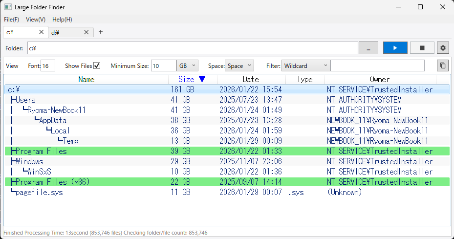
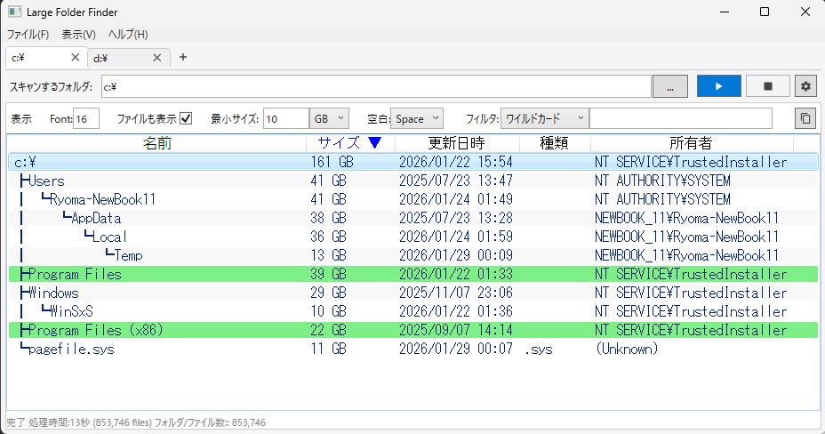

# Large Folder Finder

[**🇯🇵 日本語 (Japanese Version) is here**](#-Large-Folder-Finder-(Japanese))

This desktop application quickly searches folders on Windows and visually displays their structure and size in a tree format.
It excels at exploring network drives like NAS, helping you quickly pinpoint causes of disk space pressure.

## 🔍 Scan Result Example

Extracts and lists only folders larger than the specified size (e.g., 10 GB) in a Tree format.

## ✨ Features

- **Fast Multi-thread Scan**: Parallel processing allows for rapid scanning of drives containing a large number of files.
  - PC Example: **Approx. 400GB (approx. 1.17M files) on PC → 5 ~ 13 seconds**
  - NAS Example 1: **Approx. 1TB (approx. 70K files) on NAS → 23 seconds**
  - NAS Example 2: **Approx. 20TB (approx. 1.4M files) on NAS → Approx. 18 ~ 30 minutes**
- **Server Support**: Supports scanning via network (NAS, etc.).
- **Tabs and History Saving**: Scan results are automatically saved and can be viewed in multiple tab windows.
- **Advanced Customization**:
  - Enable/disable parallel processing, sector size consideration, skip pre-scan counting, etc.
  - Output format & copy results to clipboard
    - Show/hide files
    - Filter function (wildcard or regular expression)
    - Folder collapse feature (also reflected in clipboard output)
    - Adjust display units (KB, MB, GB, TB)
    - Font size adjustment

- **Multilingual Support**: Automatically detects OS language settings (Supports 13 languages including Japanese, English, Chinese, etc.).

## 🚀 How to Use

1. **Download**: Download and unzip the latest `LargeFolderFinder.zip` from the [Releases](https://github.com/Ryoma-h777/LargeFolderFinder/releases) page.
2. **Run**: Launch `LargeFolderFinder.exe`.
3. **Configure**: Select the path to scan and enter the minimum size to extract (e.g., 1 GB).
4. **Scan**: Click the ▶ button (Scan button).
5. **Utilize**: Copy the results using the button and use them for disk space management.

※For details, please refer to the Readme/Readme_{language}.txt file for each language.

## 💻 System Requirements

- **OS**: Windows 10 / 11
- **Runtime**: .NET Framework 4.8 (Standard on Windows, usually no installation required)

## 📄 License

This project is released under the [MIT License](License/LICENSE.txt). Anyone may use it freely and at no cost, including for commercial purposes.

If you are unable to display the MIT License attribution, you may use it under the following conditions:
※ You do not need to wait for my reply to start using it; you may begin immediately.
- Post on social media (e.g., X) stating you are using the tool, including the “Tool Name” and “Creator” (Ryoma Henzan, Cat & Chocolate Laboratory), and notify the developer.

- If you do not have a social media account, you may obtain permission to post on the developer's social media, including your company name or personal name.

- If you encounter any other issues, please contact us; we will accommodate you flexibly.

Translated with DeepL.com (free version)

---

# Large Folder Finder (Japanese)

Windows上でフォルダーを高速に検索し、構造とサイズをTree状に視覚化するデスクトップアプリです。
特にNASなどのネットワークドライブでの探索で活躍しており、ディスク容量の圧迫原因を素早く特定するのに役立ちます。

## 🔍 スキャン結果の表示例

指定したサイズ（例: 10GB）以上のフォルダーのみを抽出し、Tree形式で表示します。

## ✨ 特徴

- **高速マルチスレッドスキャン**: 並列処理により、大量のファイルを含むドライブも迅速にスキャンします。
  - PC実績例  : **約400GB (約117万ファイル) PC上のデータ   → 5 ~ 13秒**
  - NAS実績例1: **約1TB   (約7万ファイル)   NAS上のデータ  → 23秒**
  - NAS実績例2: **約20TB  (約140万ファイル) NAS上のデータ  → 約18 ~ 30分**
- **サーバー対応**: ネットワーク経由（NAS等）のスキャンも可能です。
- **タブと履歴の保存**: スキャン結果は自動的に保存され、複数のタブWindowで閲覧できます。
- **高度なカスタマイズ**:
  - 並列処理・セクタサイズの配慮・事前スキャンのスキップなど有効化/無効化
  - 出力フォーマット & 結果のクリップボードへのコピー
    - ファイルの表示/非表示
    - フォルダの折りたたみ機能(クリップボード出力にも反映)
    - フィルタ機能(ワイルドカードor正規表現)
    - 表示単位（KB, MB, GB, TB）の調整
    - フォントサイズの調整
- **多言語対応**: OSの言語設定を自動認識（日本語・英語・中国語など、全13言語）。

## 🚀 使い方

1. **ダウンロード**: [Releases](https://github.com/Ryoma-h777/LargeFolderFinder/releases) ページから最新の `LargeFolderFinder.zip` をダウンロード・解凍します。
2. **実行**: `LargeFolderFinder.exe` を起動します。
3. **設定**: スキャンしたいパスを選択し、抽出する最小サイズ（例: 1GB）を入力します。
4. **スキャン**: ▶ボタン(スキャンボタン)をクリックします。
5. **活用**: 結果をコピーボタンで取得し、容量整理の資料として利用できます。

※詳しくは各言語の Readme/Readme_{language}.txt に記載されています。

## 💻 システム要件

- **OS**: Windows 10 / 11
- **ランタイム**: .NET Framework 4.8 (Windowsに標準搭載されているため、通常はインストール不要です)

## 📄 ライセンス

このプロジェクトは [MIT ライセンス](License/LICENSE.txt) の下で公開されています。商用利用を含め、どなたでも無料で自由にご利用いただけます。

MITライセンスの表記ができない場合、以下の対応でもご利用可能です。
※利用開始は、私からの返事を待つ必要はなく、すぐにご利用を開始して構いません。
- X等SNSで「ツール名」と「作成者」(Ryoma Henzan, Cat & Chocolate Laboratory)を記載して利用していることを投稿していただき、開発者へその旨を伝える。

-  SNSアカウントをお持ちでない際は、「開発者のSNSで利用していることを御社名または個人名を含んで投稿してもよい」と許可していただく。

- その他不都合ございましたら、柔軟に対応いたしますので、ご連絡ください。

## ☕ 支援・スポンサーシップのお願い

本アプリが業務の効率化に役立ち、開発を継続的にサポートいただける場合は、ぜひご支援をお願いいたします。

特に、**企業様（目安として年商10億円以上など）**で本アプリをご活用いただいている場合は、今後のメンテナンスや新機能追加のために寄付（GitHub Sponsors 等）をご検討いただけますと幸いです。

- [GitHub Sponsors で支援する](https://github.com/sponsors/Ryoma-h777)
巡り巡っていろんな人に支えられた結果リリースできております。
支援があってもなくても、少しでもお役に立てたのなら感謝します。
「使っています」と一報いただけるだけで、私がすごく笑顔になり更に励みます。
これからもよろしくお願いいたします。

## 👤 作者

**Ryoma Henzan / Cat & Chocolate Laboratory**
